# Prices API — Database Schema Overview

> Database-focused companion to `docs/prices-api-general-overview.md`.
> This document extracts and consolidates **every database-related detail** from the
> general overview: schema (DDL), partitioning strategy, indexes, retention policy,
> RDS sizing & scaling, workers that touch the database, security posture, the
> cross-service Block Explorer dependency, and how backfill interacts with the
> live partitions. SQL is reproduced verbatim from the source document.

---

## 1. Database Role in the System

The Prices API uses a single **AWS RDS PostgreSQL 16** instance as its primary
data store. It is the system of record for:

- Tracked **assets** (classic and Soroban tokens)
- **OHLCV** price candles at multiple granularities (1m, 15m, 1h, 4h, 1d, 1w, 1M)
- **Current price** snapshots (denormalized aggregate per asset)
- **Oracle prices** (Reflector cross-reference, optionally other oracles)
- **Backfill progress** state (used by the public `GET /backfill/status` endpoint)

The database sits between the ingestion pipeline (Lambda + ECS Fargate writers)
and the public API handlers (Lambda readers behind API Gateway).

### 1.1 Position in the API Layer

```
                         ┌────────────────────────────────┐
                         │       AWS API Gateway           │
                         │  (REST API, rate limiting,      │
                         │   API keys, throttling,         │
                         │   built-in response caching)    │
                         └────────────┬───────────────────┘
                                      │
                         ┌────────────▼─────────────┐
                         │      AWS Lambda           │
                         │  (API handler functions)  │
                         │   Rust / axum             │
                         └────────────┬─────────────┘
                                      │
                         ┌────────────▼─────────────┐
                         │     RDS PostgreSQL        │
                         │  (db.t4g.micro, Single-AZ)│
                         └──────────────────────────┘
```

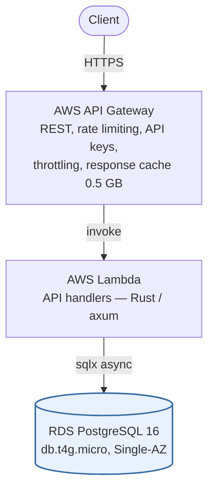

### 1.2 Position in the Data Ingestion Layer

```
       ┌───────────────┐      ┌───────────────────────┐
       │  Prices RDS   │◄─────│  EventBridge-triggered │
       │  PostgreSQL   │      │  Lambda workers (Rust): │
       └───────────────┘      │  - OHLCV Rollup        │
                              │  - Current Price Upd.  │
                              │  - Oracle Fetcher      │
                              │  - Asset Discovery     │
                              │  - Cleanup Worker      │
                              └───────────────────────┘
```

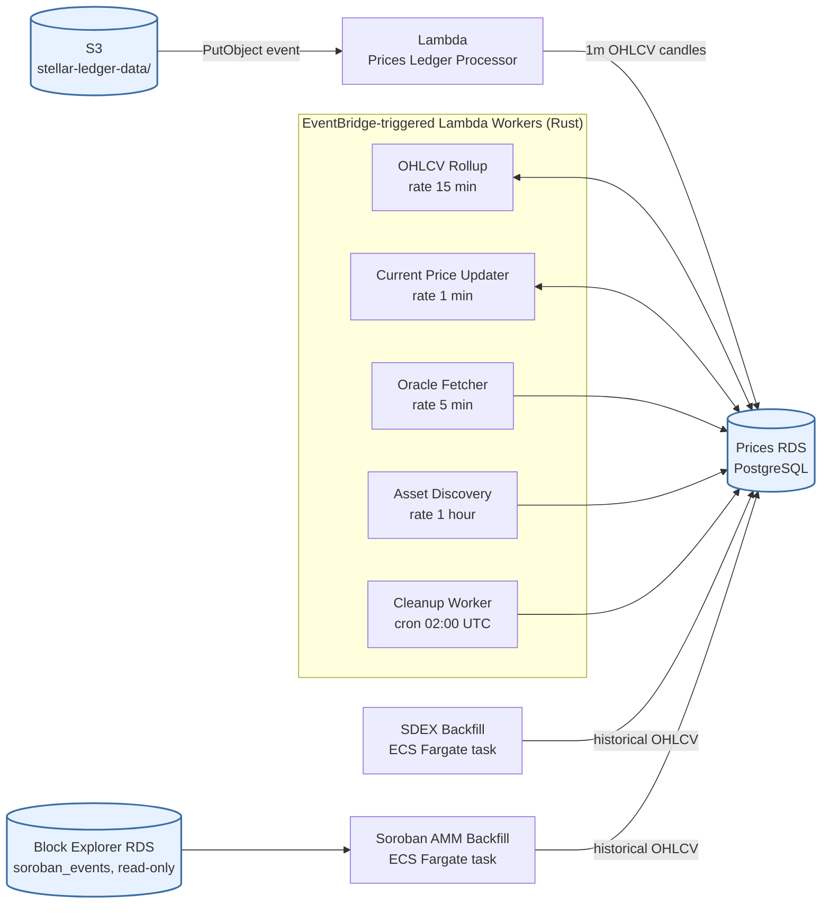

Live writes come from the **Prices Ledger Processor** Lambda (S3-event-driven,
~one ledger every 5–6 s). Background workers re-aggregate, denormalize, and
clean up. The historical **Backfill Task** writes into older partitions in
parallel with live writes; native range partitioning eliminates locking
conflicts between the two.

---

## 2. Database Tech Stack

| Component              | Technology                                                                                         |
| ---------------------- | -------------------------------------------------------------------------------------------------- |
| Database engine        | **PostgreSQL 16** on AWS RDS                                                                       |
| Partitioning           | **Native PostgreSQL range partitioning** (no extensions, e.g. no `pg_partman`, no TimescaleDB)     |
| Database client (Rust) | **`sqlx`** — compile-time verified queries, async                                                  |
| Migration tooling      | **`sqlx migrate`** (shared workspace tooling with the Block Explorer codebase)                     |
| Hosting                | AWS RDS, Single-AZ to start, deployed in the shared VPC (private subnets, not publicly accessible) |
| Credentials            | AWS Secrets Manager (DB password)                                                                  |

**Why native partitioning was chosen:**

- Queries with `WHERE timestamp > X` only scan relevant monthly partitions
  (partition pruning).
- Retention is `DROP TABLE price_ohlcv_2025_01` — instant, no `VACUUM` needed.
- No extension dependencies — works on plain AWS RDS PostgreSQL.
- Monthly partitions keep each partition at a manageable size.
- Backfill writes into historical partitions (pre-2026) alongside live writes
  into current partitions, with no locking conflicts.

---

## 3. Schema (PostgreSQL with Native Range Partitioning)

All DDL below is reproduced verbatim from the design doc. Partitioning is by
month on `timestamp`. Numeric columns use `NUMERIC(28,14)` to preserve precision
across price/volume aggregation without floating-point drift.

### 3.0 Entity-Relationship Overview

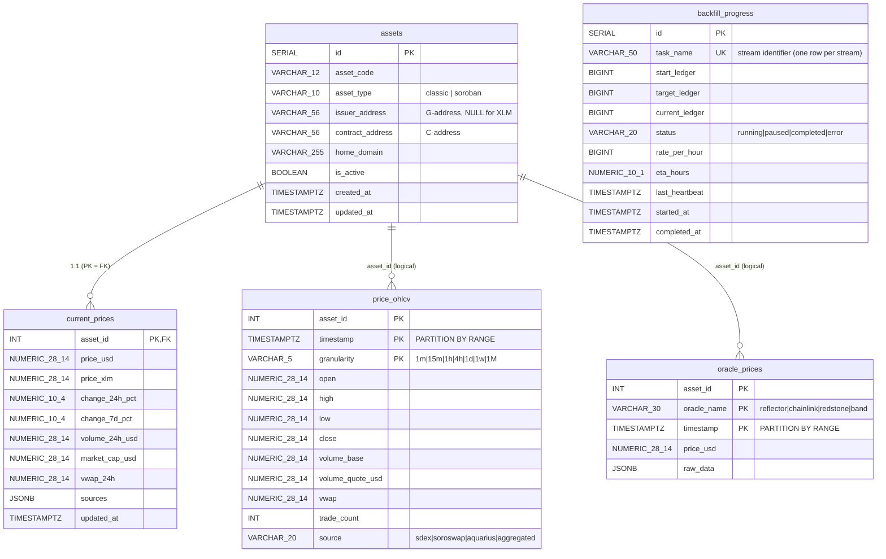

> Note: only `current_prices.asset_id` is a declared SQL foreign key.
> The `asset_id` column on `price_ohlcv` and `oracle_prices` is a logical
> reference (no `REFERENCES` clause) because foreign keys to a partitioned
> table's child are not free, and the high write rate on time-series
> partitions favours the unconstrained form.

### 3.1 `assets`

Master registry of every tracked asset (classic Stellar assets and Soroban
SEP-41 tokens). Maintained by the **Asset Discovery** Lambda (EventBridge
hourly) which scans `LedgerCloseMeta` for new classic asset issuances and new
SEP-41 contract deployments.

```sql
CREATE TABLE assets (
    id              SERIAL PRIMARY KEY,
    asset_code      VARCHAR(12) NOT NULL,
    asset_type      VARCHAR(10) NOT NULL CHECK (asset_type IN ('classic', 'soroban')),
    issuer_address  VARCHAR(56),          -- G-address, NULL for XLM
    contract_address VARCHAR(56),         -- C-address (SAC or native contract)
    home_domain     VARCHAR(255),         -- classic assets only, nullable
    is_active       BOOLEAN DEFAULT TRUE,
    created_at      TIMESTAMPTZ DEFAULT NOW(),
    updated_at      TIMESTAMPTZ DEFAULT NOW(),

    UNIQUE (asset_code, issuer_address, contract_address)
);

CREATE INDEX idx_assets_contract ON assets(contract_address);
CREATE INDEX idx_assets_code ON assets(asset_code);
```

**Notes:**

- `issuer_address` is `NULL` for XLM (the native asset).
- `contract_address` is the C-address (Stellar Asset Contract or native
  contract); also `NULL` for purely classic assets that have not been wrapped.
- The `(asset_code, issuer_address, contract_address)` triple uniquely
  identifies an asset.

### 3.2 `price_ohlcv` — Price Snapshots (OHLCV), Native Range Partitioning

Time-series OHLCV candles at multiple granularities. The parent table is
range-partitioned by month on `timestamp`. New partitions are created by the
Cleanup Worker Lambda 2 months ahead of the current date.

```sql
-- Parent table: partitioned by month on timestamp
CREATE TABLE price_ohlcv (
    asset_id        INT NOT NULL,
    timestamp       TIMESTAMPTZ NOT NULL,
    granularity     VARCHAR(5) NOT NULL,   -- '1m', '15m', '1h', '4h', '1d', '1w', '1M'
    open            NUMERIC(28,14) NOT NULL,
    high            NUMERIC(28,14) NOT NULL,
    low             NUMERIC(28,14) NOT NULL,
    close           NUMERIC(28,14) NOT NULL,
    volume_base     NUMERIC(28,14) NOT NULL DEFAULT 0,
    volume_quote_usd NUMERIC(28,14) NOT NULL DEFAULT 0,
    vwap            NUMERIC(28,14),
    trade_count     INT DEFAULT 0,
    source          VARCHAR(20),           -- 'sdex', 'soroswap', 'aquarius', 'aggregated'

    PRIMARY KEY (timestamp, asset_id, granularity)
) PARTITION BY RANGE (timestamp);

-- Create monthly partitions (managed by Cleanup Worker Lambda)
CREATE TABLE price_ohlcv_2026_01 PARTITION OF price_ohlcv
    FOR VALUES FROM ('2026-01-01') TO ('2026-02-01');
CREATE TABLE price_ohlcv_2026_02 PARTITION OF price_ohlcv
    FOR VALUES FROM ('2026-02-01') TO ('2026-03-01');
-- ... new partitions created 2 months ahead by the cleanup-worker Lambda

-- Index for typical query: asset + granularity within a time range
CREATE INDEX idx_ohlcv_asset_gran ON price_ohlcv (asset_id, granularity, timestamp DESC);
```

**Granularity values:** `'1m'`, `'15m'`, `'1h'`, `'4h'`, `'1d'`, `'1w'`, `'1M'`

**Source values:** `'sdex'`, `'soroswap'`, `'aquarius'`, `'aggregated'`

**Primary key:** `(timestamp, asset_id, granularity)` — places `timestamp`
first so partition pruning is effective on the typical "range scan within an
asset/granularity" query pattern.

**Why native partitioning works well here:**

- Queries with `WHERE timestamp > X` only scan relevant monthly partitions.
- Retention = `DROP TABLE price_ohlcv_2025_01` — instant, no vacuum needed.
- No extension dependencies — works on plain AWS RDS PostgreSQL.
- Monthly partitions keep each partition at a manageable size.
- Backfill writes into historical partitions (pre-2026) alongside live writes
  into current partitions, with no locking conflicts.

### 3.3 `current_prices` — Materialized/Cached current state

Single row per asset. Written by the **Current Price Updater** Lambda
(EventBridge `rate(1 minute)`), which reads the latest candles from
`price_ohlcv`, computes a VWAP across sources, and upserts here. This table
exists to keep `GET /price` and `GET /assets` cheap (no real-time aggregation
on the read path).

```sql
CREATE TABLE current_prices (
    asset_id        INT PRIMARY KEY REFERENCES assets(id),
    price_usd       NUMERIC(28,14) NOT NULL,
    price_xlm       NUMERIC(28,14),
    change_24h_pct  NUMERIC(10,4),
    change_7d_pct   NUMERIC(10,4),
    volume_24h_usd  NUMERIC(28,14),
    market_cap_usd  NUMERIC(28,14),
    vwap_24h        NUMERIC(28,14),
    sources         JSONB,                 -- per-source {price, volume_24h}, see below
    updated_at      TIMESTAMPTZ DEFAULT NOW()
);
```

**Notes:**

- `sources` is a JSONB blob holding the per-source price **and** 24h volume
  that contributed to the VWAP. Canonical shape:

  ```json
  {
    "sdex":     { "price": "1.0001", "volume_24h": "800000" },
    "soroswap": { "price": "1.0002", "volume_24h": "500000" },
    "aquarius": { "price": "1.0001", "volume_24h": "223400" }
  }
  ```

  - Numeric values are serialised as JSON **strings** to preserve the full
    `NUMERIC(28,14)` precision when read back through `sqlx` and re-emitted
    by the API (avoids the 64-bit floating-point round-trip that PostgreSQL
    would otherwise apply if values were stored as JSON numbers).
  - One key per source that passed the `min_volume_usd` and outlier-detection
    filters in that update cycle; sources excluded that cycle are simply
    absent from the object.
  - `GET /assets/{id}/price` returns this object verbatim. `GET /assets`
    returns the same object (the list endpoint exposes the full source
    breakdown — clients that only want price strings can extract `.price`).
- `asset_id` is both the primary key and a foreign key to `assets(id)`.

#### Why JSONB and not a separate `current_price_sources` table?

The `sources` field could plausibly be modelled three ways:

1. **JSONB blob (chosen).**
2. A separate child table — `current_price_sources(asset_id, source, price, volume_24h)` keyed by `(asset_id, source)`.
3. Flat columns on `current_prices` — `sdex_price`, `sdex_volume_24h`, `soroswap_price`, …

The blob is the right model **for this column's specific access pattern**, not as a general preference. The decisive properties are:

| Property of `sources` | Consequence |
| --------------------- | ----------- |
| **Always read whole.** Every endpoint that returns it (`GET /price`, `GET /assets`, `POST /prices/batch`) returns *all* keys for the asset together. No endpoint asks for one source in isolation. | A child-table design would force a JOIN (or a second query) on every read of the hottest path in the system, then re-fold N rows back into the nested object the API returns anyway. |
| **Always written whole.** The Current Price Updater Lambda recomputes the entire VWAP every minute and rewrites the row. There is no mutation of one source without rewriting the rest. | Single-row `UPDATE` vs. delete-and-reinsert N child rows per asset per minute. The blob avoids per-source lock churn. |
| **Never queried by content.** No filter, sort, join, or aggregation looks inside `sources`. It is a display payload, not a query target. | The main reason to normalise — being able to `WHERE source.price > X` — does not apply. |
| **Bounded, low-cardinality key set** (≤ ~10 sources realistically) and **lifecycle tied to the parent row** (a `sources` entry exists iff `current_prices` has a row). | The relational benefits of a child table (FK, independent lifecycle) carry no weight here. |
| **Sources excluded by `min_volume_usd` / outlier detection are simply absent from the object.** | A child-table design would represent "absent this cycle" as missing rows, which is the same information the JSONB conveys via missing keys — no expressivity gained. |

Flat per-source columns (option 3) are rejected outright: every new source becomes a migration, and the column set is sparse for assets that don't trade on every venue.

**The real risk with the JSONB choice is shape drift, not normalisation purity.** It is mitigated by:

- A single typed Rust struct (e.g. `BTreeMap<String, SourceEntry>` where `SourceEntry { price: Decimal, volume_24h: Decimal }`) shared between the Current Price Updater (writer) and the API handlers (readers). The shape is enforced at compile time on both sides.
- A `CHECK (jsonb_typeof(sources) = 'object')` constraint on the column to catch gross corruption at the DB level.
- If the shape ever needs to evolve, a versioned envelope (`{"v": 1, "sources": {…}}`) introduced at that point — not pre-emptively.

**When this choice should be revisited:** if a future endpoint ever needs to filter or sort assets by a per-source field (e.g. "list assets where Soroswap volume > $1M"), promote the data to a child table at that point. Until then, the blob is strictly faster, simpler, and gives up no integrity that the typed-struct convention doesn't already enforce.

### 3.4 `oracle_prices` — Oracle Prices (Partitioned)

Stores oracle-reported prices (Reflector and any other oracle integrations).
Same monthly range partitioning pattern as `price_ohlcv`. Written by the
**Oracle Fetcher** Lambda (EventBridge `rate(5 minutes)`) which calls Reflector
via Soroban RPC `simulateTransaction`. **Failures here do not block primary
ingestion.**

```sql
CREATE TABLE oracle_prices (
    asset_id        INT NOT NULL,
    oracle_name     VARCHAR(30) NOT NULL,  -- 'reflector', 'chainlink', 'redstone', 'band'
    price_usd       NUMERIC(28,14) NOT NULL,
    timestamp       TIMESTAMPTZ NOT NULL,
    raw_data        JSONB,

    PRIMARY KEY (timestamp, asset_id, oracle_name)
) PARTITION BY RANGE (timestamp);

-- Monthly partitions, same pattern as price_ohlcv
CREATE TABLE oracle_prices_2026_01 PARTITION OF oracle_prices
    FOR VALUES FROM ('2026-01-01') TO ('2026-02-01');
CREATE TABLE oracle_prices_2026_02 PARTITION OF oracle_prices
    FOR VALUES FROM ('2026-02-01') TO ('2026-03-01');

CREATE INDEX idx_oracle_asset ON oracle_prices (asset_id, oracle_name, timestamp DESC);
```

**Oracle name examples:** `'reflector'`, `'chainlink'`, `'redstone'`, `'band'`.

**Important:** oracle data is exposed only through `GET /oracles/{asset_identifier}`
for cross-reference. It does **not** feed the `price_usd` field in any other
endpoint.

### 3.5 `backfill_progress` — Backfill Progress Tracking

One-row-per-stream tracking table powering `GET /backfill/status`. The backfill
is split into two independent streams (see Section 7.1), each represented by
its own row keyed by `task_name`:

- `'sdex_archive'` — long-running SDEX archive backfill (ECS Fargate, heartbeat every 15 minutes)
- `'soroban_amm'` — one-time Soroban AMM backfill (ECS Fargate, marks itself `completed` in Tranche 1)

```sql
CREATE TABLE backfill_progress (
    id              SERIAL PRIMARY KEY,
    task_name       VARCHAR(50) NOT NULL UNIQUE,
    -- Canonical streams seeded below: 'sdex_archive', 'soroban_amm'.
    -- Additional streams (e.g. targeted gap-fills, future AMM reindexes) can
    -- be added by inserting new rows; the API handler decides which task_names
    -- it surfaces.
    start_ledger    BIGINT NOT NULL,
    target_ledger   BIGINT NOT NULL,
    current_ledger  BIGINT NOT NULL,
    status          VARCHAR(20) NOT NULL DEFAULT 'running',
    -- 'running', 'paused', 'completed', 'error'
    rate_per_hour   BIGINT,               -- ledgers/hour, rolling average; NULL if the task does not track rate
    eta_hours       NUMERIC(10,1),        -- estimated hours to completion; NULL if unknown or task is short-lived
    last_heartbeat  TIMESTAMPTZ NOT NULL DEFAULT NOW(),
    started_at      TIMESTAMPTZ NOT NULL DEFAULT NOW(),
    completed_at    TIMESTAMPTZ
);

-- Seed both stream rows at provisioning time so GET /backfill/status always has
-- a row to read for each stream.
INSERT INTO backfill_progress (task_name, start_ledger, target_ledger, current_ledger, status)
VALUES
    ('sdex_archive', 1,        0, 0, 'running'),  -- target_ledger updated to current tip on task start
    ('soroban_amm',  48500000, 0, 0, 'running');  -- ~Soroban activation; target updated to current tip on task start
```

**Status values:** `'running'`, `'paused'`, `'completed'`, `'error'`.

**Per-stream operational behaviour** (a task-implementation choice, not a schema rule — any future long-running stream would behave like `sdex_archive`):

| `task_name` | `rate_per_hour` / `eta_hours` | Heartbeat cadence | Terminal state |
| ----------- | ----------------------------- | ----------------- | -------------- |
| `sdex_archive` | populated, rolling 15-min average | every 15 min, monitored by CloudWatch alarm | `completed` post-delivery (ledger 1 reached) |
| `soroban_amm` | typically `NULL` (short-lived task) | one update at completion | `completed` in Tranche 1 |

The `GET /backfill/status` endpoint reads both rows and returns them as the
nested `sdex` and `soroban_amm` objects (see Section 7.6).

**Heartbeat alarm:** a CloudWatch alarm watches `last_heartbeat`. If the
backfill task fails to update it for more than 10 minutes, an SNS alarm fires
(email + Slack). The alarm is active for the full backfill duration, including
post-delivery.

---

## 4. Retention Policy (Cleanup Worker Lambda)

The **Cleanup Worker** Lambda runs daily on EventBridge `cron(0 2 * * *)`
(02:00 UTC). It performs both row-level deletes for fine-grained data and
table-level partition lifecycle operations.

```
Fine-grained data retention (DELETE within partitions):
  1m  granularity → keep 7 days   (DELETE WHERE granularity='1m'  AND timestamp < now()-7d)
  15m granularity → keep 30 days  (DELETE WHERE granularity='15m' AND timestamp < now()-30d)

Coarse-grained data (1h, 4h, 1d, 1w, 1M) → keep forever

Partition lifecycle (DROP entire old partitions):
  Partitions older than 13 months → DROP TABLE (all fine-grained data already cleaned)
  New partitions → CREATE 2 months ahead of current date

Both handled by the cleanup-worker Lambda (daily at 02:00 UTC).
```

Summary of the retention contract per granularity:

| Granularity | Retention | Mechanism                                            |
| ----------- | --------- | ---------------------------------------------------- |
| `1m`        | 7 days    | `DELETE` within active partitions                    |
| `15m`       | 30 days   | `DELETE` within active partitions                    |
| `1h`        | forever   | (until the partition itself is dropped at 13 months) |
| `4h`        | forever   | (until the partition itself is dropped at 13 months) |
| `1d`        | forever   | (until the partition itself is dropped at 13 months) |
| `1w`        | forever   | (until the partition itself is dropped at 13 months) |
| `1M`        | forever   | (until the partition itself is dropped at 13 months) |

**Partition lifecycle:** partitions older than 13 months are dropped wholesale
(`DROP TABLE`); new monthly partitions are created 2 months ahead of the
current date so writes never hit a missing partition.

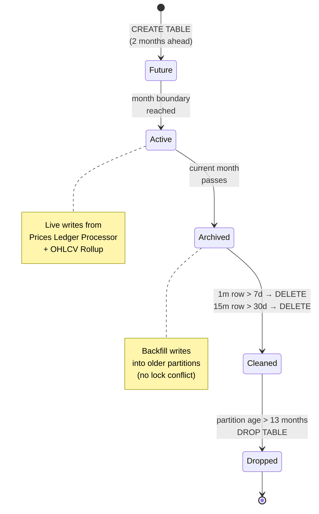

```mermaid
gantt
    title Retention by Granularity (relative to "now")
    dateFormat  X
    axisFormat  %s

    section 1m candles
    Kept (DELETE after) :done, m1, 0, 7

    section 15m candles
    Kept (DELETE after) :done, m15, 0, 30

    section 1h / 4h / 1d / 1w / 1M
    Kept until partition DROP at 13 months :active, c1, 0, 395
```

---

## 5. Indexing & Query Patterns

| Table               | Index                                                               | Purpose                                                        |
| ------------------- | ------------------------------------------------------------------- | -------------------------------------------------------------- |
| `assets`            | `PRIMARY KEY (id)`                                                  | Auto-incrementing surrogate ID                                 |
| `assets`            | `UNIQUE (asset_code, issuer_address, contract_address)`             | De-duplication of the asset triple                             |
| `assets`            | `idx_assets_contract` on `(contract_address)`                       | Lookup Soroban tokens by C-address                             |
| `assets`            | `idx_assets_code` on `(asset_code)`                                 | Search/filter by code, prefix match                            |
| `price_ohlcv`       | `PRIMARY KEY (timestamp, asset_id, granularity)`                    | Partition pruning + uniqueness within a candle                 |
| `price_ohlcv`       | `idx_ohlcv_asset_gran` on `(asset_id, granularity, timestamp DESC)` | Typical OHLCV range query: asset + granularity in a time range |
| `current_prices`    | `PRIMARY KEY (asset_id)`                                            | Single-row-per-asset upsert                                    |
| `oracle_prices`     | `PRIMARY KEY (timestamp, asset_id, oracle_name)`                    | Partition pruning + uniqueness per (oracle, asset, time)       |
| `oracle_prices`     | `idx_oracle_asset` on `(asset_id, oracle_name, timestamp DESC)`     | Latest-per-oracle lookup                                       |
| `backfill_progress` | `PRIMARY KEY (id)` + `UNIQUE (task_name)`                           | One row per backfill stream (seeded with `sdex_archive`, `soroban_amm`; extensible) |

**Partition pruning** is the central performance mechanism for the time-series
tables: by placing `timestamp` first in the primary key and partitioning by
month on it, queries with a time predicate scan only the relevant months.

---

## 6. Workers and Endpoints That Read/Write the Database

### 6.0 Read/write data-flow overview

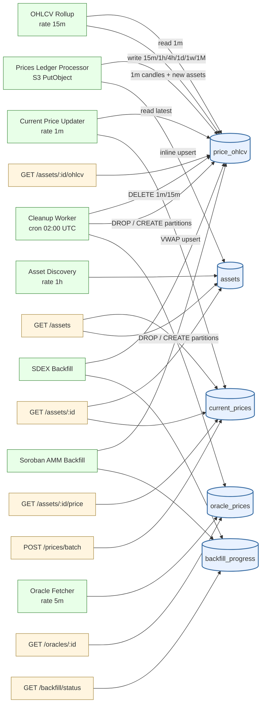

### 6.1 Writers

| Worker / Process                          | Trigger                                       | Tables written                                                                                         |
| ----------------------------------------- | --------------------------------------------- | ------------------------------------------------------------------------------------------------------ |
| **Prices Ledger Processor** Lambda        | S3 PutObject event (per ledger, ~every 5–6 s) | `price_ohlcv` (1m candles), `assets` (when new assets discovered inline)                               |
| **Asset Discovery** Lambda                | EventBridge `rate(1 hour)`                    | `assets`                                                                                               |
| **OHLCV Rollup** Lambda                   | EventBridge `rate(15 minutes)`                | `price_ohlcv` (15m, 1h, 4h, 1d, 1w, 1M rolled-up rows)                                                 |
| **Current Price Updater** Lambda          | EventBridge `rate(1 minute)`                  | `current_prices`                                                                                       |
| **Oracle Fetcher** Lambda                 | EventBridge `rate(5 minutes)`                 | `oracle_prices`                                                                                        |
| **Cleanup Worker** Lambda                 | EventBridge `cron(0 2 * * *)`                 | DELETEs in `price_ohlcv` for `1m`/`15m`; `DROP TABLE` old partitions; `CREATE TABLE` future partitions |
| **SDEX Backfill** ECS Fargate task        | Continuous (during project + post-delivery)   | Historical `price_ohlcv` partitions; heartbeat updates to `backfill_progress`                          |
| **Soroban AMM Backfill** ECS Fargate task | One-time, Tranche 1                           | Historical `price_ohlcv` partitions; status updates to `backfill_progress`                             |

### 6.2 EventBridge Scheduler Rules (DB-relevant)

```
prices-ledger-processor:  S3 event (PutObject) → Lambda "prices-ledger-processor"
oracle-ingest:             rate(5 minutes)       → Lambda "oracle-worker"
asset-discovery:           rate(1 hour)          → Lambda "discovery-worker"
ohlcv-rollup:              rate(15 minutes)      → Lambda "rollup-worker"
price-update:              rate(1 minute)        → Lambda "price-updater"
retention-cleanup:         cron(0 2 * * *)       → Lambda "cleanup-worker"
```

### 6.3 Readers (API endpoints → tables)

| Endpoint                               | Tables read                                           |
| -------------------------------------- | ----------------------------------------------------- |
| `GET /assets`                          | `current_prices` JOIN `assets`                        |
| `GET /assets/{asset_identifier}`       | `assets` (+ `current_prices`)                         |
| `GET /assets/{asset_identifier}/price` | `current_prices`                                      |
| `GET /assets/{asset_identifier}/ohlcv` | `price_ohlcv` (with partition pruning by `timestamp`) |
| `POST /prices/batch`                   | `current_prices` (multi-asset)                        |
| `GET /oracles/{asset_identifier}`      | `oracle_prices`                                       |
| `GET /backfill/status`                 | `backfill_progress`                                   |

### 6.4 Cursor pagination (`GET /assets`)

The cursor used by `GET /assets` is a Base64-encoded JSON object with the sort
column value and the asset ID of the last returned row (ID breaks ties when
sort values are equal):

```
cursor = base64({ "volume_24h": 1523400.50, "id": 42 })
       → "eyJ2b2x1bWVfMjRoIjoxNTIzNDAwLjUwLCJpZCI6NDJ9"
```

First page (no cursor):

```sql
SELECT * FROM current_prices JOIN assets ON assets.id = current_prices.asset_id
ORDER BY volume_24h DESC, id DESC
LIMIT 51;  -- limit + 1 to determine has_more
```

Subsequent pages (server decodes the cursor and uses a **keyset condition**):

```sql
SELECT * FROM current_prices JOIN assets ON assets.id = current_prices.asset_id
WHERE (volume_24h, id) < (1523400.50, 42)  -- decoded from cursor
ORDER BY volume_24h DESC, id DESC
LIMIT 51;
```

`has_more` is determined by fetching `limit + 1` rows.

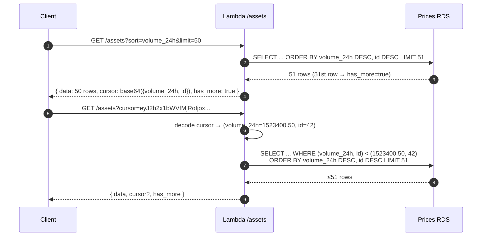

### 6.5 VWAP Calculation (writes to `current_prices.sources` + price fields)

The Current Price Updater Lambda computes:

```
Weighted Price = Σ(source_price × source_volume_24h) / Σ(source_volume_24h)

Where sources = [SDEX, Soroswap, Aquarius, ...]
Only include sources where volume_24h > configurable_min_threshold_usd (e.g. $100)
```

Volume threshold is configurable per-request via `?min_volume_usd=` query param
or defaults to the system setting.

**Outlier detection:** before a source's price is included in the VWAP, it is
compared against the inter-source median. Sources deviating by more than a
configurable percentage are excluded from that update cycle.

---

## 7. Backfill — Database-Side Considerations

Backfill is split into two streams with different sources, runtimes, and
write patterns. Both streams ultimately write into `price_ohlcv` historical
monthly partitions, plus heartbeat/status to `backfill_progress`.

### 7.1 Two-stream design

| Stream                                              | Data location                                                                                                     | Era                                                     | Method                                |
| --------------------------------------------------- | ----------------------------------------------------------------------------------------------------------------- | ------------------------------------------------------- | ------------------------------------- |
| **SDEX trades**                                     | `OperationResult → offersClaimed[]` in `LedgerCloseMeta` XDR                                                      | All-time (2015 → present, ~57M ledgers)                 | Archive reads via ECS Fargate task    |
| **Soroban AMM swaps** (Soroswap, Aquarius, Phoenix) | `SorobanTransactionMeta.events` (CAP-67) — already parsed and stored in **Block Explorer `soroban_events` table** | Soroban activation (Nov 2023) → present (~8.5M ledgers) | Read-only query to Block Explorer RDS |

The Soroban AMM stream is handled first (Tranche 1) by querying the Block
Explorer's already-indexed `soroban_events` table. This completes in hours
(not weeks) and gives full AMM history from Soroban activation. The SDEX
stream requires reading all 57 million ledgers from Stellar's public history
archives and is the long-running backfill that extends beyond the project
duration.

### 7.2 Why backfill writes do not conflict with live writes

Native range partitioning separates **historical writes** (old month
partitions) from **live writes** (current month partition). Backfill and
live ingestion can run concurrently with no locking conflicts because they
target different physical partitions.

### 7.3 Stream 1 — Soroban AMM (fast, Tranche 1)

```
Block Explorer RDS (read-only)
  soroban_events WHERE contract_id IN
  (Soroswap, Aquarius, Phoenix contracts)
        │
        ▼
┌──────────────────────────────────────────┐
│  Soroban AMM Backfill Task (Rust)        │
│  - Queries BE soroban_events by          │
│    contract_id and event topic           │
│  - Extracts token pair + amounts         │
│    from decoded JSONB topics/data        │
│  - Writes OHLCV into historical          │
│    price_ohlcv partitions                │
│  - Marks soroban_amm stream "completed"  │
└──────────────────────────────────────────┘
```

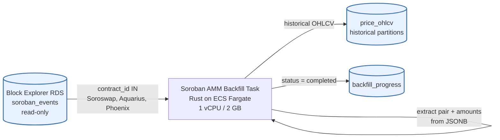

| Metric              | Value                                 | Notes                                           |
| ------------------- | ------------------------------------- | ----------------------------------------------- |
| Data source         | Block Explorer `soroban_events` table | Already indexed, decoded JSONB                  |
| Ledger range        | ~48.5M–57M (Nov 2023 to present)      | ~8.5M ledgers worth of events                   |
| Estimated runtime   | A few hours                           | DB query + OHLCV write; no archive reads needed |
| ECS task config     | 1 vCPU / 2 GB RAM                     | Short-lived; same ECS cluster                   |
| Expected completion | Tranche 1 (Week 2–3)                  |                                                 |

### 7.4 Stream 2 — SDEX (slow, runs through and past Tranche 3)

```
Stellar Public History Archives (S3-compatible)
        │
        ▼ (ledger range reads, oldest→newest)
┌──────────────────────────────────────────┐
│  SDEX Backfill ECS Fargate Task (Rust)   │
│  - Reads LedgerCloseMeta from archives   │
│  - Extracts offersClaimed[] from         │
│    ManageSellOffer/ManageBuyOffer results │
│  - Writes OHLCV into historical          │
│    price_ohlcv partitions                │
│  - Updates backfill_progress heartbeat   │
│    every 15 minutes                      │
└──────────────────────────────────────────┘
               │
               ▼
       Prices RDS PostgreSQL
       (historical price_ohlcv partitions,
        written in parallel with live writes)
```

```mermaid
flowchart TD
    Arch[(Stellar Public History Archives<br/>S3-compatible)] -->|ledger range reads<br/>oldest → newest| Task[SDEX Backfill Task<br/>Rust on ECS Fargate<br/>2 vCPU / 4 GB, continuous]
    Task -->|parse LedgerCloseMeta<br/>extract offersClaimed[]| Task
    Task -->|historical OHLCV<br/>~150k ledgers/hour| OHLCV[(price_ohlcv<br/>historical partitions)]
    Task -->|heartbeat every 15 min| BP[(backfill_progress)]
    BP -->|last_heartbeat &gt; 10 min stale| Alarm[CloudWatch Alarm<br/>→ SNS email + Slack]

    LiveTip[Prices Ledger Processor<br/>live writes, current month] --> OHLCVcur[(price_ohlcv<br/>current partition)]

    classDef store fill:#e8f1ff,stroke:#3a6ea5,stroke-width:2px;
    classDef alarm fill:#ffe5e5,stroke:#a53a3a,stroke-width:2px;
    class Arch,OHLCV,BP,OHLCVcur store;
    class Alarm alarm;
```

| Metric                                | Value                                      | Notes                                    |
| ------------------------------------- | ------------------------------------------ | ---------------------------------------- |
| Total ledgers                         | ~57 million                                | Ledger 1 (Nov 2015) to current tip       |
| Task config                           | 2 vCPU / 4 GB RAM, ECS Fargate, continuous | Shared ECS cluster                       |
| Historical read rate                  | ~150,000–200,000 ledgers/hour              | From public archives; single task        |
| Effective sustained rate (DB-limited) | ~150,000 ledgers/hour                      | `db.t4g.small` during backfill           |
| Estimated total compute               | ~380 hours (~16 days)                      | 57M / 150,000                            |
| Expected completion                   | ~4–6 weeks after Tranche 3                 | Backfill runs continuously post-delivery |

The SDEX backfill task is **self-recovering**: it tracks `current_ledger` in
`backfill_progress` and resumes from its last checkpoint on restart. Early
ledgers (pre-2018) have very few DEX trades and process faster; the estimate
above is conservative.

### 7.4a Backfill task state machine (`backfill_progress.status`)

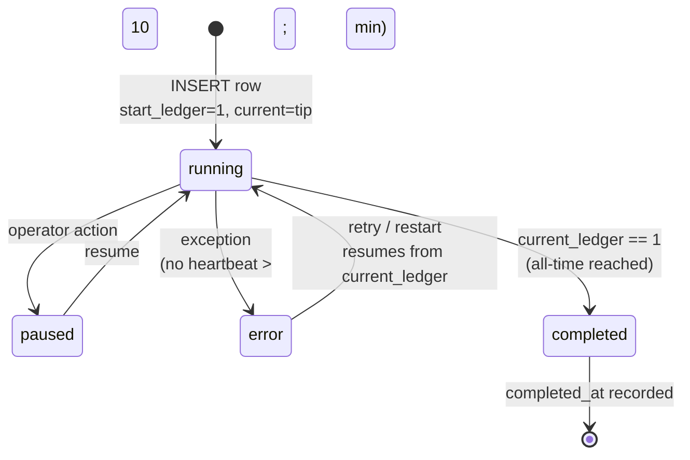

### 7.5 Backfill milestones (DB visibility)

| Tranche           | Stream      | Milestone                                                     | Validation (DB-observable)                                                                                               |
| ----------------- | ----------- | ------------------------------------------------------------- | ------------------------------------------------------------------------------------------------------------------------ |
| **1** (Week 4)    | Soroban AMM | Full AMM history from Soroban activation (Nov 2023) available | `soroban_amm.status: "completed"` in `GET /backfill/status`; OHLCV data for Soroswap pairs verifiable for Nov 2023 dates |
| **1** (Week 4)    | SDEX        | Archive backfill task running; recent 6 months covered        | `sdex.task_healthy: true`; `sdex.earliest_data_available` ~6 months ago                                                  |
| **2** (Week 9)    | SDEX        | 4+ years (back to Jan 2022)                                   | `sdex.earliest_data_available` ≤ 2022-01-01                                                                              |
| **3** (Week 13)   | SDEX        | 8+ years (back to Jan 2018)                                   | `sdex.earliest_data_available` ≤ 2018-01-01; `sdex.task_healthy: true`; credible `estimated_hours_to_completion`         |
| **Post-delivery** | SDEX        | Full all-time (ledger 1 to present)                           | `sdex.status: "completed"`; Stellar notified                                                                             |

### 7.6 `GET /backfill/status` — example response

The endpoint reflects both streams. A CloudWatch alarm fires if
`last_heartbeat` falls more than 10 minutes behind the current time.

```json
{
  "realtime_tip_ledger": 57234198,
  "sdex": {
    "status": "running",
    "current_ledger": 34891234,
    "start_ledger": 1,
    "target_ledger": 57234198,
    "progress_pct": 61.2,
    "ledgers_remaining": 22342964,
    "rate_ledgers_per_hour": 148200,
    "estimated_hours_to_completion": 150.7,
    "task_healthy": true,
    "last_heartbeat": "2026-06-15T14:29:55Z",
    "earliest_data_available": "2019-08-22T00:00:00Z"
  },
  "soroban_amm": {
    "status": "completed",
    "completed_at": "2026-04-14T08:23:11Z",
    "earliest_data_available": "2023-11-01T00:00:00Z"
  }
}
```

| Field                                 | Description                                                          |
| ------------------------------------- | -------------------------------------------------------------------- |
| `sdex.status`                         | `running`, `paused`, `completed`, or `error` — SDEX archive backfill |
| `sdex.current_ledger`                 | Oldest ledger processed so far by the SDEX backfill task             |
| `sdex.rate_ledgers_per_hour`          | Rolling 15-min average processing rate                               |
| `sdex.estimated_hours_to_completion`  | `ledgers_remaining / rate_per_hour`                                  |
| `sdex.task_healthy`                   | `false` if no heartbeat in past 10 minutes → CloudWatch alarm fires  |
| `sdex.earliest_data_available`        | Timestamp of oldest SDEX OHLCV record in the database                |
| `soroban_amm.status`                  | Typically `completed` from Tranche 1 onwards                         |
| `soroban_amm.earliest_data_available` | Soroban activation date (~Nov 2023) once complete                    |

### 7.7 Partial-history note in the OHLCV endpoint

When `timeframe=all` is requested but the backfill has not yet reached the
asset's inception date, `GET /assets/{asset_identifier}/ohlcv` includes a
`backfill_note` field indicating how far back data is available:

```json
{
  "asset": "USDC:GA5ZSE...XYZ",
  "granularity": "1d",
  "base_currency": "USD",
  "backfill_note": "Historical data available from 2022-01-01. Backfill in progress — see GET /backfill/status.",
  "data": [...]
}
```

---

## 8. RDS Sizing, Performance, Scaling

### 8.1 Target

**<100 ms p95 API response time.**

### 8.2 How that target is met

| Layer                      | Strategy                                                                                                                                                                                    |
| -------------------------- | ------------------------------------------------------------------------------------------------------------------------------------------------------------------------------------------- |
| **API Gateway caching**    | Built-in response cache (0.5 GB). Per-endpoint TTLs: `/assets` list 60s, `/ohlcv` 60s, `/price` 15s, `/backfill/status` 30s. Cache key includes query params. `POST /prices/batch` uncached |
| **API Gateway throttling** | Request throttling (100/s per API key, 1000/s global burst)                                                                                                                                 |
| **Lambda**                 | Rust binary with `lambda_runtime`. Sub-millisecond cold starts. Stateless, auto-scales to concurrency limit                                                                                 |
| **Database connections**   | Single writer instance to start. Direct Lambda→RDS connections (no proxy needed at low concurrency)                                                                                         |
| **Indexing**               | Native range partitioning by month on `timestamp`. Composite index on `(asset_id, granularity, timestamp DESC)` per partition. Partition pruning eliminates irrelevant months               |
| **Query optimization**     | `current_prices` table avoids real-time aggregation on the read path. OHLCV queries hit pre-rolled-up data                                                                                  |

### 8.3 RDS instance sizing — start small, scale up

**Starting instance:** `db.t4g.micro` (2 vCPU burstable, 1 GB RAM) — ~$12/mo.

**During backfill period:** upgraded to `db.m6g.large` (~$131/mo) — a
non-burstable general-purpose instance with 2 dedicated vCPU and 8 GB RAM. The
`t4g` burstable family is unsuitable for sustained backfill writes: CPU
credits exhaust within hours under continuous load and the instance throttles
to its baseline fraction (~20% of one vCPU), collapsing write throughput.
After backfill completes, the instance is downgraded back to `db.t4g.micro`.

> Note: an alternative wording in the design doc mentions upgrading to
> `db.t4g.small` during backfill. The dominant guidance is `db.m6g.large`
> for sustained backfill throughput; `db.t4g.small` is the cheaper next step
> on the **traffic** scaling path (see below).

**Storage:** 20 GB gp3 initially, auto-scaling enabled up to 500 GB (to
accommodate full all-time history once backfill completes).

### 8.4 Scaling path when traffic grows

| Trigger                            | Action                                                           |
| ---------------------------------- | ---------------------------------------------------------------- |
| CPU credits running out regularly  | Upgrade to `db.t4g.small` (~$25/mo) or `db.t4g.medium` (~$50/mo) |
| Sustained >50% CPU                 | Move to `db.r6g.large` (dedicated, 16 GB RAM, ~$175/mo)          |
| Connection count approaching limit | Add **RDS Proxy** (~$25/mo)                                      |
| Need high availability             | Enable **Multi-AZ** (doubles RDS cost)                           |
| Read queries bottleneck            | Add a **read replica** for API reads                             |

### 8.5 Cost summary (DB-relevant lines)

Monthly running cost (low traffic, post-backfill):

| Service                                    | Estimated Cost | Notes                                            |
| ------------------------------------------ | -------------- | ------------------------------------------------ |
| RDS PostgreSQL (`db.t4g.micro`, Single-AZ) | ~$12           | Prices API only — Block Explorer has its own RDS |

Backfill period additional costs (one-time, during 13-week project):

| Item                | Configuration                                                                                          | One-time Cost |
| ------------------- | ------------------------------------------------------------------------------------------------------ | ------------- |
| RDS during backfill | `db.m6g.large` ($131/mo, non-burstable dedicated CPU) for ~3 months; downgrade to `db.t4g.micro` after | ~$393         |

Scaled-up at high traffic (DB-relevant):

| Service                              | Added Cost |
| ------------------------------------ | ---------- |
| Upgrade to `db.r6g.large` + Multi-AZ | +~$350     |
| Add read replica                     | +~$175     |
| Add RDS Proxy                        | +~$25      |

---

## 9. Security Posture (database-relevant)

- **RDS not publicly accessible:** only reachable from the Lambda VPC.
- **DB password in AWS Secrets Manager:** never in env vars or source.
- **IAM least-privilege:** each Lambda role scoped to only the resources it
  needs (which DB-touching Lambdas need is per-role; no wildcard IAM).
- **No PII stored:** only blockchain-public data.
- **Input validation at the API edge:** asset identifiers validated against
  known patterns (G-address: 56 chars starting with `G`; C-address: 56 chars
  starting with `C`). Param ranges validated. 400 on invalid input — keeps
  malformed values from ever reaching SQL.
- **Parameterised queries via `sqlx`:** compile-time verified queries; no
  string-concatenated SQL.
- **Price manipulation protection (DB-fed):** outlier detection on VWAP
  inputs and per-source `min_volume_usd` thresholding before writing
  `current_prices`. Oracle data is exposed read-only via `/oracles/...` and
  does not feed primary price fields.

---

## 10. Cross-Service Dependency — Block Explorer `soroban_events` (read-only)

The Soroban AMM Backfill task holds a **read-only connection** to the Block
Explorer's RDS within the shared VPC. It accesses **only** the
`soroban_events` table and **does not write to it**.

| Aspect         | Detail                                                                                                                                  |
| -------------- | --------------------------------------------------------------------------------------------------------------------------------------- |
| Direction      | Prices API → Block Explorer (read-only)                                                                                                 |
| Network        | Shared VPC, private subnets                                                                                                             |
| Tables touched | `soroban_events` (Block Explorer side) only                                                                                             |
| When           | Tranche 1 only — once the AMM stream completes, the connection is no longer used                                                        |
| Why            | Avoids re-decoding ~8.5M ledgers from archives for the AMM stream; the Block Explorer has already parsed and indexed every CAP-67 event |

### 10.1 Risks and mitigations

| Risk                                                                             | Mitigation                                                                                                                                                                                             |
| -------------------------------------------------------------------------------- | ------------------------------------------------------------------------------------------------------------------------------------------------------------------------------------------------------ |
| Block Explorer `soroban_events` schema changes                                   | The Soroban AMM backfill runs only once (Tranche 1) and completes in hours. Schema changes after it completes have no impact                                                                           |
| Block Explorer DB has coverage gaps (indexing started late, missed some ledgers) | Gap detection: after the DB-sourced backfill, the task checks for contiguous OHLCV coverage from Soroban activation to present. Any gaps trigger a targeted archive-read for the missing ledger ranges |
| Block Explorer DB goes offline during the backfill window                        | Backfill is retried automatically; typical downtime during Tranche 1 is negligible                                                                                                                     |

**Boundary contract:** The Prices API never writes to the Block Explorer's
database. The Block Explorer never reads from the Prices API database.
Outside the Soroban AMM backfill window, the two services have no runtime
coupling.

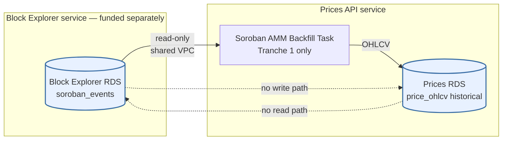

---

## 11. What Is Not Shared (DB-relevant)

The following components are **separate** and funded exclusively by the Prices
API grant:

- **Prices API RDS PostgreSQL instance** (different schema: OHLCV, oracle
  prices, current prices, assets, backfill progress).
- Prices API Lambda functions (separate function definitions, separate IAM
  roles).
- Prices API API Gateway + usage plans.
- Prices API EventBridge rules.
- Prices API Secrets Manager entries.

---

## 12. Tranche-1 DB Acceptance Criteria (verbatim)

The database is provisioned and validated in Tranche 1. Relevant acceptance
criteria from the delivery plan:

1. `cdk deploy` from a clean AWS account (sharing only the existing VPC/S3
   bucket from Block Explorer) produces the full Prices API stack with no
   manual steps.
2. Prices RDS schema matches Section 3 of the source doc: **all tables,
   partitions for current + next 2 months, all indexes present** (verifiable
   via `\d+` psql output).
3. After 24 hours of live operation: `price_ohlcv` contains continuous 1-min
   candles for at least 20 major assets (XLM, USDC, EURC, AQUA, BTC, ETH) with
   no gaps >2 candles.
4. `GET /backfill/status` returns `{"status": "running", "backfill_task_healthy": true}`
   with `backfill_current_ledger` advancing.
5. CloudWatch alarm test: backfill task stopped manually → alarm fires within
   15 minutes (heartbeat watchdog on `backfill_progress.last_heartbeat`).
6. `earliest_data_available` in `GET /backfill/status` shows a date
   approximately 6 months ago.

---

## 13. Quick Reference — Tables at a Glance

| Table               | Partitioning                   | Primary Key                          | Written by                                                                          | Read by                                           |
| ------------------- | ------------------------------ | ------------------------------------ | ----------------------------------------------------------------------------------- | ------------------------------------------------- |
| `assets`            | none                           | `id`                                 | Asset Discovery Lambda; Prices Ledger Processor (inline)                            | All asset/price endpoints                         |
| `price_ohlcv`       | RANGE on `timestamp` (monthly) | `(timestamp, asset_id, granularity)` | Prices Ledger Processor; OHLCV Rollup; Backfill tasks; Cleanup Worker (DELETE/DROP) | `GET /ohlcv`, Current Price Updater               |
| `current_prices`    | none                           | `asset_id`                           | Current Price Updater Lambda                                                        | `GET /assets`, `GET /price`, `POST /prices/batch` |
| `oracle_prices`     | RANGE on `timestamp` (monthly) | `(timestamp, asset_id, oracle_name)` | Oracle Fetcher Lambda; Cleanup Worker (DROP)                                        | `GET /oracles/{asset}`                            |
| `backfill_progress` | none                           | `id` (UNIQUE on `task_name`)         | Backfill ECS tasks — one row per stream (heartbeat cadence is per-task; `sdex_archive` updates every 15 min, `soroban_amm` updates once at completion) | `GET /backfill/status`                            |

---

## 14. Full Database Schema — One-Piece Mermaid Diagram

A single, self-contained Mermaid diagram that combines: the ER schema (all 5
tables with columns, types, PK/FK markers, partitioning hints), the live and
backfill writers, the API readers, the cross-service Block Explorer
read-only edge, and the partition / retention lifecycle. Render this block in
any Mermaid-capable viewer (GitHub, VS Code preview, mermaid.live) to see the
entire database design at a glance.

```mermaid
flowchart TB
    %% ============================================================
    %% LEGEND / STYLES
    %% ============================================================
    classDef store      fill:#e8f1ff,stroke:#3a6ea5,stroke-width:2px,color:#0b2545;
    classDef writer     fill:#e8ffe8,stroke:#3a8a3a,stroke-width:1px,color:#10421a;
    classDef reader     fill:#fff5e0,stroke:#a5853a,stroke-width:1px,color:#523b08;
    classDef external   fill:#f3e8ff,stroke:#6a3a8a,stroke-width:1px,color:#2e0b45;
    classDef alarm      fill:#ffe5e5,stroke:#a53a3a,stroke-width:2px,color:#5a0b0b;
    classDef partition  fill:#eef7ee,stroke:#3a8a3a,stroke-width:1px,color:#10421a;

    %% ============================================================
    %% EXTERNAL / UPSTREAM SOURCES
    %% ============================================================
    subgraph EXT["External / upstream sources"]
        direction LR
        S3ledger[("S3<br/>stellar-ledger-data/<br/>LedgerCloseMeta XDR")]
        Archives[("Stellar Public<br/>History Archives<br/>S3-compatible")]
        Reflector[["Reflector Oracle<br/>(Soroban RPC<br/>simulateTransaction)"]]
        BErds[("Block Explorer RDS<br/>soroban_events<br/>READ-ONLY, shared VPC")]
    end
    class S3ledger,Archives,BErds store
    class Reflector external

    %% ============================================================
    %% WRITERS — LIVE INGESTION
    %% ============================================================
    subgraph LIVE["Live ingestion writers (Rust)"]
        direction TB
        PLP["Prices Ledger Processor<br/>Lambda<br/>S3 PutObject (~5–6 s)"]
        AD["Asset Discovery<br/>Lambda<br/>EventBridge rate(1 hour)"]
        Rollup["OHLCV Rollup<br/>Lambda<br/>EventBridge rate(15 min)"]
        CPU["Current Price Updater<br/>Lambda<br/>EventBridge rate(1 min)"]
        OracleW["Oracle Fetcher<br/>Lambda<br/>EventBridge rate(5 min)"]
        Cleanup["Cleanup Worker<br/>Lambda<br/>EventBridge cron(0 2 * * *)"]
    end
    class PLP,AD,Rollup,CPU,OracleW,Cleanup writer

    %% ============================================================
    %% WRITERS — BACKFILL (one-time + long-running)
    %% ============================================================
    subgraph BF["Backfill writers (ECS Fargate, Rust)"]
        direction TB
        AMM["Soroban AMM Backfill<br/>1 vCPU / 2 GB<br/>Tranche 1 — runs once"]
        SDEX["SDEX Backfill<br/>2 vCPU / 4 GB<br/>continuous, ~150k ledgers/h"]
    end
    class AMM,SDEX writer

    %% ============================================================
    %% PRICES RDS — TABLES (ER-style nodes)
    %% ============================================================
    subgraph RDS["Prices RDS — PostgreSQL 16"]
        direction TB

        Assets["<b>assets</b><br/>━━━━━━━━━━━━━━━━━━━━<br/>id SERIAL PK<br/>asset_code VARCHAR(12)<br/>asset_type VARCHAR(10) CHECK<br/>issuer_address VARCHAR(56)<br/>contract_address VARCHAR(56)<br/>home_domain VARCHAR(255)<br/>is_active BOOLEAN<br/>created_at TIMESTAMPTZ<br/>updated_at TIMESTAMPTZ<br/>━━━━━━━━━━━━━━━━━━━━<br/>UNIQUE(code,issuer,contract)<br/>idx_assets_contract<br/>idx_assets_code"]

        OHLCV["<b>price_ohlcv</b> (PARTITIONED)<br/>━━━━━━━━━━━━━━━━━━━━<br/>asset_id INT (PK part)<br/>timestamp TIMESTAMPTZ (PK part)<br/>granularity VARCHAR(5) (PK part)<br/>open / high / low / close NUMERIC(28,14)<br/>volume_base NUMERIC(28,14)<br/>volume_quote_usd NUMERIC(28,14)<br/>vwap NUMERIC(28,14)<br/>trade_count INT<br/>source VARCHAR(20)<br/>━━━━━━━━━━━━━━━━━━━━<br/>PARTITION BY RANGE(timestamp)<br/>idx_ohlcv_asset_gran<br/>(asset_id, granularity, timestamp DESC)"]

        Current["<b>current_prices</b><br/>━━━━━━━━━━━━━━━━━━━━<br/>asset_id INT PK,FK→assets.id<br/>price_usd NUMERIC(28,14)<br/>price_xlm NUMERIC(28,14)<br/>change_24h_pct NUMERIC(10,4)<br/>change_7d_pct NUMERIC(10,4)<br/>volume_24h_usd NUMERIC(28,14)<br/>market_cap_usd NUMERIC(28,14)<br/>vwap_24h NUMERIC(28,14)<br/>sources JSONB<br/>updated_at TIMESTAMPTZ"]

        OracleP["<b>oracle_prices</b> (PARTITIONED)<br/>━━━━━━━━━━━━━━━━━━━━<br/>asset_id INT (PK part)<br/>oracle_name VARCHAR(30) (PK part)<br/>timestamp TIMESTAMPTZ (PK part)<br/>price_usd NUMERIC(28,14)<br/>raw_data JSONB<br/>━━━━━━━━━━━━━━━━━━━━<br/>PARTITION BY RANGE(timestamp)<br/>idx_oracle_asset<br/>(asset_id, oracle_name, timestamp DESC)"]

        BP["<b>backfill_progress</b><br/>━━━━━━━━━━━━━━━━━━━━<br/>id SERIAL PK<br/>task_name VARCHAR(50) UNIQUE<br/>  (stream identifier)<br/>start_ledger BIGINT<br/>target_ledger BIGINT<br/>current_ledger BIGINT<br/>status VARCHAR(20)<br/>  running | paused | completed | error<br/>rate_per_hour BIGINT<br/>eta_hours NUMERIC(10,1)<br/>last_heartbeat TIMESTAMPTZ<br/>started_at TIMESTAMPTZ<br/>completed_at TIMESTAMPTZ<br/>━━━━━━━━━━━━━━━━━━━━<br/>One row per stream<br/>(seeded with sdex_archive,<br/>soroban_amm)"]

        %% Partition lifecycle (illustrative children of price_ohlcv)
        subgraph PARTS["price_ohlcv monthly partitions (lifecycle)"]
            direction LR
            PFut["price_ohlcv_2026_05<br/>(future, +2 months)"]
            PCur["price_ohlcv_2026_03<br/>(current — live writes)"]
            PArc["price_ohlcv_2025_xx<br/>(archived — coarse only)"]
            PDrop["price_ohlcv_2024_xx<br/>(age &gt; 13 mo — DROP)"]
        end
        class PFut,PCur,PArc,PDrop partition
    end
    class Assets,OHLCV,Current,OracleP,BP store

    %% ============================================================
    %% RELATIONS — SCHEMA (FK + logical references)
    %% ============================================================
    Assets -- "asset_id (FK declared)" --- Current
    Assets -. "asset_id (logical, no FK<br/>partitioned target)" .- OHLCV
    Assets -. "asset_id (logical, no FK<br/>partitioned target)" .- OracleP

    %% Partition pruning relationship (visual hint)
    OHLCV --- PFut
    OHLCV --- PCur
    OHLCV --- PArc
    OHLCV --- PDrop

    %% ============================================================
    %% WRITES (live ingestion)
    %% ============================================================
    S3ledger -->|"PutObject event"| PLP
    PLP -->|"1m candles"| OHLCV
    PLP -->|"upsert new assets"| Assets
    AD -->|"new SEP-41 / classic issuances"| Assets
    Rollup -->|"read 1m"| OHLCV
    Rollup -->|"write 15m/1h/4h/1d/1w/1M"| OHLCV
    CPU -->|"read latest candles"| OHLCV
    CPU -->|"VWAP upsert"| Current
    Reflector -->|"simulateTransaction"| OracleW
    OracleW -->|"oracle prices"| OracleP

    %% Cleanup
    Cleanup -->|"DELETE 1m &gt; 7d<br/>DELETE 15m &gt; 30d"| OHLCV
    Cleanup -->|"DROP age &gt; 13 mo<br/>CREATE +2 months ahead"| OHLCV
    Cleanup -->|"DROP / CREATE partitions"| OracleP

    %% ============================================================
    %% WRITES (backfill — into historical partitions)
    %% ============================================================
    BErds -->|"read-only<br/>contract_id IN (Soroswap,<br/>Aquarius, Phoenix)"| AMM
    AMM -->|"historical OHLCV"| PArc
    AMM -->|"status = completed"| BP

    Archives -->|"ledger range reads<br/>oldest → newest"| SDEX
    SDEX -->|"historical OHLCV"| PArc
    SDEX -->|"current_ledger + heartbeat<br/>every 15 min"| BP

    %% ============================================================
    %% ALARM
    %% ============================================================
    BP -->|"last_heartbeat &gt; 10 min stale"| Alarm["CloudWatch Alarm<br/>→ SNS (email + Slack)"]
    class Alarm alarm

    %% ============================================================
    %% READERS — API endpoints
    %% ============================================================
    subgraph API["Public API (API Gateway → Lambda axum)"]
        direction TB
        R1["GET /assets"]
        R2["GET /assets/:id"]
        R3["GET /assets/:id/price"]
        R4["GET /assets/:id/ohlcv"]
        R5["POST /prices/batch"]
        R6["GET /oracles/:id"]
        R7["GET /backfill/status"]
    end
    class R1,R2,R3,R4,R5,R6,R7 reader

    R1 --> Current
    R1 --> Assets
    R2 --> Assets
    R2 --> Current
    R3 --> Current
    R4 --> OHLCV
    R5 --> Current
    R6 --> OracleP
    R7 --> BP
```

**How to read the diagram**

- **Blue cylinders** are persistent stores (Prices RDS tables, S3, Block
  Explorer RDS, history archives).
- **Green nodes** are writers (Lambdas + ECS Fargate backfill tasks).
- **Yellow nodes** are public API endpoints (readers).
- **Purple nodes** are external services (e.g. Reflector via Soroban RPC).
- **Red node** is the CloudWatch alarm fed by `backfill_progress.last_heartbeat`.
- **Light-green nodes** inside `price_ohlcv` represent illustrative monthly
  partitions in different phases of the retention lifecycle (future, current,
  archived, eligible for `DROP`).
- Solid lines are runtime dataflow; dashed lines are logical schema
  references that are not declared as SQL foreign keys (because the target is
  a partitioned table).

---

## 15. PostgreSQL Tables Only — One-Piece Mermaid ER Diagram

A focused, schema-only view: just the five PostgreSQL tables, every column
with its SQL type, primary keys, foreign keys, unique constraints, and
partitioning hints. No workers, no API endpoints, no external services.

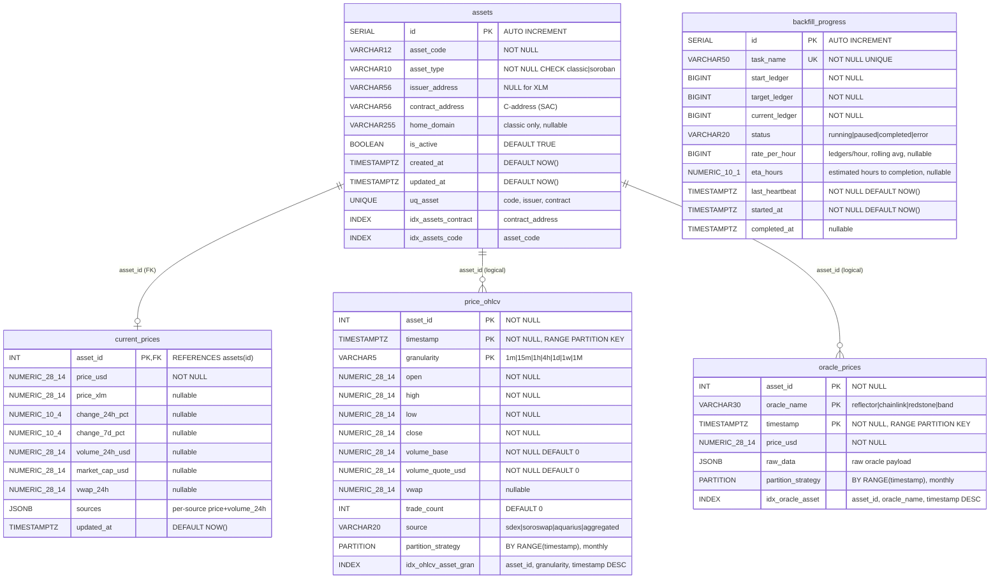

**Notes on the diagram**

- `assets ||--o| current_prices` is a real SQL foreign key
  (`current_prices.asset_id REFERENCES assets(id)`).
- `assets ||--o{ price_ohlcv` and `assets ||--o{ oracle_prices` are drawn
  with the same relationship glyph but are **logical-only** references —
  there is no `REFERENCES` clause in the DDL, because foreign keys to a
  partitioned table's child are expensive on high-write time-series tables.
  The `(logical)` label on each edge is the only marker; Mermaid ER does
  not support a separate "non-enforced" line style.
- Underscored type names like `NUMERIC_28_14` and `VARCHAR12` are Mermaid
  ER-syntax stand-ins for `NUMERIC(28,14)` and `VARCHAR(12)` respectively
  (Mermaid ER does not allow parentheses inside type tokens).
- `PARTITION` "rows" are not real columns — they are pinned to the bottom of
  the entity to surface the partitioning strategy and shipped indexes.

---

_This document is a derivative of `docs/prices-api-general-overview.md`. If
the source design changes, regenerate this file to keep it in sync._
