# Prices API — Database Schema Overview

> Database-focused companion to `docs/prices-api-general-overview.md`.
> This document extracts and consolidates **every database-related detail** from the
> general overview: schema (DDL), partitioning strategy, sort keys, retention policy,
> cross-cloud sizing, workers that touch the database, security posture, the
> cross-service Block Explorer dependency, and how backfill interacts with the
> live partitions. SQL is reproduced from the source document.

## Revision History

| Date       | Sections                               | Driver                                                                                                                                                                           | Summary                                                                                                                                                                                                                                                                                                                                                                                                                                                                                                                                                                                                                                                                                 |
| ---------- | -------------------------------------- | -------------------------------------------------------------------------------------------------------------------------------------------------------------------------------- | --------------------------------------------------------------------------------------------------------------------------------------------------------------------------------------------------------------------------------------------------------------------------------------------------------------------------------------------------------------------------------------------------------------------------------------------------------------------------------------------------------------------------------------------------------------------------------------------------------------------------------------------------------------------------------------- |
| 2026-06-11 | §3.2 §3.0, Schema source-of-truth refs | [Task 0060](../../lore/1-tasks/active/0060_FEATURE_prices-clickhouse-crate-combined-backfill-sizing/README.md)                                                                   | **Schema implemented as the `packages/prices-clickhouse` crate** (`schema/init.sql` = 12 tables, source of truth; `rollups.sql` = refreshable-MV chain; `preroll.sql` = full-range re-aggregate). Built + applied on a local ClickHouse 25.6 and validated by a combined SDEX + soroban (oracle) backfill. **Sizing finding:** measured ~3.6 KB/ledger over a 10k-ledger sample (≈48× the prior 74 B/ledger task-0046 estimate), driven by ~4,343-asset pair diversity (317k 1m candles) and short-window rollups that don't yet amortize. `assets` implemented with `String` (not `FixedString`) columns to match the writer contract. See task 0060 `notes/G-measurement-results.md`. |
| 2026-05-20 | All sections + Appendices A & B        | [ADR 0007](../../lore/2-adrs/0007_live-data-sink-on-shared-hetzner-clickhouse.md) (accepted) · [Task 0049](../../lore/1-tasks/active/0049_DOCS_overview-rewrite-for-adr-0007.md) | **Live data sink flipped from Prices-owned RDS PostgreSQL 16 to BE's shared Hetzner ClickHouse cluster** (separate `prices` database, isolated via CH multi-tenant primitives). Schema rewritten to per-source `ReplacingMergeTree(version)` rows on per-granularity tables (`price_ohlcv_1m`, `_15m`, …, `_1M`) feeding a materialised-view rollup chain that eliminates the OHLCV Rollup Lambda. Cleanup becomes `ALTER TABLE … DROP PARTITION`. All 14 mermaid blocks (including Appendices A and B) updated to ClickHouse types, engines, sort keys, MV chain, and the mTLS edge. RDS sizing/scaling ladder removed; Hetzner cost-share added (~$1-2/env/mo per task 0046).         |

---

## 1. Database Role in the System

The Prices API uses a separate **`prices` database** inside the **BE-shared Hetzner
ClickHouse cluster** as its primary data store (ADR 0007). It is the system of record for:

- Tracked **assets** (classic and Soroban tokens)
- **OHLCV** price candles at multiple granularities (1m, 15m, 1h, 4h, 1d, 1w, 1M),
  stored as per-source rows on per-granularity tables
- **Current price** snapshots (denormalized aggregate per asset, cross-source VWAP)
- **Oracle prices** (Reflector cross-reference, optionally other oracles)
- **Backfill progress** state (used by the public `GET /backfill/status` endpoint)

The database sits between the ingestion pipeline (Lambda writers, no VPC) and the
public API handlers (Lambda readers behind API Gateway). All Lambda → CH traffic
flows over the public internet to Caddy:443 and is gated by mTLS, with per-env
client certificates loaded from AWS Secrets Manager.

### 1.1 Position in the API Layer

```
                         ┌────────────────────────────────┐
                         │       AWS API Gateway           │
                         │  (REST API, rate limiting,      │
                         │   API keys, throttling,         │
                         │   built-in response caching)    │
                         └────────────┬───────────────────┘
                                      │
                         ┌────────────▼─────────────┐
                         │      AWS Lambda           │
                         │  (API handler functions)  │
                         │   Rust / axum             │
                         │   (no VPC; outbound only) │
                         └────────────┬─────────────┘
                                      │ HTTPS-mTLS (public internet)
                                      │ client cert from Secrets Manager
                                      ▼
                  ┌─────────────────────────────────────┐
                  │  Caddy:443 reverse proxy             │
                  │  (Hetzner, BE-managed; mTLS termin.) │
                  └────────────┬────────────────────────┘
                                      │
                  ┌─────────────────────────────────────┐
                  │  ClickHouse `prices` database        │
                  │  (shared Hetzner cluster, BE-funded; │
                  │   separate database from BE's        │
                  │   `default.*`, ADR 0007)             │
                  └─────────────────────────────────────┘
```

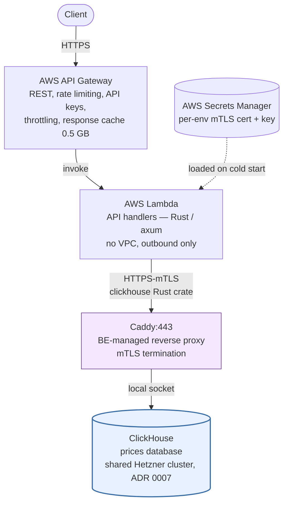

### 1.2 Position in the Data Ingestion Layer

```
       ┌────────────────────────┐      ┌──────────────────────────┐
       │  Hetzner ClickHouse    │◄─────│  EventBridge-triggered    │
       │  `prices` database     │      │  Lambda workers (Rust):   │
       │  (shared, ADR 0007)    │      │  - Current Price Updater  │
       └────────────────────────┘      │  - Oracle Fetcher         │
              ▲                        │  - Asset Discovery        │
              │ MV chain               │  - Cleanup Worker         │
              │ 1m → 15m → 1h →        └──────────────────────────┘
              │ 4h → 1d → 1w → 1M
              │ (replaces OHLCV Rollup Lambda)
```

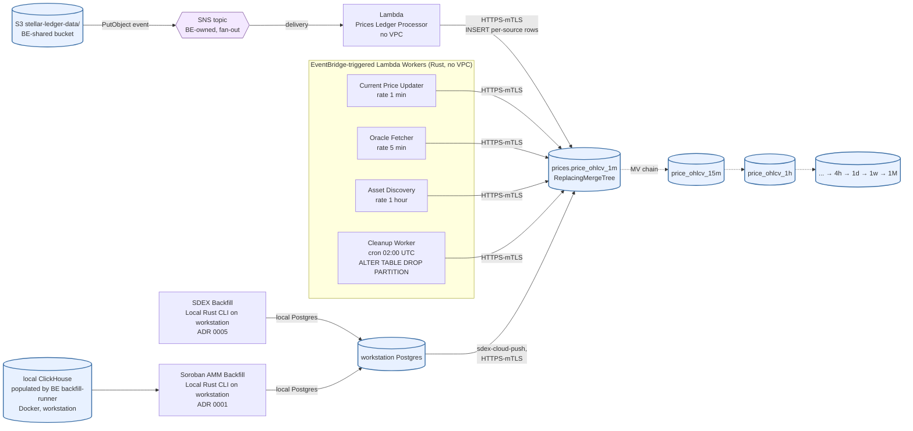

Live writes come from the **Prices Ledger Processor** Lambda (SNS-driven via the
`stellar-ledger-data/` bucket fan-out topic, ~one ledger every 5–6 s). Background
workers re-aggregate (Current Price Updater for VWAP), denormalize, and clean up.
**Rollups happen inside ClickHouse** via the MV chain on `price_ohlcv_1m` — the
OHLCV Rollup Lambda from the prior design is eliminated (ADR 0007 §3.4). The
historical **Backfill** is workstation-local (ADRs 0001 / 0005); accumulated rows
are pushed to the Hetzner cluster via separate post-backfill tools.

---

## 2. Database Tech Stack

| Component              | Technology                                                                                                                                                                |
| ---------------------- | ------------------------------------------------------------------------------------------------------------------------------------------------------------------------- |
| Database engine        | **ClickHouse** on BE's shared Hetzner cluster (separate `prices` database, ADR 0007)                                                                                      |
| Storage engines        | `ReplacingMergeTree(version)` for OHLCV; `ReplacingMergeTree(updated_at)` for `current_prices` / `assets` / `backfill_progress`; `ReplacingMergeTree` for `oracle_prices` |
| Rollups                | Chain of CH materialised views: `price_ohlcv_1m → _15m → _1h → _4h → _1d → _1w → _1M` (replaces the OHLCV Rollup Lambda)                                                  |
| Partitioning           | `PARTITION BY toYYYYMM(timestamp)` on every OHLCV/oracle table; cleanup via `ALTER TABLE … DROP PARTITION`                                                                |
| Database client (Rust) | [`clickhouse`](https://crates.io/crates/clickhouse) — async, native protocol over HTTPS-mTLS                                                                              |
| Schema tooling         | Plain SQL DDL applied by the prices-api schema applier on first deploy; prices-api owns `prices.*` migrations unilaterally (ADR 0007 §3.7)                                |
| Hosting                | BE-managed Hetzner box behind Caddy:443; cross-cloud (AWS → Hetzner) hop, ~80–130 ms RTT mitigated by warm connection reuse and batched per-ledger writes                 |
| Credentials            | AWS Secrets Manager — per-env client cert + key for Caddy mTLS (2 secrets per env)                                                                                        |

**Why ClickHouse on a BE-shared cluster (ADR 0007):**

- Eliminates one production DB the prices-api would otherwise own (RDS).
- Cost-share at empirical scale (~0.45 GB/yr, ~74 bytes/ledger, 14.8× compression
  per task 0046) is ~1-2% pro-rata, i.e. ~$1–2/env/mo vs. $12+/mo for the
  smallest RDS instance and substantially more at any scale-up tier.
- Columnar storage + `LowCardinality(String)` for the `source` column drives down
  per-row footprint for the per-source OHLCV shape (ADR 0004).
- Materialised-view rollup chain replaces a scheduled Lambda — one fewer moving
  part to operate.
- `ReplacingMergeTree(version)` makes re-ingestion (replay, retry, backfill
  overlap) idempotent without `ON CONFLICT … DO UPDATE` machinery (ADR 0007 §3.3).

**Why monthly partitions via `toYYYYMM(timestamp)`:**

- Queries with `WHERE timestamp > X` only scan relevant monthly partitions
  (partition pruning).
- Retention is `ALTER TABLE prices.price_ohlcv_1m DROP PARTITION '202503'` —
  instant, no per-row DELETE, no vacuum.
- Backfill writes into old monthly partitions of the higher-granularity tables
  directly (skipping the MV chain since rolled candles are produced by the
  backfill itself), alongside live writes into the current partition of
  `_1m`. ClickHouse's MergeTree-family engines are safe under concurrent
  inserts.

---

## 3. Schema (ClickHouse on shared Hetzner cluster, ADR 0007)

All tables live in the `prices` database inside BE's shared Hetzner ClickHouse
cluster. Schema ownership: prices-api owns `prices.*` migrations unilaterally;
cross-database reads against `default.*` (if any) are wrapped in named `prices.*`
views (ADR 0007 §3.7). Numeric columns use `Decimal(38, 14)` to preserve
precision across price/volume aggregation; the sort key on every OHLCV table is
`(asset_id, quote_asset_id, source, timestamp)` so per-(asset, quote, source)
time-series scans are O(log N).

### 3.0 Entity-Relationship Overview

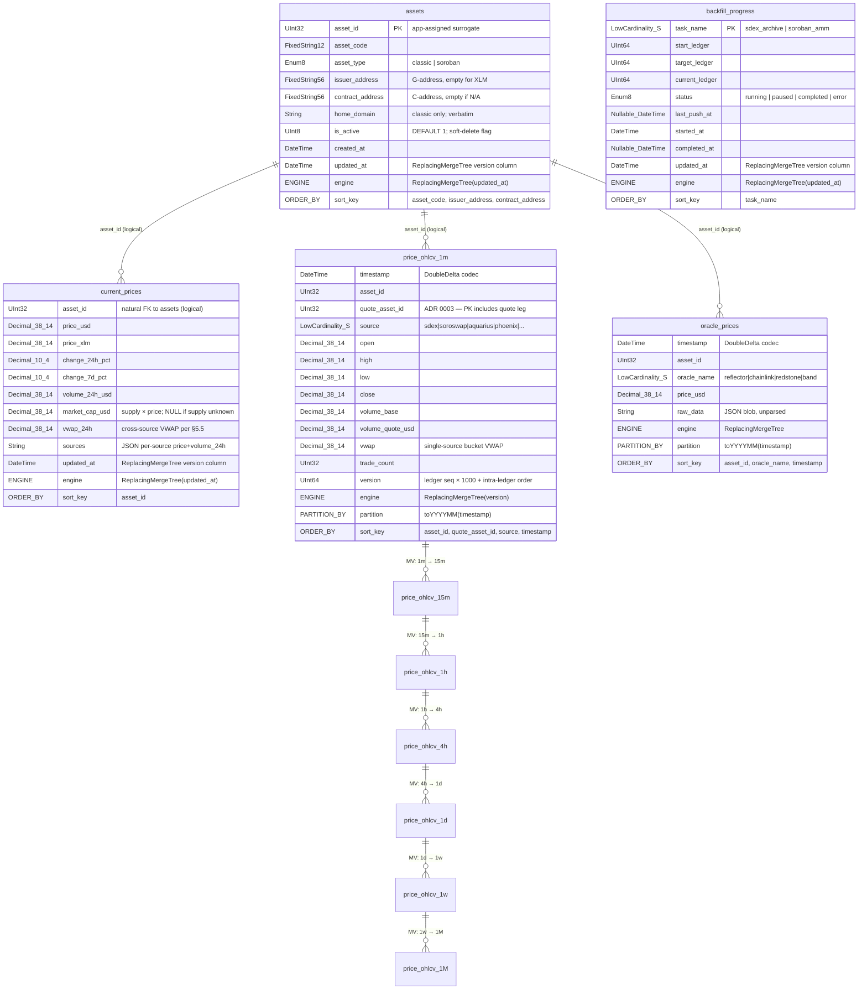

> **Notes on the diagram.** There are no SQL foreign keys (ClickHouse does
> not enforce them); every `asset_id` reference is logical. The "1:1" /
> "1:N" cardinality glyphs reflect the application-level relationship, not
> a declared constraint. Mermaid ER syntax does not allow parentheses or
> commas inside type tokens, so `Decimal(38, 14)` appears as `Decimal_38_14`
> and `LowCardinality(String)` as `LowCardinality_S`. `FixedStringN` likewise
> stands in for `FixedString(N)`. `ENGINE`, `PARTITION_BY`, and `ORDER_BY`
> "pseudo-rows" surface the storage-engine metadata that drives merges,
> partition pruning, and primary-index layout.

> **MV chain edges.** The arrows from `price_ohlcv_1m` down through `_15m`,
> `_1h`, `_4h`, `_1d`, `_1w`, `_1M` represent the materialised-view
> rollup chain (ADR 0007 §3.4). Each step is a refreshable CH MV that
> re-aggregates the parent granularity (read `FINAL`) into the next coarser
> one on a refresh schedule — not on INSERT (task 0059; see §3.2).
> This replaces the OHLCV Rollup Lambda from the prior design.

### 3.1 `prices.assets`

Master registry of every tracked asset (classic Stellar assets and Soroban
SEP-41 tokens). Maintained by the **Asset Discovery** Lambda (EventBridge
hourly) which scans `LedgerCloseMeta` for new classic asset issuances and new
SEP-41 contract deployments and UPSERTs into this table.

```sql
CREATE TABLE prices.assets (
    asset_id         UInt32,            -- application-assigned surrogate id
    asset_code       FixedString(12),
    asset_type       Enum8('classic' = 1, 'soroban' = 2),
    issuer_address   FixedString(56),   -- G-address; empty string for XLM
    contract_address FixedString(56),   -- C-address (SAC or native contract); empty if N/A
    home_domain      String,            -- classic assets only; stored verbatim
    is_active        UInt8 DEFAULT 1,   -- soft-delete flag; readers filter `is_active = 1`
                                        -- unless ?include_inactive=true is set
    created_at       DateTime DEFAULT now(),
    updated_at       DateTime DEFAULT now()
)
ENGINE = ReplacingMergeTree(updated_at)
ORDER BY (asset_code, issuer_address, contract_address)
SETTINGS index_granularity = 8192;
```

**Notes:**

- `asset_id` is an **application-assigned surrogate** (a small `UInt32` counter
  materialised in the prices-api write path), not the asset's on-chain identity.
  ClickHouse does not have `SERIAL` / sequences — the writer assigns the next
  unused id on UPSERT against the natural key tuple.
- `issuer_address` is empty (zero-padded `FixedString(56)`) for XLM (the
  native asset). `FixedString(56)` is preferred over `String` for fixed-width
  strkeys because it stores in column-store as fixed-width slots, with better
  compression and tighter sort-key handling.
- `contract_address` is the C-address (Stellar Asset Contract or native
  contract); also empty for purely classic assets that have not been wrapped.
- The `(asset_code, issuer_address, contract_address)` triple is the natural
  key and is the table's `ORDER BY` clause, so reads by identity are O(log N).
- `home_domain` is the federation host advertised by the issuing account
  (set via Stellar's `set_options` operation). The Asset Discovery Lambda
  copies the string verbatim into this column with no validation or
  normalisation. Consumers that need a canonical form should normalise on read.
- `is_active` is a **soft-delete flag**, not a discovery state. New rows
  inserted by the Asset Discovery Lambda default to `1`. The backend may set
  it to `0` to hide an asset from `GET /assets` and the price-update path
  without removing its `price_ohlcv` / `oracle_prices` history. Readers should
  filter `WHERE is_active = 1` by default.
- The engine is `ReplacingMergeTree(updated_at)`: writes that bump
  `updated_at` collapse duplicate rows on background merge, last-write-wins.
  Asset Discovery re-UPSERTs idempotently — the rate is hourly, so the
  collapsed-row window is comfortably within merge cadence.

#### Filtering / sorting on small tables (no B-tree indexes in ClickHouse)

`GET /assets?type=classic|soroban|all` is a documented filter. ClickHouse does
not have B-tree secondary indexes the way PostgreSQL does, so the design
decision is different from the prior Postgres-shaped doc:

| Reason                                                                      | Detail                                                                                                                                                                                                                                                                                                                               |
| --------------------------------------------------------------------------- | ------------------------------------------------------------------------------------------------------------------------------------------------------------------------------------------------------------------------------------------------------------------------------------------------------------------------------------ |
| **The table is small.**                                                     | `assets` is one row per tracked asset — Tranche 1 ships with ~20, realistic upper bound is ≤10k. The whole table sits comfortably in CH's data parts on a single MergeTree merge. A `SELECT … WHERE asset_type = 'classic'` is a scan over the merged data parts; at <10k rows it's sub-millisecond regardless of indexing strategy. |
| **The `ORDER BY` key is `(asset_code, issuer_address, contract_address)`.** | Reads by identity (lookups for `GET /assets/{asset_identifier}`) are O(log N) via the sparse primary index. Filters by `asset_type` or `is_active` are full-scans, but the table is small enough that this is not measurable.                                                                                                        |
| **List-sorted reads use `current_prices`.**                                 | `GET /assets?sort=volume_24h` orders by a `prices.current_prices` column, not an `assets` column. The handler issues `SELECT … FROM prices.current_prices FINAL JOIN prices.assets ON …`; the order/limit happens against `current_prices`, which is itself sorted by `asset_id`. With <10k assets the scan is bounded.              |

**When to revisit:** if the assets table grows past ~100k rows _and_ a sorted
read becomes hot, add a CH `MaterializedView` projecting `current_prices`
into the sort order the API needs. Don't reach for secondary indexes —
projections / MVs are the CH idiom.

### 3.2 `prices.price_ohlcv_*` — per-granularity, per-source OHLCV

Time-series OHLCV candles at multiple granularities. **One table per
granularity** (`price_ohlcv_1m`, `_15m`, `_1h`, `_4h`, `_1d`, `_1w`, `_1M`)
with identical row shape; each is `ReplacingMergeTree(version)` and
partitioned monthly via `toYYYYMM(timestamp)`. Rollups happen automatically
via a chain of materialised views attached to `_1m`.

**Per-source rows (ADR 0004).** Each table carries one row per
`(timestamp, asset_id, quote_asset_id, source)` — cross-source merging
happens at read time (§5 / ADR 0007 §3.3), not at write time. This drops the
historical `source = 'aggregated'` convention used by the prior Postgres
design.

```sql
CREATE TABLE prices.price_ohlcv_1m (
    timestamp        DateTime CODEC(DoubleDelta),
    asset_id         UInt32,
    quote_asset_id   UInt32,                  -- ADR 0003: PK includes the quote leg
    source           LowCardinality(String),  -- 'sdex', 'soroswap', 'aquarius', 'phoenix', ...
    open             Decimal(38, 14),
    high             Decimal(38, 14),
    low              Decimal(38, 14),
    close            Decimal(38, 14),
    volume_base      Decimal(38, 14) DEFAULT 0,
    volume_quote     Decimal(38, 14) DEFAULT 0,  -- native quote-asset volume (sum of
                                                  -- quote-leg amounts); the decoder already
                                                  -- computes this to derive vwap. Oracle-
                                                  -- multiplied into volume_quote_usd by the
                                                  -- enrichment Lambda (task 0026)
    volume_quote_usd Decimal(38, 14) DEFAULT 0,  -- USD-denominated; filled by task 0026
    vwap             Decimal(38, 14),         -- single-source, single-minute VWAP
                                               -- (volume_quote / volume_base);
                                               -- see §5.5 of the main overview
                                               -- for cross-source weighting
    trade_count      UInt32 DEFAULT 0,
    version          UInt64                   -- monotonic per-row version for
                                               -- ReplacingMergeTree (ledger_seq × 1000
                                               -- + intra-ledger order)
)
ENGINE = ReplacingMergeTree(version)
PARTITION BY toYYYYMM(timestamp)
ORDER BY (asset_id, quote_asset_id, source, timestamp)
SETTINGS index_granularity = 8192;

-- Identical shape for the rolled-up granularities; populated by the MV chain below.
CREATE TABLE prices.price_ohlcv_15m AS prices.price_ohlcv_1m;
CREATE TABLE prices.price_ohlcv_1h  AS prices.price_ohlcv_1m;
CREATE TABLE prices.price_ohlcv_4h  AS prices.price_ohlcv_1m;
CREATE TABLE prices.price_ohlcv_1d  AS prices.price_ohlcv_1m;
CREATE TABLE prices.price_ohlcv_1w  AS prices.price_ohlcv_1m;
CREATE TABLE prices.price_ohlcv_1M  AS prices.price_ohlcv_1m;
```

**Sort key:** `(asset_id, quote_asset_id, source, timestamp)` — places the
join-cardinality-low columns first so per-(asset, quote, source) time-series
scans walk a contiguous block of the sorted data parts, and the `timestamp`
sub-key inside that block gives O(log N) range scans.

**Source values (example):** `'sdex'`, `'soroswap'`, `'aquarius'`,
`'phoenix'`. `LowCardinality(String)` stores these as 16-bit dictionary
indices; per-row cost is trivial.

> #### ⚠️ Requirement — engine MUST be `ReplacingMergeTree(version)` (enrichment idempotency)
>
> Confirmed by the BE cross-team contract (task 0026 question C.4, 2026-06-09):
> `price_ohlcv_*` **must** be `ReplacingMergeTree(version)` — **not** a plain
> `MergeTree`. The `volume_quote_usd` enrichment Lambda (task 0026) does **not**
> `ALTER TABLE … UPDATE` the zero-valued rows. ClickHouse has no efficient
> in-place update, so enrichment instead **re-INSERTs a corrected copy of the row
> with a strictly-greater `version`**, and the engine collapses the pair to the
> enriched winner on the next background merge. This load-bearing invariant holds:
>
> - **Engine = `ReplacingMergeTree(version)`.** On a plain `MergeTree` the zero
>   row and the enriched row would coexist forever, double-counting every read.
> - **Enriched re-inserts carry `version = original_version + 1`.** The
>   ledger-derived `version` of the source row + 1 guarantees the enriched copy
>   wins the dedup. If a later legitimate write to the same bucket arrives with a
>   higher ledger-derived version, it wins and resets `volume_quote_usd = 0`; the
>   next enrichment pass re-enriches it (self-healing).
> - **Reads that must reflect enrichment use `SELECT … FINAL`.** Background merges
>   are asynchronous, so between the enrich INSERT and the next merge both versions
>   physically coexist; `FINAL` forces the collapse at query time. The enrichment
>   pass itself reads candidates via `FINAL WHERE volume_quote_usd = 0`, which is
>   also what makes re-running it idempotent.
> - **`volume_quote` is required input.** Enrichment computes
>   `volume_quote_usd = oracle_price_usd × volume_quote` (exact), so the decoder/
>   writer (task 0038 + backfills) must populate the `volume_quote` column above.

#### Rollup chain — materialised views

The 1m → 15m → 1h → 4h → 1d → 1w → 1M rollup runs **inside ClickHouse** as a
chain of **refreshable** materialised views (no OHLCV Rollup Lambda — ADR 0007
§3.4). Each MV **re-aggregates the whole bucket from the previous granularity
read `FINAL`** on a schedule, rather than summing the inserted block. Reading
`FINAL` means each refresh sees the deduplicated, **enrichment-corrected**
source (task 0026 re-INSERTs corrected `_1m` rows), so corrections propagate up
the chain by construction and there is no partial-block under-count.

> **Why not a plain insert-trigger MV?** A ClickHouse insert-trigger MV
> aggregates only the _inserted block_, not the whole bucket. Because a
> 15-minute bucket arrives as ~15 separate per-minute INSERTs, an insert-trigger
> `sum()` into a `ReplacingMergeTree` target keeps only one partial per bucket
> (~15× under-count) and never reflects enrichment re-inserts. Task **0059**
> proved this against CH 24.8.14 and chose the refreshable / re-aggregate
> pattern below — see its
> [G-note](../../lore/1-tasks/active/0059_FEATURE_mv-rollup-version-propagation-enriched-reinserts/notes/G-rollup-version-propagation-decision.md)
>
> - `proof/`. An ADR-0007 amendment recording this is pending.

Sketch DDL for the first step; the others mirror the same pattern with
different `toStartOfInterval` durations and source/target table names (each
reads the _previous_ granularity `FINAL`):

```sql
CREATE MATERIALIZED VIEW prices.mv_ohlcv_1m_to_15m
REFRESH EVERY 1 MINUTE                    -- coarser grains refresh less often
TO prices.price_ohlcv_15m AS
SELECT
    toStartOfInterval(timestamp, INTERVAL 15 MINUTE) AS timestamp,
    asset_id,
    quote_asset_id,
    source,
    argMin(open,  timestamp)        AS open,
    max(high)                        AS high,
    min(low)                         AS low,
    argMax(close, timestamp)         AS close,
    sum(volume_base)                 AS volume_base,
    sum(volume_quote)                AS volume_quote,
    sum(volume_quote_usd)            AS volume_quote_usd,
    volume_quote_usd / nullIf(volume_base, 0) AS vwap,   -- ref aliases, never re-sum(…)
    sum(trade_count)                 AS trade_count,
    max(version)                     AS version
FROM prices.price_ohlcv_1m FINAL             -- post-dedup, post-enrichment
WHERE timestamp >= now() - INTERVAL 2 HOUR   -- bounded re-scan; widen for coarse grains
GROUP BY timestamp, asset_id, quote_asset_id, source;

-- Repeat for 15m → 1h, 1h → 4h, 4h → 1d, 1d → 1w, 1w → 1M — each FROM the
-- previous granularity FINAL.
```

Two correctness points task 0059 established (both required of the final DDL):

- **`vwap` references the summed aliases** (`volume_quote_usd / nullIf(
volume_base, 0)`), never `sum(…)/sum(…)` — re-summing an aliased column nests
  aggregate-in-aggregate and fails with `Code: 184 ILLEGAL_AGGREGATION`.
- **Version projection.** A _true_ Refreshable MV atomically replaces the target
  each refresh, so `version = max(version)` is fine. If a cluster's CH version
  forces a scheduled `INSERT … SELECT … FROM _1m FINAL` into a
  `ReplacingMergeTree` instead, `max(version)` is **insufficient** — enriching
  an early minute leaves the bucket max unchanged, tying the stale and corrected
  rollup rows; project a strictly-increasing version (`sum(version)` or a
  refresh epoch) there.

Refreshable MVs require ClickHouse ≥ 23.12; the exact mechanism (refreshable MV
vs. scheduled re-aggregate) is finalised in task **0051** against the Hetzner
cluster's CH version. The implemented DDL now lives in the
**`packages/prices-clickhouse`** crate (task 0060) — `schema/init.sql` (12
tables, the source of truth, applied by `prices-clickhouse-init`),
`schema/rollups.sql` (the refreshable-MV chain), and `schema/preroll.sql` (the
deterministic full-range re-aggregate used by backfill / the sizing
measurement). Implementation note: `assets` uses `String` (not `FixedString`)
columns there, matching the proven `sdex-backfill` writer contract; the
footprint difference is negligible.

#### Write semantics — INSERT with `ReplacingMergeTree(version)`

All writers (live `Prices Ledger Processor`, the MV chain, both backfill
streams) issue plain `INSERT` statements that produce one row per
`(timestamp, asset_id, quote_asset_id, source)` per minute the source
contributed to. **Duplicate-PK rows from re-ingestion are collapsed by the
engine on background merge**, ordered by the `version` column — no
`ON CONFLICT … DO UPDATE` and no incremental-merge expressions are needed at
write time.

| Scenario                            | Why this Just Works on CH                                                                                                                                                                                                                                                                                     |
| ----------------------------------- | ------------------------------------------------------------------------------------------------------------------------------------------------------------------------------------------------------------------------------------------------------------------------------------------------------------- |
| Multiple ledgers in the same minute | The Prices Ledger Processor is invoked per SNS message (~5–6 s per ledger), so ~10–12 invocations land within one minute. Each emits its own row(s); the engine collapses on the next merge, keeping the highest `version`. Live read path uses `FINAL` or `argMax/argMin + GROUP BY` to see the merged view. |
| Backfill restart from checkpoint    | The SDEX backfill CLI tracks `current_ledger` in `prices.backfill_progress` and resumes from its last checkpoint. Re-ingestion of a partially-processed ledger writes duplicate-PK rows that collapse on merge.                                                                                               |
| Backfill / live overlap             | If a backfill chunk's tip-end overlaps with live writes, the engine collapses on `version` — backfill chunks carry their own (`ledger_seq × 1000 + intra_ledger_order`) version, so live writes (higher version, newer ledgers) win deterministically.                                                        |

**Per-bucket VWAP (single-source, single-minute) is computed at write time**
as `volume_quote_usd / volume_base`. The **cross-source weighted price**
(§5.5 of the main overview) is computed one layer up by the Current Price
Updater Lambda — see the L1/L2/L3 layering table in the overview.

**Eventual consistency.** `ReplacingMergeTree(version)` collapses duplicates
in the background; reads briefly see un-merged rows. Read handlers use
`SELECT … FROM prices.price_ohlcv_1m FINAL` or an explicit
`argMax/argMin + GROUP BY` re-aggregation (ADR 0007 §3.3). Both patterns
were verified workable in task 0044 §2; trade-off acknowledged in ADR 0007
§Negative.

**Backfill writes vs. live ingestion.** Monthly partitions separate historical
writes (old month partitions) from live writes (current month partition);
ClickHouse's MergeTree-family engines are safe under concurrent inserts.
Backfill chunks that pre-roll higher granularities write directly to the
target table (`_1d`, `_1h`, …) — they coexist with the rollup MVs, whose
bounded refresh window (see §3.2) only re-aggregates _recent_ buckets, leaving
historical backfilled partitions untouched.

### 3.3 `prices.current_prices` — Materialised / cached current state

One row per asset. Written by the **Current Price Updater** Lambda
(EventBridge `rate(1 minute)`), which reads the latest per-source candles from
`prices.price_ohlcv_1m`, computes a cross-source VWAP per §5.5 of the main
overview, and INSERTs here. The engine is `ReplacingMergeTree(updated_at)`;
duplicates from re-run cycles collapse on background merge. This table exists
to keep `GET /price` and `GET /assets` cheap (no real-time aggregation on the
read path).

```sql
CREATE TABLE prices.current_prices (
    asset_id         UInt32,
    price_usd        Decimal(38, 14),
    price_xlm        Decimal(38, 14),
    change_24h_pct   Decimal(10, 4),
    change_7d_pct    Decimal(10, 4),
    volume_24h_usd   Decimal(38, 14),
    market_cap_usd   Decimal(38, 14),     -- token_supply × price_usd; NULL if supply
                                           -- unavailable. Supply is read from the
                                           -- asset's token contract (Soroban
                                           -- `total_supply` / SEP-41) for SAC/Soroban
                                           -- assets; classic assets without a SAC
                                           -- fall back to Horizon's /assets endpoint
    vwap_24h         Decimal(38, 14),
    sources          String,              -- JSON: per-source {price, volume_24h};
                                           -- see canonical shape below
    updated_at       DateTime DEFAULT now()
)
ENGINE = ReplacingMergeTree(updated_at)
ORDER BY (asset_id)
SETTINGS index_granularity = 8192;
```

**Notes:**

- `sources` is a **JSON object stored as `String`** (ClickHouse has no native
  JSONB type; `String` + application-side serialisation is the canonical
  idiom). Canonical shape:

  ```json
  {
    "sdex": { "price": "1.0001", "volume_24h": "800000" },
    "soroswap": { "price": "1.0002", "volume_24h": "500000" },
    "aquarius": { "price": "1.0001", "volume_24h": "223400" }
  }
  ```

  - Numeric values are serialised as JSON **strings** to preserve the full
    `Decimal(38, 14)` precision through the wire round-trip.
  - One key per source that passed the `min_volume_usd` and outlier-detection
    filters in that update cycle; sources excluded that cycle are absent from
    the object.
  - `GET /assets/{id}/price` returns this object verbatim. `GET /assets`
    returns the same object — the list endpoint exposes the full source
    breakdown.

- **No SQL foreign key** to `prices.assets`. ClickHouse does not enforce FKs;
  `asset_id` here is a logical reference. The "1:1" cardinality is an
  application-level invariant maintained by the Current Price Updater
  (one INSERT per asset per cycle).
- `market_cap_usd` is computed by the Current Price Updater Lambda as
  `token_supply * price_usd`. `token_supply` is fetched from the asset's
  token contract — for Soroban assets and SACs this is a `total_supply`
  contract call; classic assets without a SAC fall back to Horizon's
  `/assets` endpoint. The cell is left NULL when the supply call fails or
  the asset has no contract registered; consumers must treat the field as
  nullable.
- The engine is `ReplacingMergeTree(updated_at)`: each minute's INSERT
  produces a new row with a fresh `updated_at`; background merges collapse
  to the latest per asset. Read handlers use `SELECT … FINAL` or
  `argMax(…, updated_at) … GROUP BY asset_id` to see the merged view.

#### Why JSON-in-`String` and not a separate `current_price_sources` table?

The `sources` field could plausibly be modelled three ways:

1. **JSON object in a `String` column (chosen).**
2. A separate child table — `current_price_sources(asset_id, source, price, volume_24h)` keyed by `(asset_id, source)`.
3. A CH `Nested(source String, price Decimal, volume_24h Decimal)` column.
4. Flat columns on `current_prices` — `sdex_price`, `sdex_volume_24h`, `soroswap_price`, …

The blob is the right model **for this column's specific access pattern**, not as a general preference. The decisive properties are:

| Property of `sources`                                                                                                                                                                              | Consequence                                                                                                                                                                                |
| -------------------------------------------------------------------------------------------------------------------------------------------------------------------------------------------------- | ------------------------------------------------------------------------------------------------------------------------------------------------------------------------------------------ |
| **Always read whole.** Every endpoint that returns it (`GET /price`, `GET /assets`, `POST /prices/batch`) returns _all_ keys for the asset together. No endpoint asks for one source in isolation. | A child-table design would force a JOIN (or a second query) on every read of the hottest path in the system, then re-fold N rows back into the nested object the API returns anyway.       |
| **Always written whole.** The Current Price Updater Lambda recomputes the entire VWAP every minute and rewrites the row. There is no mutation of one source without rewriting the rest.            | Single INSERT vs. N rows per asset per minute. The blob avoids per-source merge churn on `ReplacingMergeTree`.                                                                             |
| **Never queried by content.** No filter, sort, join, or aggregation looks inside `sources`. It is a display payload, not a query target.                                                           | The main reason to normalise — being able to `WHERE source.price > X` — does not apply. CH JSON-extraction functions (`JSONExtractString`, etc.) work fine for ad-hoc operator inspection. |
| **Bounded, low-cardinality key set** (≤ ~10 sources realistically).                                                                                                                                | The relational benefits of a child table carry no weight here.                                                                                                                             |

`Nested` (option 3) is the CH-idiomatic alternative but offers nothing over
the JSON-String for this access pattern — `Nested` shines when the per-source
data is queried independently, which we don't do. Flat per-source columns
(option 4) are rejected outright: every new source becomes a migration.

**Shape drift is mitigated** by a single typed Rust struct (e.g.
`BTreeMap<String, SourceEntry>` with `SourceEntry { price: Decimal, volume_24h: Decimal }`)
shared between the Current Price Updater (writer) and the API handlers (readers).
The shape is enforced at compile time on both sides.

**When to revisit:** if a future endpoint ever needs to filter or sort assets
by a per-source field (e.g. "list assets where Soroswap volume > $1M"),
promote the data to a child table or `Nested` column at that point. Until
then, the JSON-String is strictly faster and simpler.

### 3.4 `prices.oracle_prices` — Oracle prices (append-only)

Stores oracle-reported prices (Reflector and any other oracle integrations).
Monthly partitioning via `toYYYYMM(timestamp)`. Written by the **Oracle Fetcher**
Lambda (EventBridge `rate(5 minutes)`) which calls Reflector via Soroban RPC
`simulateTransaction`. **Failures here do not block primary ingestion.**

The engine is `ReplacingMergeTree`, which dedups on the full sort key
`(asset_id, oracle_name, timestamp)`. A given (asset, oracle, second) sample is
therefore a single logical row even if a backfill re-run or crash-resume
re-decodes the same ledger — matching the idempotent re-INSERT guarantee the
`price_ohlcv` tables get from `ReplacingMergeTree(version)`. The read path still
chooses `argMax(price_usd, timestamp)` when it wants "latest oracle reading for
asset X"; use `FINAL` (or rely on background merges) for the collapsed view.

```sql
CREATE TABLE prices.oracle_prices (
    timestamp     DateTime CODEC(DoubleDelta),
    asset_id      UInt32,
    oracle_name   LowCardinality(String),  -- 'reflector', 'chainlink', 'redstone', 'band'
    price_usd     Decimal(38, 14),
    raw_data      String                   -- JSON blob, unparsed for forensic value
)
ENGINE = ReplacingMergeTree
PARTITION BY toYYYYMM(timestamp)
ORDER BY (asset_id, oracle_name, timestamp)
SETTINGS index_granularity = 8192;
```

**Oracle name examples:** `'reflector'`, `'chainlink'`, `'redstone'`, `'band'`.

**Important:** oracle data is exposed only through
`GET /oracles/{asset_identifier}` for cross-reference. It does **not** feed
the `price_usd` field in any other endpoint.

### 3.5 `prices.backfill_progress` — Backfill Progress Tracking

One-row-per-stream tracking table powering `GET /backfill/status`. The backfill
is split into two independent streams (see Section 7.1), each represented by
its own row keyed by `task_name`. Per ADRs 0001 and 0005, both canonical
streams run as workstation-local processes; the cloud-side row is updated by
a **push step**, not by a continuously-running cloud-side task:

- `'sdex_archive'` — tip-backward chunks pushed by `sdex-cloud-push` (ADR 0005)
- `'soroban_amm'` — one-shot completion push by the AMM CLI (ADR 0001)

```sql
CREATE TABLE prices.backfill_progress (
    task_name        LowCardinality(String),  -- 'sdex_archive', 'soroban_amm'
                                               -- (canonical streams; additional task_names
                                               -- can be inserted for targeted gap-fills
                                               -- or future AMM reindexes)
    start_ledger     UInt64,
    target_ledger    UInt64,
    current_ledger   UInt64,                   -- boundary ledger reflected in the cloud
                                                -- DB after the most recent push: oldest
                                                -- pushed for sdex_archive (high→low),
                                                -- newest pushed for soroban_amm (low→high)
    status           Enum8('running' = 1, 'paused' = 2, 'completed' = 3, 'error' = 4)
                     DEFAULT 'running',
    last_push_at     Nullable(DateTime),       -- timestamp of the most recent push that
                                                -- advanced current_ledger; NULL until the
                                                -- first push. Used by the freshness alarm
    started_at       DateTime DEFAULT now(),
    completed_at     Nullable(DateTime),
    updated_at       DateTime DEFAULT now()
)
ENGINE = ReplacingMergeTree(updated_at)
ORDER BY (task_name);

-- Seed both stream rows at provisioning time so GET /backfill/status always
-- has a row to read for each stream. target_ledger is updated to the current
-- realtime tip when each task starts.
INSERT INTO prices.backfill_progress
    (task_name, start_ledger, target_ledger, current_ledger, status)
VALUES
    ('sdex_archive', 1,        0, 0, 'running'),
    ('soroban_amm',  48500000, 0, 0, 'running');
```

**Status values:** `'running'`, `'paused'`, `'completed'`, `'error'`.

**Per-stream operational behaviour:**

| `task_name`    | Push pattern                                                                | Terminal state                               |
| -------------- | --------------------------------------------------------------------------- | -------------------------------------------- |
| `sdex_archive` | Tip-backward chunks via `sdex-cloud-push` (operator-invoked between chunks) | `completed` post-delivery (ledger 1 reached) |
| `soroban_amm`  | Single one-shot completion push from the AMM CLI                            | `completed` in Tranche 1 (Week 2–3)          |

The `GET /backfill/status` endpoint reads both rows (using `FINAL` or
`argMax(…, updated_at)` to see the merged view) and returns them as the
nested `sdex` and `soroban_amm` objects (see Section 7.6).

**Removed from earlier (Postgres / Fargate-era) schema.** `id SERIAL PRIMARY KEY`,
`last_heartbeat`, `rate_per_hour`, and `eta_hours` were on the prior schema
that assumed one continuous Fargate task per stream, heartbeating every 15
minutes. ADR 0005 made Stream 2 a local workstation CLI; ADR 0001 had
already done the same for Stream 1. Neither stream has a continuously-running
cloud-side process now, so none of those fields had a meaningful value to
write. Operators inspect live CLI progress (rate, ETA) via direct SQL on the
workstation Postgres; the cloud row carries only the most recent push state.

**Freshness alarm (replaces heartbeat alarm).** A CloudWatch alarm watches
`sdex.last_push_at`. If it is older than the configured push-cadence
threshold for the active tranche (operator-tunable; e.g. 7 days for
Tranche 1, looser post-delivery as completion approaches), an SNS alarm
fires (email + Slack). The threshold is tranche-tunable because push cadence
is driven by tip-backward chunk size, not by a continuous heartbeat.
A laptop-side staleness check is **not** wired into AWS alarms — workstation
uptime is an operator-managed concern (consistent with BE ADR 0010).

---

## 4. Retention Policy (Cleanup Worker Lambda)

The **Cleanup Worker** Lambda runs daily on EventBridge `cron(0 2 * * *)`
(02:00 UTC). Under ADR 0007 every retention operation is **partition drop**,
not row delete — ClickHouse's `ALTER TABLE … DROP PARTITION` is instant and
runs on a per-table basis (one DDL per per-granularity OHLCV table). There
is no `CREATE PARTITION` step because CH creates partitions implicitly on
first INSERT.

```
Fine-grained data retention (DROP PARTITION per per-granularity table):
  prices.price_ohlcv_1m   → keep 7 days  (DROP PARTITION for months > 7d old)
  prices.price_ohlcv_15m  → keep 30 days (DROP PARTITION for months > 30d old)

Coarse-grained data (1h, 4h, 1d, 1w, 1M) → keep forever
  (per-table; no DROP needed)

Oracle table:
  prices.oracle_prices    → DROP PARTITION for months > 13 months old

Implementation:
  ALTER TABLE prices.price_ohlcv_1m  DROP PARTITION '<YYYYMM>'
  ALTER TABLE prices.price_ohlcv_15m DROP PARTITION '<YYYYMM>'
  ALTER TABLE prices.oracle_prices   DROP PARTITION '<YYYYMM>'

  No CREATE PARTITION step — ClickHouse creates a partition implicitly
  on the first INSERT that lands in a new month.

Cleanup-worker Lambda runs daily at 02:00 UTC and issues these DDLs
over HTTPS-mTLS to Caddy:443.
```

Summary of the retention contract per granularity:

| Table             | Retention | Mechanism                                  |
| ----------------- | --------- | ------------------------------------------ |
| `price_ohlcv_1m`  | 7 days    | `ALTER TABLE … DROP PARTITION` (per-month) |
| `price_ohlcv_15m` | 30 days   | `ALTER TABLE … DROP PARTITION` (per-month) |
| `price_ohlcv_1h`  | forever   | (no cleanup)                               |
| `price_ohlcv_4h`  | forever   | (no cleanup)                               |
| `price_ohlcv_1d`  | forever   | (no cleanup)                               |
| `price_ohlcv_1w`  | forever   | (no cleanup)                               |
| `price_ohlcv_1M`  | forever   | (no cleanup)                               |
| `oracle_prices`   | 13 months | `ALTER TABLE … DROP PARTITION` (per-month) |

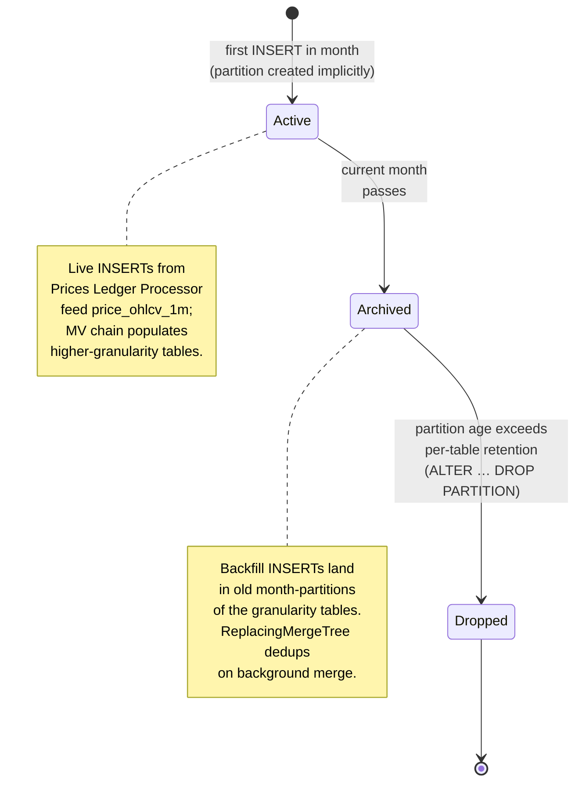

```mermaid
gantt
    title Retention by Per-Granularity Table (relative to "now")
    dateFormat  X
    axisFormat  %s

    section price_ohlcv_1m
    DROP PARTITION after :done, m1, 0, 7

    section price_ohlcv_15m
    DROP PARTITION after :done, m15, 0, 30

    section price_ohlcv_{1h,4h,1d,1w,1M}
    Kept forever (no cleanup) :active, c1, 0, 1000

    section oracle_prices
    DROP PARTITION after :done, op, 0, 395
```

---

## 5. Sort Keys & Query Patterns

ClickHouse uses **sort keys** (the `ORDER BY` clause on each MergeTree table)
rather than B-tree secondary indexes. The sort key drives the sparse primary
index that's consulted at scan time; well-chosen sort keys reduce scanned
data by orders of magnitude without the per-row cost of B-tree indexes.

| Table                                              | Sort key (`ORDER BY`)                            | Partition key                    | Purpose                                                                  |
| -------------------------------------------------- | ------------------------------------------------ | -------------------------------- | ------------------------------------------------------------------------ |
| `prices.assets`                                    | `(asset_code, issuer_address, contract_address)` | — (small table, no partitioning) | Identity lookup for `GET /assets/{asset_identifier}`                     |
| `prices.price_ohlcv_1m` (and all rolled-up tables) | `(asset_id, quote_asset_id, source, timestamp)`  | `toYYYYMM(timestamp)`            | Per-(asset, quote, source) time-series scans; partition pruning by month |
| `prices.current_prices`                            | `(asset_id)`                                     | — (small table, no partitioning) | One row per asset; lookup by id                                          |
| `prices.oracle_prices`                             | `(asset_id, oracle_name, timestamp)`             | `toYYYYMM(timestamp)`            | Latest-per-oracle lookup, partition pruning by month                     |
| `prices.backfill_progress`                         | `(task_name)`                                    | —                                | One row per backfill stream                                              |

**Partition pruning** remains the central performance mechanism for the
time-series tables: `WHERE timestamp BETWEEN X AND Y` only scans relevant
monthly partitions, regardless of overall table size.

**Sort-key locality.** OHLCV reads almost always filter by `(asset_id,
quote_asset_id, source)` first and then range-scan `timestamp`. Placing the
join-cardinality-low columns first in the sort key means each (asset, quote,
source) combination's data lives in a contiguous run within each partition's
data part, so a typical `WHERE asset_id = ? AND quote_asset_id = ? AND source
= ? AND timestamp BETWEEN ? AND ?` query reads a small contiguous block.

**Sorted reads on `current_prices`.** ClickHouse has no B-tree, so the
keyset-pagination indexes from the prior PostgreSQL design (`idx_current_prices_volume_24h`,
etc.) don't translate. Instead:

| Approach (chosen for v1)                            | Detail                                                                                                                                                                                                                                                                                 |
| --------------------------------------------------- | -------------------------------------------------------------------------------------------------------------------------------------------------------------------------------------------------------------------------------------------------------------------------------------- |
| **In-memory order + LIMIT**                         | The Lambda handler issues `SELECT … FROM prices.current_prices FINAL ORDER BY volume_24h_usd DESC LIMIT N`. With <10k tracked assets the sort is bounded; CH executes it in single-digit milliseconds even on a cold cache.                                                            |
| **Projection on hot sort column (if needed later)** | If sorted reads become a measurable bottleneck, add a CH `ALTER TABLE … ADD PROJECTION` that pre-sorts `current_prices` by a sort column. Projections are CH's idiomatic "secondary index" — they materialise an alternate sort order without changing the table's primary `ORDER BY`. |

**Materialised views** are the rollup mechanism on `price_ohlcv_*` (§3.2);
they also serve as the closest analogue to a "secondary index" if a future
read pattern needs a different sort or aggregation. The MV chain itself is
not part of indexing — it's a write-time aggregation pipeline.

---

## 6. Workers and Endpoints That Read/Write the Database

### 6.0 Read/write data-flow overview

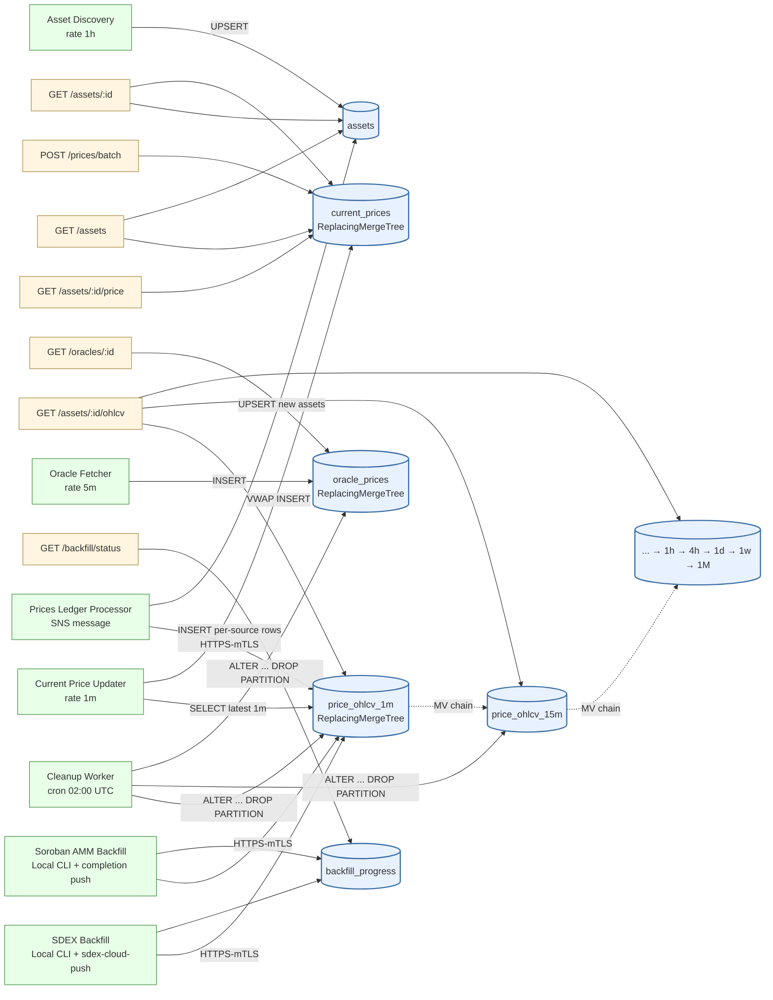

### 6.1 Writers

| Worker / Process                                       | Trigger                                                            | Tables written                                                                                                                                |
| ------------------------------------------------------ | ------------------------------------------------------------------ | --------------------------------------------------------------------------------------------------------------------------------------------- |
| **Prices Ledger Processor** Lambda                     | SNS message (per S3 PutObject; ~every 5–6 s)                       | `prices.price_ohlcv_1m` (per-source 1m INSERTs); `prices.assets` (when new assets discovered inline)                                          |
| **Asset Discovery** Lambda                             | EventBridge `rate(1 hour)`                                         | `prices.assets`                                                                                                                               |
| **MV chain (CH-internal)**                             | INSERT into `prices.price_ohlcv_1m` (and successive granularities) | `prices.price_ohlcv_15m` / `_1h` / `_4h` / `_1d` / `_1w` / `_1M`. **Not a Lambda** — runs inside ClickHouse, replaces the OHLCV Rollup Lambda |
| **Current Price Updater** Lambda                       | EventBridge `rate(1 minute)`                                       | `prices.current_prices` (cross-source VWAP per §5.5)                                                                                          |
| **Oracle Fetcher** Lambda                              | EventBridge `rate(5 minutes)`                                      | `prices.oracle_prices`                                                                                                                        |
| **Cleanup Worker** Lambda                              | EventBridge `cron(0 2 * * *)`                                      | `ALTER TABLE … DROP PARTITION` on aged partitions of `prices.price_ohlcv_1m` / `_15m` / `oracle_prices`                                       |
| **SDEX Backfill** (local CLI + `sdex-cloud-push`)      | Tip-backward chunks during project                                 | Historical `prices.price_ohlcv_*` partitions; updates to `prices.backfill_progress` row for `sdex_archive`                                    |
| **Soroban AMM Backfill** (local CLI + completion push) | One-time, Tranche 1                                                | Historical `prices.price_ohlcv_*` partitions; updates to `prices.backfill_progress` row for `soroban_amm`                                     |

**Worker removed (ADR 0007 §3.4):** the **OHLCV Rollup Lambda** is gone.
Rollups happen inside ClickHouse via the MV chain attached to
`prices.price_ohlcv_1m`. The previously-scheduled `ohlcv-rollup` EventBridge
rule no longer exists.

### 6.2 EventBridge Scheduler Rules (DB-relevant)

```
prices-ledger-processor:  SNS message  → Lambda "prices-ledger-processor"
oracle-ingest:             rate(5 minutes)  → Lambda "oracle-worker"
asset-discovery:           rate(1 hour)     → Lambda "discovery-worker"
price-update:              rate(1 minute)   → Lambda "price-updater"
retention-cleanup:         cron(0 2 * * *)  → Lambda "cleanup-worker"
```

### 6.3 Readers (API endpoints → tables)

| Endpoint                               | Tables read                                                                                                  |
| -------------------------------------- | ------------------------------------------------------------------------------------------------------------ |
| `GET /assets`                          | `prices.current_prices FINAL` JOIN `prices.assets FINAL`                                                     |
| `GET /assets/{asset_identifier}`       | `prices.assets FINAL` (+ `prices.current_prices FINAL`)                                                      |
| `GET /assets/{asset_identifier}/price` | `prices.current_prices FINAL`                                                                                |
| `GET /assets/{asset_identifier}/ohlcv` | `prices.price_ohlcv_<granularity>` (`FINAL` or `argMax/argMin + GROUP BY`; partition pruning by `timestamp`) |
| `POST /prices/batch`                   | `prices.current_prices FINAL` (multi-asset)                                                                  |
| `GET /oracles/{asset_identifier}`      | `prices.oracle_prices` (`argMax(price_usd, timestamp)` for "latest per oracle")                              |
| `GET /backfill/status`                 | `prices.backfill_progress FINAL`                                                                             |

`FINAL` (or `argMax/argMin … GROUP BY`) resolves `ReplacingMergeTree`'s
eventual consistency at read time. CH executes `FINAL` by streaming the
underlying merged data parts through the deduplication operator; it costs
more than a plain `SELECT` but is bounded for small tables (`assets`,
`current_prices`, `backfill_progress`) and effective with sort-key locality
for the OHLCV tables.

### 6.4 Cursor pagination (`GET /assets`)

The cursor used by `GET /assets` is a Base64-encoded JSON object with the sort
column value and the asset ID of the last returned row (ID breaks ties when
sort values are equal):

```
cursor = base64({ "volume_24h": 1523400.50, "asset_id": 42 })
       → "eyJ2b2x1bWVfMjRoIjoxNTIzNDAwLjUwLCJhc3NldF9pZCI6NDJ9"
```

First page (no cursor):

```sql
SELECT *
FROM prices.current_prices FINAL
JOIN prices.assets FINAL ON prices.assets.asset_id = prices.current_prices.asset_id
ORDER BY volume_24h_usd DESC, asset_id DESC
LIMIT 51;  -- limit + 1 to determine has_more
```

Subsequent pages (server decodes the cursor and uses a **keyset condition**):

```sql
SELECT *
FROM prices.current_prices FINAL
JOIN prices.assets FINAL ON prices.assets.asset_id = prices.current_prices.asset_id
WHERE (volume_24h_usd, asset_id) < (1523400.50, 42)  -- decoded from cursor
ORDER BY volume_24h_usd DESC, asset_id DESC
LIMIT 51;
```

`has_more` is determined by fetching `limit + 1` rows.

**No secondary indexes.** Unlike the prior PostgreSQL design, there are no
`(sort_column DESC NULLS LAST, asset_id DESC)` composite indexes — CH does
not have that machinery. With <10k tracked assets the cost of `ORDER BY +
LIMIT N` on `current_prices` is bounded and single-digit milliseconds; the
keyset condition narrows the scanned row set further. If the asset table
grows past ~100k and sorted reads become hot, the right CH move is to add a
`PROJECTION` on the sort column (see §5).

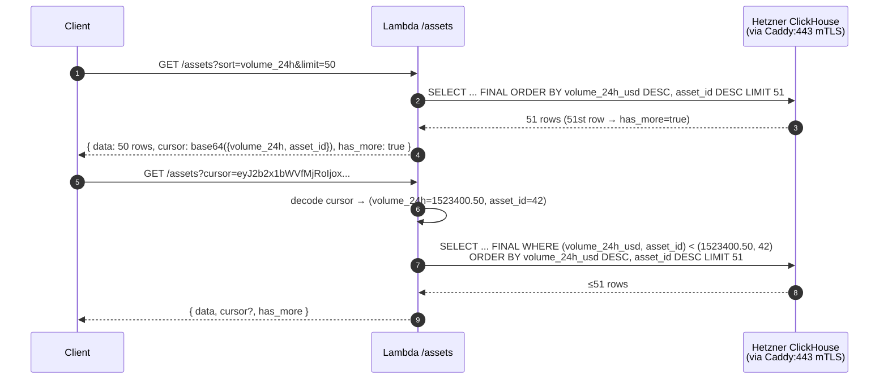

### 6.5 VWAP Calculation (writes to `current_prices.sources` + price fields)

The Current Price Updater Lambda computes:

```
Weighted Price = Σ(source_price × source_volume_24h) / Σ(source_volume_24h)

Where sources = [SDEX, Soroswap, Aquarius, ...]
Only include sources where volume_24h > configurable_min_threshold_usd (e.g. $100)
```

Volume threshold is configurable per-request via `?min_volume_usd=` query param
or defaults to the system setting.

**Outlier detection:** before a source's price is included in the VWAP, it is
compared against the inter-source median. Sources deviating by more than a
configurable percentage are excluded from that update cycle.

---

## 7. Backfill — Database-Side Considerations

Backfill is split into two streams with different sources, runtimes, and
write patterns. Both streams ultimately write into `price_ohlcv` historical
monthly partitions, plus heartbeat/status to `backfill_progress`.

### 7.1 Two-stream design (ADRs 0001, 0005, 0007)

| Stream                                              | Data location                                                                                                                                | Era                                                     | Method                                                                                                                                                                            |
| --------------------------------------------------- | -------------------------------------------------------------------------------------------------------------------------------------------- | ------------------------------------------------------- | --------------------------------------------------------------------------------------------------------------------------------------------------------------------------------- |
| **SDEX trades**                                     | `ClaimAtom` from the five trade-shaped op types in `LedgerCloseMeta` XDR                                                                     | All-time (2015 → present, ~57M ledgers)                 | Local Rust CLI on operator workstation (anonymous reads against `s3://aws-public-blockchain`) → local Postgres → `sdex-cloud-push` lands rows in Hetzner CH `prices.*` (ADR 0005) |
| **Soroban AMM swaps** (Soroswap, Aquarius, Phoenix) | `soroban_events` in **local** ClickHouse, populated upfront by BE's `backfill-runner --target=clickhouse` against the same public S3 archive | Soroban activation (Nov 2023) → present (~8.5M ledgers) | Local Rust CLI on operator workstation; one-shot completion push lands rows in Hetzner CH `prices.*` (ADR 0001)                                                                   |

The Soroban AMM stream is handled first (Tranche 1). The operator runs BE's
`backfill-runner --target=clickhouse` to populate a local CH instance
(Docker) with `soroban_events` from Soroban activation to tip (~8.5M
ledgers); the prices-api `soroban-amm-backfill` CLI queries that local CH,
decodes ScVal via `stellar-xdr`, bucketizes into per-source 1-min rows, and
pushes the result to Hetzner CH `prices.*` in a single completion push. The
whole run completes in hours; the local CH instance is torn down once the
push lands. The SDEX stream requires reading all 57 million ledgers from
Stellar's public history archives and is the long-running backfill that
extends beyond the project duration.

### 7.2 Why backfill writes do not conflict with live writes

ClickHouse's monthly partition layout separates **historical writes** (old
month partitions of the higher-granularity tables) from **live writes**
(current month partition of `price_ohlcv_1m`). MergeTree-family engines are
safe under concurrent inserts; `ReplacingMergeTree(version)` collapses any
overlap deterministically on background merge (live writes carry higher
`version` values than backfill writes for the same `(timestamp, asset_id,
quote_asset_id, source)` PK tuple).

### 7.3 Stream 1 — Soroban AMM (fast, Tranche 1, ADR 0001)

```
BE `backfill-runner --target=clickhouse` (BE task 0205)
  populates local CH `soroban_events` upfront from
  s3://aws-public-blockchain (~8.5M ledgers, ~hours)
        │
        ▼
Local ClickHouse (Docker) on operator workstation
  soroban_events WHERE signature = 'swap'
    AND contract_id IN (Soroswap, Aquarius, Phoenix)
  JOIN ledgers ON closed_at  (per BE CH prod schema)
        │
        ▼
┌──────────────────────────────────────────────────────────┐
│  soroban-amm-backfill — local Rust CLI                   │
│  - Queries local CH by signature + contract_id            │
│  - Decodes topics_xdr + data_xdr (ScVal) via              │
│    `stellar-xdr` crate                                    │
│  - Extracts token pair + amounts                          │
│  - Buckets to per-source 1-minute rows                    │
│  - Writes to local Postgres (Docker) on workstation       │
└──────────────────────────────────────────────────────────┘
        │
        ▼ one-shot completion push (only Hetzner-CH-touching step on Stream 1)
Hetzner ClickHouse `prices.*` (HTTPS-mTLS to Caddy:443)
  - Lands all per-source rows into `prices.price_ohlcv_1m`
    (historical month-partitions) + pre-rolled higher-granularity
    tables (`_1d`, `_1h`, …) for ranges where the CLI pre-aggregates
  - Sets `prices.backfill_progress` row for `soroban_amm`:
    current_ledger, last_push_at, status='completed', completed_at
```

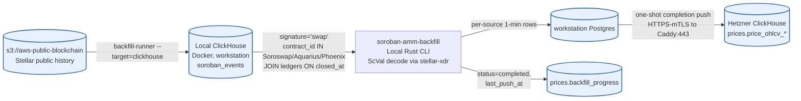

| Metric                | Value                                                                                                       | Notes                                                                                                |
| --------------------- | ----------------------------------------------------------------------------------------------------------- | ---------------------------------------------------------------------------------------------------- |
| Data source           | Local ClickHouse `soroban_events` (Docker, populated upfront by BE's `backfill-runner --target=clickhouse`) | Per-event rows with inlined `topics_xdr` + `data_xdr` + hoisted `signature` column                   |
| Ledger range          | ~48.5M–57M (Nov 2023 to present)                                                                            | ~8.5M ledgers worth of events                                                                        |
| Runtime               | Local Rust CLI on operator workstation (`soroban-amm-backfill`)                                             | No AWS infrastructure for the backfill itself; mirrors §7.4 Stream 2's local-CLI pattern             |
| Workstation prep step | BE `backfill-runner --target=clickhouse` populates local CH                                                 | One-shot; runs against `s3://aws-public-blockchain` anonymous reads                                  |
| Sink during backfill  | Local Postgres (Docker) on workstation                                                                      | Hetzner ClickHouse is **not** written until the one-shot completion push                             |
| Estimated wall-clock  | A few hours, dominated by `backfill-runner` archive ingestion                                               | CH query + extraction + OHLCV write is fast against an indexed local store                           |
| Cloud-push cadence    | One-shot completion push only                                                                               | `prices.backfill_progress.soroban_amm` advances from `running` to `completed` in a single transition |
| Expected completion   | During Tranche 1 (Week 2–3)                                                                                 | After the push, the local CH instance is torn down                                                   |

### 7.4 Stream 2 — SDEX (slow, runs through and past Tranche 3, ADR 0005)

```
s3://aws-public-blockchain/v1.1/stellar/ledgers/pubnet/
(Stellar public history archive, anonymous `--no-sign-request`)
        │
        ▼ `aws s3 sync` (partition-at-a-time prefetch)
┌─────────────────────────────────────────────────────────┐
│  sdex-backfill — local Rust CLI on operator workstation │
│  (mirrors BE `backfill-runner` pattern, BE ADR 0010)    │
│  - Decompresses `.xdr.zst` via BE `xdr-parser` crate    │
│    (git Cargo dep; library only, no runtime coupling)   │
│  - Filter + extract per task 0022's spec:               │
│    5 trade-shaped op types → ClaimAtom → TradeTick      │
│  - Buckets to per-source 1-minute rows                  │
│  - Per-ledger atomic txn: row UPSERTs +                 │
│    backfill_progress checkpoint commit together         │
└─────────────────────────────────────────────────────────┘
               │
               ▼
       Local Postgres (Docker) on workstation
       (operator-owned; backfill writes here, not Hetzner CH)
               │
               ▼ `sdex-cloud-push` (separate post-backfill tool, HTTPS-mTLS)
       Hetzner ClickHouse `prices.*`
       (historical price_ohlcv_* month-partitions; runs in
        tip-backward chunks so the cloud view advances every
        push cycle)
```

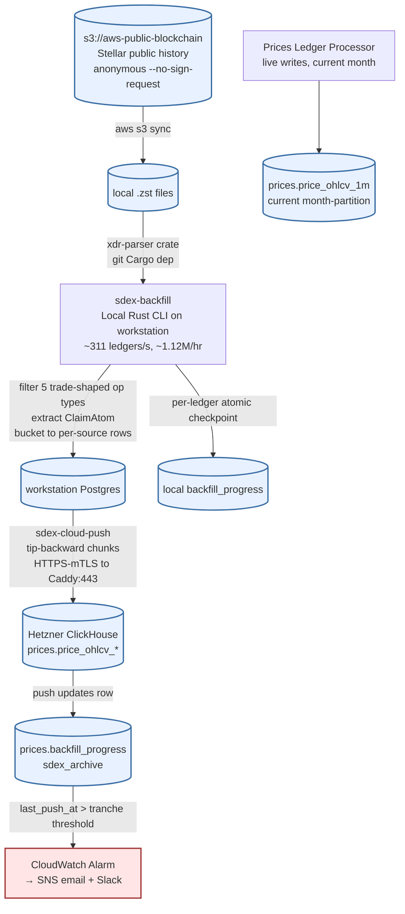

| Metric                               | Value                                                     | Notes                                                                             |
| ------------------------------------ | --------------------------------------------------------- | --------------------------------------------------------------------------------- |
| Total ledgers                        | ~57 million                                               | Ledger 1 (Nov 2015) to current tip                                                |
| Runtime                              | Local Rust CLI on operator workstation                    | No AWS infrastructure for the backfill itself; mirrors BE `backfill-runner`       |
| Source                               | `s3://aws-public-blockchain/v1.1/stellar/ledgers/pubnet/` | Anonymous `--no-sign-request`; no AWS account needed to read                      |
| Sink during backfill                 | Local Postgres (Docker) on workstation                    | Hetzner ClickHouse is **not** written during backfill — only by `sdex-cloud-push` |
| Measured CLI rate                    | ~311 ledgers/s (~1.12M ledgers/hour)                      | Per task 0022's measurement against the SDEX filter                               |
| Effective wall-clock (network-bound) | ~12–16 days continuous on one laptop                      | Archive sync is the bottleneck; CPU rarely saturates                              |
| Cloud-push cadence                   | Tip-backward chunks                                       | The cloud `GET /backfill/status` view advances at push cadence, not CLI cadence   |
| Expected completion                  | Full historical coverage extends past Tranche 3           | Tranche 3 acceptance is "progressing", not "complete"                             |

The `sdex-backfill` CLI is **resumable at per-ledger granularity**: each
ledger's row UPSERTs and its `backfill_progress` checkpoint advance commit
atomically in a single local-Postgres transaction. A crash mid-ledger leaves
`current_ledger` pointing at the last fully-processed ledger; restart
re-fetches and re-UPSERTs that ledger idempotently. Early ledgers (pre-2018)
have very few DEX trades and process faster.

### 7.4a Backfill state machine (`prices.backfill_progress.status`)

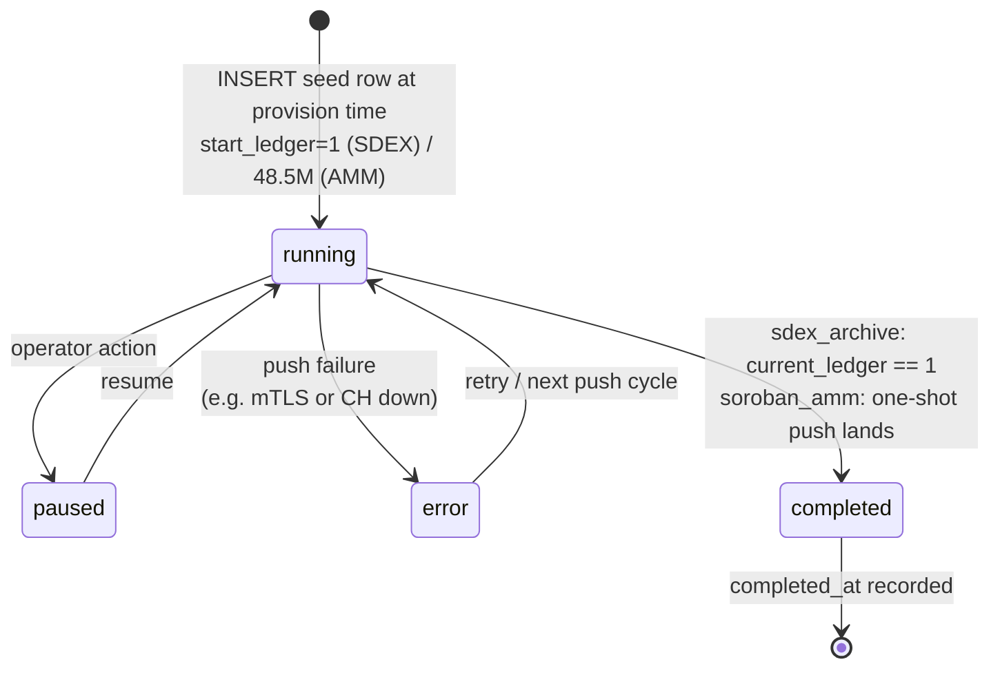

### 7.5 Backfill milestones (DB visibility)

| Tranche           | Stream      | Milestone                                                                       | Validation (DB-observable)                                                                                                                     |
| ----------------- | ----------- | ------------------------------------------------------------------------------- | ---------------------------------------------------------------------------------------------------------------------------------------------- |
| **1** (Week 4)    | Soroban AMM | Full AMM history from Soroban activation (Nov 2023) available                   | `soroban_amm.status: "completed"` in `GET /backfill/status`; OHLCV data for Soroswap pairs verifiable for Nov 2023 dates                       |
| **1** (Week 4)    | SDEX        | First tip-backward chunk (~6 months) processed locally and pushed to Hetzner CH | `sdex.earliest_data_available` ~6 months ago; `sdex.last_push_at` within configured Tranche 1 window                                           |
| **2** (Week 9)    | SDEX        | 4+ years pushed (back to Jan 2022)                                              | `sdex.earliest_data_available` ≤ 2022-01-01 after a fresh push                                                                                 |
| **3** (Week 13)   | SDEX        | 8+ years pushed (back to Jan 2018)                                              | `sdex.earliest_data_available` ≤ 2018-01-01; `sdex.last_push_at` fresh; operator reports a credible remaining estimate from local CLI progress |
| **Post-delivery** | SDEX        | Full all-time SDEX history (ledger 1 to present) pushed                         | `sdex.status: "completed"`; Stellar notified                                                                                                   |

### 7.6 `GET /backfill/status` — example response

The endpoint reflects both streams. A CloudWatch alarm fires if
`sdex.last_push_at` is older than the configured push-cadence threshold for
the active tranche (operator-tunable; e.g. 7 days for Tranche 1, looser as
completion approaches).

```json
{
  "realtime_tip_ledger": 57234198,
  "sdex": {
    "status": "running",
    "current_ledger": 34891234,
    "start_ledger": 1,
    "target_ledger": 57234198,
    "progress_pct": 39.2,
    "ledgers_remaining": 34891233,
    "last_push_at": "2026-06-15T11:30:00Z",
    "earliest_data_available": "2019-08-22T00:00:00Z"
  },
  "soroban_amm": {
    "status": "completed",
    "last_push_at": "2026-04-14T08:23:11Z",
    "completed_at": "2026-04-14T08:23:11Z",
    "earliest_data_available": "2023-11-01T00:00:00Z"
  }
}
```

| Field                                 | Description                                                                                                                                                                                                   |
| ------------------------------------- | ------------------------------------------------------------------------------------------------------------------------------------------------------------------------------------------------------------- |
| `sdex.status`                         | `running`, `paused`, `completed`, or `error` — SDEX archive backfill                                                                                                                                          |
| `sdex.current_ledger`                 | Oldest ledger reflected in the cloud DB after the most recent `sdex-cloud-push`. Advances at push cadence, not CLI cadence                                                                                    |
| `sdex.progress_pct`                   | `(target_ledger - current_ledger) / (target_ledger - start_ledger) * 100`, computed at read time                                                                                                              |
| `sdex.ledgers_remaining`              | `current_ledger - start_ledger`, computed at read time                                                                                                                                                        |
| `sdex.last_push_at`                   | Timestamp of the most recent successful `sdex-cloud-push`. CloudWatch freshness alarm fires when this is older than the configured push-cadence threshold for the active tranche. `null` until the first push |
| `sdex.earliest_data_available`        | Stored timestamp of the oldest SDEX OHLCV row — recorded by the push step when it first lands a candle for a given timestamp, **not** computed live via `MIN(timestamp)`. Returned as-is, so reads are O(1)   |
| `soroban_amm.status`                  | Typically `completed` from Tranche 1 onwards                                                                                                                                                                  |
| `soroban_amm.last_push_at`            | Timestamp of the one-shot AMM CLI's completion push. `null` until the push happens                                                                                                                            |
| `soroban_amm.earliest_data_available` | Same semantics as `sdex.earliest_data_available` — stored, not computed. Lands at the Soroban activation date (~Nov 2023) once the one-time backfill completes                                                |

### 7.7 Partial-history note in the OHLCV endpoint

When `timeframe=all` is requested but the backfill has not yet reached the
asset's inception date, `GET /assets/{asset_identifier}/ohlcv` includes a
`backfill_note` field indicating how far back data is available:

```json
{
  "asset": "USDC:GA5ZSE...XYZ",
  "granularity": "1d",
  "base_currency": "USD",
  "backfill_note": "Historical data available from 2022-01-01. Backfill in progress — see GET /backfill/status.",
  "data": [...]
}
```

---

## 8. Sizing, Performance, Scaling (Hetzner ClickHouse, shared with BE)

### 8.1 Target

**<100 ms p95 API response time.**

### 8.2 How that target is met

| Layer                                      | Strategy                                                                                                                                                                                                                                                                                                              |
| ------------------------------------------ | --------------------------------------------------------------------------------------------------------------------------------------------------------------------------------------------------------------------------------------------------------------------------------------------------------------------- |
| **API Gateway caching**                    | Built-in response cache (0.5 GB). Per-endpoint TTLs: `/assets` list 60s, `/ohlcv` 60s, `/price` 15s, `/backfill/status` 30s. Cache key includes query params. `POST /prices/batch` uncached                                                                                                                           |
| **API Gateway throttling**                 | Request throttling (100/s per API key, 1000/s global burst)                                                                                                                                                                                                                                                           |
| **Lambda**                                 | Rust binary with `lambda_runtime`. Sub-millisecond cold starts. Stateless, auto-scales to concurrency limit. No VPC, so no ENI provisioning latency on cold start                                                                                                                                                     |
| **ClickHouse client (`clickhouse` crate)** | Warm connection pool reused across Lambda invocations to amortise mTLS handshake (~80-130 ms cross-cloud RTT to Caddy). Per-request payloads batched per-ledger so a typical invocation issues 1–2 INSERTs, not one per trade                                                                                         |
| **Sort key + partitioning**                | Per-granularity tables sorted by `(asset_id, quote_asset_id, source, timestamp)`; monthly partitions on `timestamp`. Partition pruning + sort-key skip eliminate irrelevant months and assets on hot reads                                                                                                            |
| **Query optimization**                     | `prices.current_prices` avoids real-time aggregation on the read path. OHLCV reads target the granularity table that already holds the requested resolution. Read handlers issue `SELECT … FINAL` or `argMax/argMin + GROUP BY` to handle `ReplacingMergeTree` eventual consistency                                   |
| **Cross-cloud latency mitigation**         | Public-internet hop AWS → Hetzner is ~80-130 ms RTT. Mitigated by warm-container connection reuse, per-ledger write batching, API Gateway response caching for read-heavy endpoints, and single-round-trip CH query patterns. Single-digit-ms p50 SELECTs over the public hop are routine once the connection is warm |

### 8.3 ClickHouse sizing — BE-owned, prices-api joins as a second tenant

The live data plane is BE's production Hetzner ClickHouse cluster (single CH
instance on a single Hetzner box behind Caddy:443). Prices-api joins as a
second tenant via its own `prices` database, isolated by ClickHouse's native
multi-tenant primitives (database, user, quota, profile).

| Metric                             | Value                                                       | Source                                  |
| ---------------------------------- | ----------------------------------------------------------- | --------------------------------------- |
| Prices-api storage footprint       | ~0.45 GB/year flat-growth                                   | Task 0046 empirical                     |
| Average per-ledger storage         | ~74 bytes/ledger                                            | Task 0046 empirical                     |
| Compression ratio (LZ4 + sort-key) | ~14.8×                                                      | Task 0046 empirical on `soroban_events` |
| Write rate                         | ~1 INSERT per ledger (~12k/day per env at mainnet cadence)  | §6.1                                    |
| Read rate                          | API-Gateway-throttled ≤100 req/s per key, cached at gateway | §8.2                                    |

Hardware sizing, OS-level tuning, and any vertical/horizontal scaling
decisions are owned by BE. Prices-api's contribution to the box is
empirically light; the tier choice is driven by BE's `default.*` footprint,
not by `prices.*`.

### 8.4 Capacity contention — fallback to sidecar CH

The open capacity question that task 0047 is verifying: can the shared CH +
Caddy host absorb the combined read/write load of both tenants under peak
conditions? Task 0047 returns one of three outcomes:

| Outcome    | Action                                                                                                                                                                                                                                                                                                               |
| ---------- | -------------------------------------------------------------------------------------------------------------------------------------------------------------------------------------------------------------------------------------------------------------------------------------------------------------------- |
| **GREEN**  | Proceed with ADR 0007 as-proposed (shared `prices` DB in BE's CH cluster).                                                                                                                                                                                                                                           |
| **YELLOW** | Proceed with tuning (bump `max_concurrent_queries`, tune Caddy keepalive, schedule MV merges off-peak).                                                                                                                                                                                                              |
| **RED**    | Fallback to **Option 4 sidecar CH** (ADR 0007 Alternative 3): a second CH container on the same Hetzner box, separate port, separate data volumes. Cost delta: +~€39-69/mo for a second Hetzner tier if a second box becomes preferable. No prices-api code changes; only the Caddy endpoint and the cert pair swap. |

**No RDS scaling path applies.** The previously-documented `db.t4g.micro →
db.r6g.large + Multi-AZ + read replica + RDS Proxy` escalation ladder is
removed; with the live data plane on ClickHouse, that machinery is not part
of the prices-api budget at any traffic level.

### 8.5 Cost summary (DB-relevant lines)

Monthly running cost (low traffic, post-backfill):

| Service                               | Estimated Cost | Notes                                                                                                                                                        |
| ------------------------------------- | -------------- | ------------------------------------------------------------------------------------------------------------------------------------------------------------ |
| Hetzner CH cost-share for `prices` DB | ~$1–$2/env/mo  | Opening proposal ~1-2% pro-rata per task 0046; flat fee acceptable up to ~$5/env per the brief without changing the recommendation. D12 commercial follow-up |

Backfill period additional costs (one-time, during 13-week project):

| Item                     | Configuration                                                                                                                                     | One-time Cost   |
| ------------------------ | ------------------------------------------------------------------------------------------------------------------------------------------------- | --------------- |
| Cloud DB during backfill | No RDS upgrade required (ADR 0007); the bursty pushes hit Hetzner CH instead. Empirically <1 GB extra (task 0046) — no marginal cost-share change | **$0 marginal** |

Scaled-up at high traffic (DB-relevant):

| Service                                                 | Added Cost                                                  |
| ------------------------------------------------------- | ----------------------------------------------------------- |
| Hetzner CH cost-share re-opened (D12 escalation clause) | +~$3-15/env if production scales materially                 |
| Sidecar CH fallback (if task 0047 returns RED)          | +~€39-69/mo for one Hetzner box (one box covers all 3 envs) |

---

## 9. Security Posture (database-relevant)

- **ClickHouse endpoint reachable only via mTLS through Caddy:443** on the
  BE-managed Hetzner box. There is no other network surface to `prices.*`.
- **mTLS material in AWS Secrets Manager** (per-env client cert + key, two
  secrets per env). Cert + key are loaded into the Lambda runtime on cold
  start and held in memory for the container's lifetime; never in env vars
  or source. Rotation: 1-year manual cadence (BE Cluster C agreement);
  CloudWatch alarm on cert NotAfter approaching expiry; revocation = CA
  rotation on compromise.
- **No Prices-api VPC** (ADR 0007 §3.6). Lambdas run outside any VPC; mTLS
  is the gating mechanism, not IP / security-group rules.
- **`prices.*` schema ownership** is unilateral on the prices-api side
  (ADR 0007 §3.7). DDL changes are announcement, not approval — but
  cross-database reads against `default.*` should be wrapped in named
  `prices.*` views to keep the breakage surface narrow.
- **IAM least-privilege:** each Lambda role scoped to only the resources it
  needs — notably `secretsmanager:GetSecretValue` for the mTLS cert + key
  pair, `sns:Subscribe` / Lambda invocation permissions on the BE-owned
  bucket-fan-out SNS topic, and nothing else. No wildcard IAM.
- **No PII stored:** only blockchain-public data.
- **Input validation at the API edge:** asset identifiers validated against
  known patterns (G-address: 56 chars starting with `G`; C-address: 56 chars
  starting with `C`). Param ranges validated. 400 on invalid input — keeps
  malformed values from ever reaching ClickHouse.
- **Parameterised queries via the `clickhouse` Rust crate:** typed
  parameter binding; no string-concatenated SQL.
- **Price manipulation protection (DB-fed):** outlier detection on VWAP
  inputs and per-source `min_volume_usd` thresholding before writing
  `prices.current_prices`. Oracle data is exposed read-only via
  `/oracles/...` and does not feed primary price fields.
- **Backup RPO is daily Borg** on the Hetzner box (BE-managed; BE Cluster B
  agreement). Demotion from RDS PITR is acknowledged in ADR 0007 §Negative;
  OHLCV data has a natural replay path from BE's S3 archive (BE ADR 0006
  indefinite retention) so daily-granularity restore is operationally
  acceptable.

---

## 10. Cross-Service Dependency — Hetzner ClickHouse shared tenancy (ADR 0007)

Per ADR 0007, the prices-api **live data plane** is a tenant inside BE's
Hetzner ClickHouse cluster. The two services share a host and an mTLS-fronted
endpoint, but each owns its own database (`prices` vs `default`) and its own
schema migrations.

Per ADR 0001, the Soroban AMM backfill consumes a **local** ClickHouse
instance on the operator's workstation populated by
`backfill-runner --target=clickhouse` — separate from the production Hetzner
CH, torn down after the cloud push lands.

| Aspect            | Detail                                                                                                                                                  |
| ----------------- | ------------------------------------------------------------------------------------------------------------------------------------------------------- |
| Direction         | Prices API ↔ Hetzner ClickHouse (read + write), gated by mTLS                                                                                           |
| Network           | Public internet from AWS Lambda to Caddy:443 on Hetzner                                                                                                 |
| Databases touched | `prices.*` (prices-api writes + reads); `default.*` reads only via named `prices.*` views (rare)                                                        |
| When              | Continuous, for live ingestion + reads, post-Tranche-1                                                                                                  |
| Why               | Eliminates one production DB the prices-api would otherwise own; cost-share at empirical scale is ~$1-2/env/mo vs $12+/mo for the smallest RDS instance |

### 10.1 Risks and mitigations

| Risk                                                                                      | Mitigation                                                                                                                                                                                                                                |
| ----------------------------------------------------------------------------------------- | ----------------------------------------------------------------------------------------------------------------------------------------------------------------------------------------------------------------------------------------- |
| Cross-tenant throughput contention on the shared Hetzner CH                               | **Task 0047** verifies cross-tenant throughput (GREEN/YELLOW/RED) before implementation begins. RED supersedes ADR 0007 to Alternative 3 (sidecar CH on the same Hetzner box — same code shape, different host).                          |
| BE evolves `default.*` schema in ways that conflict with prices-api views                 | ADR 0007 §3.7: prices-api owns `prices.*` unilaterally; any cross-DB read into `default.*` is wrapped in a named `prices.*` view so the breakage surface is narrow and reviewable.                                                        |
| Cross-cloud network outage (AWS ↔ Hetzner)                                                | Lambdas tolerate connect failures with exponential-backoff retry; SNS delivery retries the message; BE's S3 retention (indefinite per BE ADR 0006) supports replay of arbitrary windows by re-firing PutObject events. No data-loss path. |
| mTLS cert expiry not detected                                                             | CloudWatch NotAfter alarm fires 30 days before expiry; 1-year manual rotation cadence; revocation = CA rotation.                                                                                                                          |
| Hetzner box backup RPO is daily Borg, not RDS PITR                                        | Accepted in ADR 0007 §Negative. OHLCV data has natural replay path from BE's S3 archive; daily-granularity restore is operationally acceptable.                                                                                           |
| BE's `backfill-runner` produces incorrect or incomplete rows in the **local** Stream 1 CH | Gap detection: after the AMM CLI's cloud push, prices-api checks for contiguous OHLCV coverage from Soroban activation to present. Any gaps trigger a targeted archive-read for the missing ledger ranges.                                |
| BE's `backfill-runner` evolves between the prep step and the AMM CLI run                  | Pin a known-good `backfill-runner` version for the workstation prep. Re-pin and re-populate the local instance if BE ships an incompatible change.                                                                                        |

**Boundary contract:** The Prices API never writes to BE's `default.*`
schema; BE never reads from `prices.*`. The runtime coupling is exactly the
shared-host + shared-Caddy endpoint, gated by mTLS, with strict
per-database isolation via ClickHouse's native multi-tenant primitives.

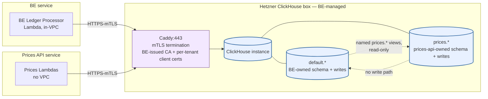

---

## 11. What Is Not Shared (DB-relevant)

The following components are **separate** and funded exclusively by the
Prices API grant:

- **`prices.*` schema + migrations** on the shared Hetzner CH cluster
  (different shape from BE's `default.*`).
- Prices API Lambda functions (separate function definitions, separate IAM
  roles, no VPC).
- Prices API API Gateway + usage plans + response cache.
- Prices API EventBridge rules.
- Prices API Secrets Manager entries (per-env mTLS material + a few
  external-API keys).
- Prices API onboarding portal (S3 + CloudFront).

**Removed from earlier (RDS-shaped) version of this list:** "Prices API RDS
PostgreSQL instance". The RDS instance no longer exists under ADR 0007.

---

## 12. Tranche-1 DB Acceptance Criteria

The database is provisioned and validated in Tranche 1. Relevant acceptance
criteria from the delivery plan, restated against the canonical
`GET /backfill/status` response shape defined in Section 7.6:

1. `cdk deploy` from a clean AWS account produces the full Prices API stack
   with **no RDS, no VPC, no NAT Gateway** in its synth output. Secrets for
   the per-env mTLS cert + key pair are present and IAM allows
   `secretsmanager:GetSecretValue` for them.
2. BE-side prep completed (one-time): SNS topic added to BE's
   `stellar-ledger-data/` bucket fan-out; per-env client cert issued from
   BE's CA for the prices-api Lambda; prices-api's `prices` database +
   user + quota provisioned inside the shared Hetzner CH cluster.
3. `prices.*` schema on Hetzner CH matches Section 3 (verifiable via
   `clickhouse-client --query "SHOW TABLES FROM prices"` and
   `SHOW CREATE TABLE prices.price_ohlcv_1m` etc., issued by the operator
   over mTLS).
4. After 24 hours of live operation: `prices.price_ohlcv_1m` contains
   continuous 1-min per-source rows for at least 20 major assets (XLM, USDC,
   EURC, AQUA, BTC, ETH) with no gaps >2 candles (verified via `FINAL`
   SELECT against the table).
5. `GET /backfill/status` returns `sdex.status: "running"`,
   `sdex.last_push_at` within the configured Tranche 1 push-cadence window,
   and `sdex.current_ledger` decreasing across successive pushes
   (tip-backward direction). `soroban_amm.status` is `"running"` early in
   Tranche 1 and transitions to `"completed"` once the AMM stream finishes.
6. CloudWatch alarm test: skip a scheduled `sdex-cloud-push` cycle →
   freshness alarm fires once `sdex.last_push_at` exceeds the configured
   Tranche 1 threshold.
7. `sdex.earliest_data_available` in `GET /backfill/status` shows a date
   approximately 6 months ago.

---

## 13. Quick Reference — Tables at a Glance

| Table                                                            | Engine                           | Partitioning          | Sort key                                         | Written by                                                                                                                | Read by                                                                                   |
| ---------------------------------------------------------------- | -------------------------------- | --------------------- | ------------------------------------------------ | ------------------------------------------------------------------------------------------------------------------------- | ----------------------------------------------------------------------------------------- |
| `prices.assets`                                                  | `ReplacingMergeTree(updated_at)` | none                  | `(asset_code, issuer_address, contract_address)` | Asset Discovery Lambda; Prices Ledger Processor (inline)                                                                  | All asset/price endpoints                                                                 |
| `prices.price_ohlcv_1m`                                          | `ReplacingMergeTree(version)`    | `toYYYYMM(timestamp)` | `(asset_id, quote_asset_id, source, timestamp)`  | Prices Ledger Processor; backfill streams (sdex-cloud-push, soroban-amm completion push); Cleanup Worker (DROP PARTITION) | `GET /ohlcv` (1m timeframe), Current Price Updater, MV chain feeding rolled granularities |
| `prices.price_ohlcv_15m` / `_1h` / `_4h` / `_1d` / `_1w` / `_1M` | `ReplacingMergeTree(version)`    | `toYYYYMM(timestamp)` | `(asset_id, quote_asset_id, source, timestamp)`  | MV chain on `_1m`; backfill streams (for pre-rolled ranges)                                                               | `GET /ohlcv` (rolled granularities)                                                       |
| `prices.current_prices`                                          | `ReplacingMergeTree(updated_at)` | none                  | `(asset_id)`                                     | Current Price Updater Lambda                                                                                              | `GET /assets`, `GET /price`, `POST /prices/batch`                                         |
| `prices.oracle_prices`                                           | `ReplacingMergeTree`             | `toYYYYMM(timestamp)` | `(asset_id, oracle_name, timestamp)`             | Oracle Fetcher Lambda; Cleanup Worker (DROP PARTITION)                                                                    | `GET /oracles/{asset}`                                                                    |
| `prices.backfill_progress`                                       | `ReplacingMergeTree(updated_at)` | none                  | `(task_name)`                                    | Backfill cloud-push step — one row per stream                                                                             | `GET /backfill/status`                                                                    |

---

## Appendices

The two diagrams below are reference material rather than primary content of
the main flow. **Appendix A** is the lighter, schema-only ER view — the
recommended starting point for readers who only want to see tables and
columns. **Appendix B** is the full system diagram showing writers, readers,
external services, partitions, and the alarm — useful when reasoning about
end-to-end dataflow.

---

### Appendix A — ClickHouse Tables Only (ER Diagram)

A focused, schema-only view: every `prices.*` table, every column with its
ClickHouse type, the engine, sort key, and partition key. No workers, no
API endpoints, no external services. ClickHouse does not enforce foreign
keys; all inter-table `asset_id` references are **logical** (application-
maintained), shown as `||--o{` for the cardinality but with no `REFERENCES`
clause in the DDL.

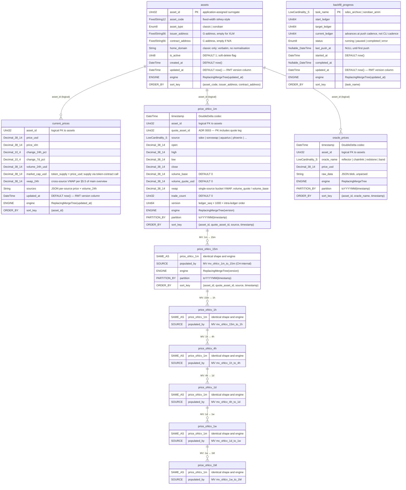

**Notes on the diagram**

- **No SQL foreign keys.** ClickHouse does not enforce FKs; every `asset_id`
  reference is logical (application-maintained by the Current Price Updater
  and the Prices Ledger Processor). The "1:1" / "1:N" cardinality glyphs
  reflect the application-level relationship, not a declared constraint.
- **MV chain edges.** The arrows between `price_ohlcv_1m`, `_15m`, `_1h`,
  `_4h`, `_1d`, `_1w`, `_1M` represent the **materialised-view rollup chain**
  (ADR 0007 §3.4). Each step is a refreshable CH MV that re-aggregates the
  parent granularity (read `FINAL`) into the next coarser one on a refresh
  schedule — not on INSERT (task 0059; see §3.2). This replaces the OHLCV
  Rollup Lambda from the prior PostgreSQL-shaped design.
- **Type-token stand-ins.** Mermaid ER syntax does not allow parentheses
  or commas inside type tokens, so `Decimal(38, 14)` appears as
  `Decimal_38_14`, `LowCardinality(String)` as `LowCardinality_S`,
  `FixedString(N)` as `FixedStringN`, and `Nullable(DateTime)` as
  `Nullable_DateTime`.
- **`ENGINE` / `PARTITION_BY` / `ORDER_BY` pseudo-rows** are not real
  columns — they are pinned to the bottom of each entity to surface the
  storage-engine metadata that drives merges, partition pruning, and the
  primary-index layout.
- **`SAME_AS` / `SOURCE` pseudo-rows on the rolled-up tables** abbreviate
  identical schema (they have the same columns as `price_ohlcv_1m`) and
  show which MV populates them. The full DDL for all seven granularity
  tables and the six MVs is implemented in the
  [`packages/prices-clickhouse`](../../packages/prices-clickhouse) crate
  (`schema/init.sql` + `schema/rollups.sql`), task 0060.

---

### Appendix B — Full System Diagram (One-Piece, ADR 0007)

A single, self-contained Mermaid diagram that combines: the `prices.*`
schema on Hetzner ClickHouse, the live and backfill writers, the API
readers, the SNS bucket fan-out, the mTLS edge between AWS Lambdas and
Caddy:443, the local-CLI backfill topology, the cross-service Hetzner
shared-tenancy boundary, the MV chain, and the partition / retention
lifecycle. Render this block in any Mermaid-capable viewer (GitHub, VS
Code preview, mermaid.live) to see the entire database design at a glance.

```mermaid
flowchart TB
    %% ============================================================
    %% LEGEND / STYLES
    %% ============================================================
    classDef store      fill:#e8f1ff,stroke:#3a6ea5,stroke-width:2px,color:#0b2545;
    classDef writer     fill:#e8ffe8,stroke:#3a8a3a,stroke-width:1px,color:#10421a;
    classDef reader     fill:#fff5e0,stroke:#a5853a,stroke-width:1px,color:#523b08;
    classDef external   fill:#f3e8ff,stroke:#6a3a8a,stroke-width:1px,color:#2e0b45;
    classDef alarm      fill:#ffe5e5,stroke:#a53a3a,stroke-width:2px,color:#5a0b0b;
    classDef partition  fill:#eef7ee,stroke:#3a8a3a,stroke-width:1px,color:#10421a;
    classDef workstation fill:#fff0e6,stroke:#a55c3a,stroke-width:1px,color:#5a2e08;

    %% ============================================================
    %% EXTERNAL / UPSTREAM SOURCES
    %% ============================================================
    subgraph EXT["External / upstream sources (BE-shared)"]
        direction LR
        S3ledger[("S3 stellar-ledger-data/<br/>LedgerCloseMeta XDR<br/>BE-shared bucket")]
        SNS{{"SNS topic — bucket fan-out<br/>BE-owned (one-time CDK change)<br/>Subscribers: BE Ledger Proc.<br/>+ Prices Ledger Proc."}}
        Archives[("s3://aws-public-blockchain<br/>Stellar Public History<br/>anonymous --no-sign-request")]
        Reflector[["Reflector Oracle<br/>(Soroban RPC simulateTransaction)"]]
    end
    class S3ledger,Archives store
    class Reflector,SNS external

    S3ledger -->|"PutObject event"| SNS

    %% ============================================================
    %% AWS — LIVE INGESTION WRITERS (no VPC)
    %% ============================================================
    subgraph LIVE["AWS Lambda writers — Rust, no VPC"]
        direction TB
        PLP["Prices Ledger Processor<br/>SNS subscriber (~5–6 s/ledger)"]
        AD["Asset Discovery<br/>EventBridge rate(1 hour)"]
        CPU["Current Price Updater<br/>EventBridge rate(1 min)"]
        OracleW["Oracle Fetcher<br/>EventBridge rate(5 min)"]
        Cleanup["Cleanup Worker<br/>EventBridge cron(0 2 * * *)"]
    end
    class PLP,AD,CPU,OracleW,Cleanup writer

    SNS -->|"SNS delivery"| PLP
    Reflector -->|"simulateTransaction"| OracleW

    %% ============================================================
    %% AWS — SECRETS MANAGER (mTLS material)
    %% ============================================================
    SM[("AWS Secrets Manager<br/>per-env mTLS cert + key<br/>(2 secrets per env)")]
    class SM store
    SM -.->|"loaded on cold start"| LIVE

    %% ============================================================
    %% WORKSTATION — BACKFILL WRITERS (ADRs 0001, 0005)
    %% ============================================================
    subgraph WS["Operator workstation — Docker (ADRs 0001, 0005)"]
        direction TB
        BERun["BE backfill-runner<br/>--target=clickhouse<br/>(one-shot prep, Stream 1)"]
        LocalCH[("Local ClickHouse<br/>soroban_events<br/>(Docker, torn down after push)")]
        AMM["soroban-amm-backfill<br/>Rust CLI (Stream 1)<br/>ScVal decode via stellar-xdr"]
        SDEX["sdex-backfill<br/>Rust CLI (Stream 2)<br/>~311 ledgers/s, ~1.12M/h"]
        LocalPG[("Workstation Postgres<br/>price_ohlcv staging<br/>(Docker)")]
        SDEXpush["sdex-cloud-push<br/>tip-backward chunks"]
        AMMpush["AMM completion push<br/>one-shot"]
    end
    class BERun,AMM,SDEX,SDEXpush,AMMpush writer
    class LocalCH,LocalPG workstation

    Archives -->|"backfill-runner --target=clickhouse"| BERun
    BERun --> LocalCH
    LocalCH --> AMM
    Archives -->|"aws s3 sync"| SDEX
    AMM --> LocalPG
    SDEX --> LocalPG
    LocalPG --> SDEXpush
    LocalPG --> AMMpush

    %% ============================================================
    %% HETZNER — CADDY + CLICKHOUSE (BE-managed)
    %% ============================================================
    subgraph HZ["Hetzner box — BE-managed"]
        direction TB
        Caddy["Caddy:443<br/>mTLS termination<br/>BE-issued CA + per-tenant certs"]

        subgraph DBs["ClickHouse cluster — multi-tenant"]
            direction TB
            DefaultDB[("default.*<br/>BE-owned schema + writes")]

            subgraph pricesDB["prices.* — prices-api-owned (ADR 0007)"]
                direction TB

                Assets["<b>prices.assets</b><br/>━━━━━━━━━━━━━━━━━━━━<br/>asset_id UInt32 (surrogate)<br/>asset_code FixedString(12)<br/>asset_type Enum8 classic|soroban<br/>issuer_address FixedString(56)<br/>contract_address FixedString(56)<br/>home_domain String<br/>is_active UInt8 (soft-delete)<br/>created_at / updated_at DateTime<br/>━━━━━━━━━━━━━━━━━━━━<br/>ReplacingMergeTree(updated_at)<br/>ORDER BY (code, issuer, contract)"]

                OHLCV1m["<b>prices.price_ohlcv_1m</b><br/>━━━━━━━━━━━━━━━━━━━━<br/>timestamp DateTime CODEC(DoubleDelta)<br/>asset_id UInt32<br/>quote_asset_id UInt32 (ADR 0003)<br/>source LowCardinality(String)<br/>open/high/low/close Decimal(38,14)<br/>volume_base / volume_quote_usd Decimal(38,14)<br/>vwap Decimal(38,14) (per-source bucket)<br/>trade_count UInt32<br/>version UInt64 (RMT version)<br/>━━━━━━━━━━━━━━━━━━━━<br/>ReplacingMergeTree(version)<br/>PARTITION BY toYYYYMM(timestamp)<br/>ORDER BY (asset_id, quote_asset_id, source, timestamp)"]

                OHLCV15m["<b>price_ohlcv_15m</b><br/>(same shape; MV-populated)"]
                OHLCV1h["<b>price_ohlcv_1h</b>"]
                OHLCV4h["<b>price_ohlcv_4h</b>"]
                OHLCV1d["<b>price_ohlcv_1d</b>"]
                OHLCV1w["<b>price_ohlcv_1w</b>"]
                OHLCV1M["<b>price_ohlcv_1M</b>"]

                Current["<b>prices.current_prices</b><br/>━━━━━━━━━━━━━━━━━━━━<br/>asset_id UInt32 (logical FK)<br/>price_usd / price_xlm Decimal(38,14)<br/>change_24h_pct / change_7d_pct Decimal(10,4)<br/>volume_24h_usd / market_cap_usd Decimal(38,14)<br/>vwap_24h Decimal(38,14)<br/>sources String (JSON)<br/>updated_at DateTime (RMT version)<br/>━━━━━━━━━━━━━━━━━━━━<br/>ReplacingMergeTree(updated_at)<br/>ORDER BY (asset_id)"]

                OracleP["<b>prices.oracle_prices</b><br/>━━━━━━━━━━━━━━━━━━━━<br/>timestamp DateTime<br/>asset_id UInt32<br/>oracle_name LowCardinality(String)<br/>price_usd Decimal(38,14)<br/>raw_data String (JSON)<br/>━━━━━━━━━━━━━━━━━━━━<br/>ReplacingMergeTree<br/>PARTITION BY toYYYYMM(timestamp)<br/>ORDER BY (asset_id, oracle_name, timestamp)"]

                BP["<b>prices.backfill_progress</b><br/>━━━━━━━━━━━━━━━━━━━━<br/>task_name LowCardinality(String)<br/>  sdex_archive | soroban_amm<br/>start/target/current_ledger UInt64<br/>status Enum8<br/>last_push_at Nullable(DateTime)<br/>started_at / updated_at DateTime<br/>completed_at Nullable(DateTime)<br/>━━━━━━━━━━━━━━━━━━━━<br/>ReplacingMergeTree(updated_at)<br/>ORDER BY (task_name)"]

                %% MV chain (rollups)
                OHLCV1m -. "MV mv_ohlcv_1m_to_15m" .-> OHLCV15m
                OHLCV15m -. "MV ..._15m_to_1h" .-> OHLCV1h
                OHLCV1h -. "MV ..._1h_to_4h" .-> OHLCV4h
                OHLCV4h -. "MV ..._4h_to_1d" .-> OHLCV1d
                OHLCV1d -. "MV ..._1d_to_1w" .-> OHLCV1w
                OHLCV1w -. "MV ..._1w_to_1M" .-> OHLCV1M
            end

            DefaultDB -. "no write path" .- pricesDB
            DefaultDB -. "read-only via named prices.* views" .- pricesDB
        end

        Caddy --> DefaultDB
        Caddy --> Assets
        Caddy --> OHLCV1m
        Caddy --> Current
        Caddy --> OracleP
        Caddy --> BP

        %% Partition lifecycle (illustrative children of price_ohlcv_1m)
        subgraph PARTS["price_ohlcv_1m partitions (monthly, illustrative)"]
            direction LR
            PFut["partition 202605<br/>(future month, implicit on first INSERT)"]
            PCur["partition 202603<br/>(current — live INSERTs)"]
            PArc["partition 202501<br/>(archived — backfill writes here)"]
            PDrop["partition 202403<br/>(retention exceeded — ALTER DROP PARTITION)"]
        end
        class PFut,PCur,PArc,PDrop partition

        OHLCV1m --- PFut
        OHLCV1m --- PCur
        OHLCV1m --- PArc
        OHLCV1m --- PDrop
    end
    class Caddy external
    class DefaultDB,Assets,OHLCV1m,OHLCV15m,OHLCV1h,OHLCV4h,OHLCV1d,OHLCV1w,OHLCV1M,Current,OracleP,BP store

    %% ============================================================
    %% AWS-side WRITES go over the public internet to Caddy
    %% ============================================================
    PLP -->|"HTTPS-mTLS<br/>INSERT per-source rows"| Caddy
    AD -->|"HTTPS-mTLS UPSERT"| Caddy
    CPU -->|"HTTPS-mTLS read 1m + INSERT current"| Caddy
    OracleW -->|"HTTPS-mTLS INSERT"| Caddy
    Cleanup -->|"HTTPS-mTLS ALTER ... DROP PARTITION"| Caddy

    %% ============================================================
    %% WORKSTATION-side WRITES go to Caddy too (only AWS-touching steps)
    %% ============================================================
    SDEXpush -->|"HTTPS-mTLS<br/>tip-backward chunks"| Caddy
    AMMpush -->|"HTTPS-mTLS<br/>one-shot completion"| Caddy

    %% ============================================================
    %% LOGICAL SCHEMA REFERENCES (no SQL FKs in CH)
    %% ============================================================
    Assets -. "asset_id (logical)" .- Current
    Assets -. "asset_id (logical)" .- OHLCV1m
    Assets -. "asset_id (logical)" .- OracleP

    %% ============================================================
    %% ALARM (push freshness, not heartbeat)
    %% ============================================================
    BP -->|"sdex.last_push_at &gt; tranche threshold<br/>(7d for T1, looser later)"| Alarm["CloudWatch Alarm<br/>→ SNS (email + Slack)"]
    class Alarm alarm

    %% ============================================================
    %% READERS — API endpoints
    %% ============================================================
    subgraph API["Public API (AWS API Gateway → Lambda axum, no VPC)"]
        direction TB
        R1["GET /assets"]
        R2["GET /assets/:id"]
        R3["GET /assets/:id/price"]
        R4["GET /assets/:id/ohlcv"]
        R5["POST /prices/batch"]
        R6["GET /oracles/:id"]
        R7["GET /backfill/status"]
    end
    class R1,R2,R3,R4,R5,R6,R7 reader

    R1 -->|"HTTPS-mTLS"| Caddy
    R2 -->|"HTTPS-mTLS"| Caddy
    R3 -->|"HTTPS-mTLS"| Caddy
    R4 -->|"HTTPS-mTLS"| Caddy
    R5 -->|"HTTPS-mTLS"| Caddy
    R6 -->|"HTTPS-mTLS"| Caddy
    R7 -->|"HTTPS-mTLS"| Caddy
```

**How to read the diagram**

- **Blue cylinders** are persistent stores (Hetzner CH tables, S3, archives,
  workstation Postgres, AWS Secrets Manager).
- **Green nodes** are writers (Lambdas + workstation CLIs + cloud-push tools).
- **Yellow nodes** are public API endpoints (readers).
- **Purple nodes** are external services and BE-managed infrastructure
  (Reflector, SNS topic, Caddy).
- **Orange nodes** are workstation-local components (Docker-hosted CH, local
  Postgres) — outside the AWS / Hetzner production surface.
- **Red node** is the CloudWatch alarm fed by `prices.backfill_progress.sdex.last_push_at`
  (push freshness alarm; the heartbeat-style alarm from the prior design is
  gone).
- **Light-green nodes** inside `price_ohlcv_1m` represent illustrative
  monthly partitions in different phases of the retention lifecycle
  (future, current, archived = backfill targets, eligible for `ALTER … DROP
PARTITION`).
- **Dotted lines inside `prices.*`** represent the materialised-view rollup
  chain (`1m → 15m → 1h → 4h → 1d → 1w → 1M`) — runs CH-internally,
  replaces the OHLCV Rollup Lambda.
- **`default.*` and `prices.*` are co-tenants** on the same CH instance with
  strict per-database isolation (CH multi-tenant primitives). Cross-DB reads
  are wrapped in named `prices.*` views; no write path crosses the boundary.
- Solid lines are runtime dataflow; dashed lines are logical references (no
  SQL FK enforcement in CH).

---

_This document is a derivative of `docs/prices-api-general-overview.md`. If
the source design changes, regenerate this file to keep it in sync._
