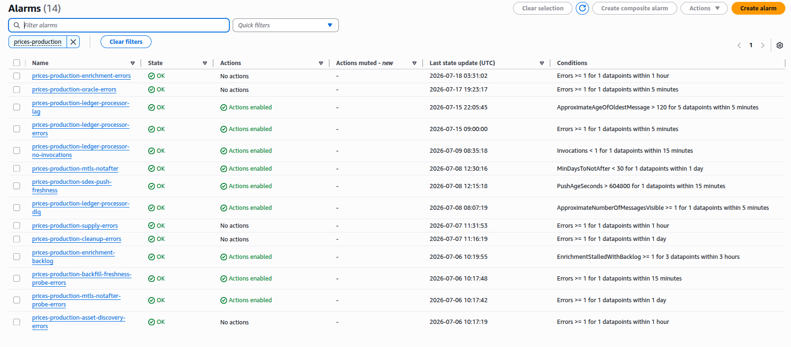

# SCF Submission — Documents & Build Pipeline

This directory holds the Stellar Community Fund **Deliverable Verification**
package for the Stellar Prices API, plus the reproducible toolchain that
builds it.

The structure mirrors the sibling Soroban Block Explorer repository's
`docs/scf/`, which has shipped two SCF submissions using it.

## File inventory

| File                                  | Role                                                                                                        |
| ------------------------------------- | ----------------------------------------------------------------------------------------------------------- |
| `milestone-1-form-answers.md`         | Exact text to paste into each field of the SCF Deliverable Verification web form.                           |
| `milestone-1-evidence.md`             | Full evidence companion to the M1 submission video — **source of truth**.                                   |
| `milestone-1-evidence.pdf`            | PDF render of the above, attached in Google Drive next to the video. **Build output.**                      |
| `milestone-1-video-scenario.md`       | Scene-by-scene recording script for the 5–7 minute demo video.                                              |
| `ch-demo-queries.sql`                 | Read-only ClickHouse queries the operator runs against production; outputs feed both the video and the PDF. |
| `architecture.mmd`                    | Mermaid source for the architecture diagram.                                                                |
| `architecture.png`                    | Rendered diagram, embedded in the evidence PDF. **Build output.**                                           |
| `build-pdf.sh`                        | Reproducible PDF render script (`pandoc + typst`).                                                          |
| `screenshots/`                        | Evidence images referenced from `milestone-1-evidence.md`.                                                  |
| `header.typ`, `full-width-tables.lua` | Typst/pandoc styling for the PDF render.                                                                    |

## Build the PDF

One-time tooling install:

```bash
# Linux (Debian/Ubuntu)
sudo apt install pandoc poppler-utils      # poppler-utils optional (page count)
cargo install --locked typst-cli           # or: snap install typst

# macOS
brew install pandoc typst poppler
```

`pandoc` must be **≥ 3.1** for `--pdf-engine=typst`; distro packages are often
older. If yours is, install from https://github.com/jgm/pandoc/releases. The
build script checks this and fails early with a clear message.

Render:

```bash
./build-pdf.sh
```

Output: `milestone-1-evidence.pdf`. The script also lists any unresolved
`<TODO:>` markers in the source so you remember to fill in query outputs and
screenshots before the final upload.

## Render the architecture diagram

```bash
npx -y @mermaid-js/mermaid-cli -i architecture.mmd -o architecture.png -s 3
```

`-s 3` renders at 3× scale so the diagram stays legible in the PDF.

### Why this toolchain

- **Typst** as the engine: handles Unicode (`→`, `—`, `✅`, en-dashes) natively
  — no LaTeX font fiddling.
- **GFM input mode**: gives GitHub-style heading auto-IDs so the in-doc anchor
  links resolve.
- ~10× faster than xelatex; cold render under 2 s.

## Submission workflow (end-to-end)

```
0. FIRST — refresh the coarse tables, or your evidence will look stale.
   The rollup MVs are dropped (see "Ground rules"), so 1h/4h/1d/1w/1M only
   advance when someone runs the pre-roll. If you skip this, AC 6's query
   reports a latest_candle from whenever it was last run, and a reviewer
   will ask why your daily data stops days before submission.

       packages/prices-clickhouse/schema/preroll-live-gap.sql
       --param_start_ts=<last coarse tip>  --param_end_ts=<a clean hour, just
                                             behind the live 1m frontier>

   Then confirm every tip moved (the verify block in that file). Do this in
   the SAME session as the queries and the video, so the PDF and the video
   show the same numbers.

1. Run  ch-demo-queries.sql  against production ClickHouse over mTLS.
   Paste each output into milestone-1-evidence.md, replacing its
   <TODO: paste output> marker.

2. Capture the screenshots for every <TODO: screenshot> marker — ideally in
   the same session as the video recording, so the PDF and the video show the
   same numbers:
       - `make synth-production` + the no-RDS/VPC/NAT grep
       - CloudWatch alarms list in OK state
       - the Slack alarm notification from the task 0056 fire-test

3. Replace each <TODO:> with a Markdown image embed:
       

4. Render the diagram, then run  ./build-pdf.sh  to regenerate the PDF.

5. Record the video from  milestone-1-video-scenario.md  (5–7 min).

6. Upload the PDF + video to a Google Drive folder with link-sharing set to
   "anyone with the link can view".

7. Open  milestone-1-form-answers.md , replace every <ANGLE_BRACKET>
   placeholder (Drive folder link, video URL), and work the
   pre-submission checklist at the bottom.

8. Copy the four field blocks into the SCF Deliverable Verification form
   and submit.
```

## Ground rules for this package

These are not style preferences; they are what keeps the submission
defensible.

- **Claim only what is demonstrated.** Milestone 1 is Infrastructure &
  Real-time Ingestion. The full API surface, the dashboard, and full-chain
  backfill coverage are later tranches — `milestone-1-evidence.md` §6 says so
  explicitly, and Field 1 of the form answers matches it exactly.
- **Never screenshot the CloudWatch dashboard.** `prices-production-overview`
  is a scaffold with no data widgets. The seven alarms are real and
  fire-tested; the dashboard is not evidence.
- **Do not re-create the rollup MVs before recording.** The six `mv_ohlcv_*`
  views are deliberately dropped on production (in replace mode they overwrote
  pre-rolled coarse history — a real incident). `SHOW TABLES` will not list
  them, the package says so explicitly, and a reviewer running that query
  themselves must find exactly what we described. Re-creating them to make the
  output "look right" would be both dishonest and an outage. Coarse is kept
  current by the pre-roll in step 0 instead.
- **History lives in the coarse tables, not `price_ohlcv_1m`.** `1m` is a
  transient feeder pruned at 7 days (`15m` at 30); `1h/4h/1d/1w/1M` are kept
  forever. Any depth-of-history claim or query must read the coarse tables —
  asking `1m` for six months returns a few days and reads as a failure.
- **Scope refinements get disclosed, not buried.** Every deviation from the
  approved plan (RDS → ClickHouse foremost) is named, rationalised, and linked
  to the ADR that records it, in both the PDF and the video.
- **No secrets in any artifact.** No API keys, no certificate material, no
  private keys — in the markdown, the PDF, the screenshots, or any video
  frame. Export `$KEY` outside the recorded shell.
- **No personal names**, no Polish, no internal slang. English-only.

## Known limitations of the current render

- **Long URLs in tables** (§7 "Live endpoints and access") wrap mid-domain.
  Acceptable for a reviewer, not pretty. Fix would be a small typst template;
  not blocking.
- **`<TODO:>` markers** render as inline text until replaced. They stay
  intentionally visible as placeholders.

## Regenerating from scratch

The PDF and PNG are build artifacts, reproducible from `.md` / `.mmd` source.
If the PDF drifts out of sync (someone edits the markdown and forgets to
re-render), just run `./build-pdf.sh` again.

The PDF is **committed** — for reviewer ease, the repo ships the same artifact
the SCF reviewer sees. To keep the repo source-only instead, add
`docs/scf/*.pdf` to `.gitignore`.
