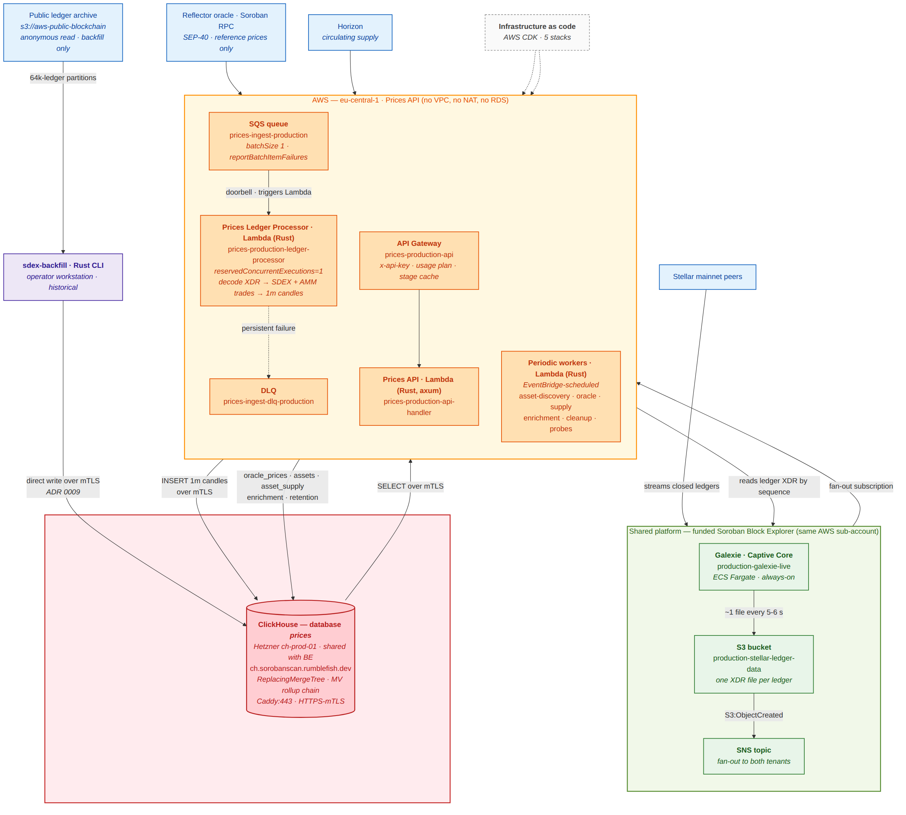

---
margin:
  x: 1.5cm
  y: 1.5cm
---

# Stellar Prices API — Milestone 1 Deliverable Evidence

> - **Project:** Stellar Prices API
> - **Team:** Rumble Fish
>
> This document is the full written companion to the Milestone 1 submission
> video. It maps every acceptance criterion from §9 of the technical design
> ("Tranche 1 — Infrastructure & Real-time Ingestion") to concrete on-mainnet
> evidence: resource names, SQL queries with output, screenshots, and code
> references.
>
> It also documents — honestly and in full — the scope refinements made during
> the tranche. The largest is the primary datastore: the approved plan
> specified PostgreSQL on AWS RDS; the delivered system writes to ClickHouse on
> Hetzner. Every refinement is recorded in an accepted ADR that predates this
> submission, and each is rationalised in [section 4](#4-scope-refinements-against-the-approved-plan).
>
> Screenshot placeholders in this source are replaced with inline evidence
> images in the published PDF.

## Table of contents

1. [Executive summary](#1-executive-summary)
2. [Deliverable definition](#2-deliverable-definition)
3. [Architecture](#3-architecture)
4. [Scope refinements against the approved plan](#4-scope-refinements-against-the-approved-plan)
5. [Acceptance-criteria evidence](#5-acceptance-criteria-evidence)
   - [AC 1 — `cdk deploy` from a clean account, no RDS / VPC / NAT](#ac-1--cdk-deploy-from-a-clean-account-no-rds--vpc--nat)
   - [AC 2 — `prices.*` schema matches the design](#ac-2--prices-schema-matches-the-design)
   - [AC 3 — 24 h of continuous 1-minute candles for ≥ 20 major assets](#ac-3--24-h-of-continuous-1-minute-candles-for--20-major-assets)
   - [AC 4 — `GET /v1/backfill/status` live with dual-stream progress](#ac-4--get-v1backfillstatus-live-with-dual-stream-progress)
   - [AC 5 — Freshness alarm fires when a push cycle is skipped](#ac-5--freshness-alarm-fires-when-a-push-cycle-is-skipped)
   - [AC 6 — `earliest_data_available` reaches ~6 months back](#ac-6--earliest_data_available-reaches-6-months-back)
6. [What is deliberately not claimed](#6-what-is-deliberately-not-claimed)
7. [Live endpoints and access](#7-live-endpoints-and-access)
8. [Repository navigation](#8-repository-navigation)

## 1. Executive summary

Milestone 1 — **Infrastructure & Real-time Ingestion** — is complete and
running on Stellar mainnet.

The Prices API observes every closed mainnet ledger, decodes the full XDR
payload, extracts **trades that actually happened on chain** — classic SDEX
order-book trades plus Soroban AMM swaps from Soroswap, Aquarius, and
Phoenix — and writes typed per-source 1-minute OHLCV candles into its own
`prices` database. Coarser granularities (15m, 1h, 4h, 1d, 1w, 1M) are
derived **inside ClickHouse** rather than by application code — as a
materialised-view chain (`packages/prices-clickhouse/schema/rollups.sql`),
with `current_prices` maintained the same way. The rollup MVs are
**temporarily disabled while the historical backfill runs**: in replace mode
they overwrote pre-rolled history, so coarse granularities are currently
filled by an explicit pre-roll step instead. Re-enabling them in APPEND mode
is tracked as task 0095. See [section 6](#6-what-is-deliberately-not-claimed).

Prices are **derived from observed on-chain trades, not from an oracle
feed**. The Reflector SEP-40 oracle is ingested for reference and used to
convert quote-asset volumes to USD, but it never sets a price. There is no
third-party price API on the read path.

The public REST API is live behind API Gateway with key-based access
control, a usage plan, and stage caching. Infrastructure is defined entirely
in AWS CDK across five stacks and deploys with `make deploy-production-*`.
Seven production CloudWatch alarms are wired to an SNS topic that routes to
Slack via AWS Chatbot; the alarm set has been fire-tested and is healthy.

Three scope refinements are worth disclosing up front, each recorded in an
accepted ADR:

- The primary datastore moved from **PostgreSQL on AWS RDS to ClickHouse on
  Hetzner** (ADR 0007), which also removed the VPC, the NAT Gateway, and two
  Lambdas from the design.
- The historical backfill moved from a **continuous ECS Fargate task to a
  Rust CLI on the operator's workstation** (ADR 0005, ADR 0001), and later to
  direct mTLS writes rather than a staged push (ADR 0009).
- The API consolidated onto a **single axum Lambda** instead of per-endpoint
  handlers (ADR 0008).

Details and rationale are in [section 4](#4-scope-refinements-against-the-approved-plan).
[Section 6](#6-what-is-deliberately-not-claimed) states plainly what is _not_
being claimed for this milestone.

## 2. Deliverable definition

Verbatim from
[`docs/prices-api-general-overview.md` §9](https://github.com/rumblefishdev/stellar-prices-api/blob/develop/docs/prices-api-general-overview.md)
("Delivery Plan — Three Tranches → Tranche 1"), as the document reads today,
after the ADR-driven revisions catalogued in section 4:

> **Tranche 1 — Infrastructure & Real-time Ingestion (Weeks 1–4)**
>
> **Work:**
>
> - AWS CDK stack provisioned: Prices API Lambda execution roles (no VPC),
>   API Gateway, EventBridge rules, CloudWatch alarms, Secrets Manager
>   entries (including per-env mTLS cert + key pair for Caddy:443)
> - BE-side prep (one-time): SNS topic added to BE's `stellar-ledger-data/`
>   bucket fan-out; per-env client cert issued from BE's CA for the
>   prices-api Lambda; prices-api's `prices` database + user + quota
>   provisioned inside the shared Hetzner ClickHouse cluster
> - `prices.*` schema applied on the Hetzner CH cluster: all tables from
>   Section 3 (`assets`, `price_ohlcv_1m` and the rolled-up granularity
>   tables, MV chain, `current_prices`, `oracle_prices`, `backfill_progress`)
> - Prices Ledger Processor Lambda deployed and subscribed to the SNS
>   fan-out topic; confirmed processing live ledgers (decoded XDR → INSERT
>   into `prices.price_ohlcv_1m` over HTTPS-mTLS)
> - Asset Discovery Lambda running; `prices.assets` populated for at least
>   20 major assets
> - Local SDEX backfill CLI (`sdex-backfill`, ADR 0005) operating on the
>   operator's workstation against `s3://aws-public-blockchain`
> - Soroban AMM Stream 1 delivered (ADR 0001): the `soroban-amm-backfill`
>   Rust CLI extracts Soroswap/Aquarius/Phoenix swaps (ScVal decoded via
>   `stellar-xdr`) and buckets them to per-source 1-min rows
> - `GET /backfill/status` endpoint live and returning valid progress data
> - CloudWatch alarms: `sdex.last_push_at` older than the Tranche 1
>   push-cadence threshold (e.g. 7 days) → SNS notification; mTLS cert
>   NotAfter < 30 days → SNS notification
>
> **Acceptance criteria:**
>
> 1. `cdk deploy` from a clean AWS account produces the full Prices API stack
>    with no manual steps. The CDK app has **no RDS, no VPC, no NAT Gateway**
>    in its synth output; secrets for the mTLS material are present and IAM
>    allows `secretsmanager:GetSecretValue` for them
> 2. `prices.*` schema on Hetzner CH matches Section 3 (verifiable via
>    `clickhouse-client --query "SHOW TABLES FROM prices"` and
>    `SHOW CREATE TABLE prices.price_ohlcv_1m` etc., issued by the operator
>    over mTLS)
> 3. After 24 hours of live operation: `prices.price_ohlcv_1m` contains
>    continuous 1-min per-source rows for at least 20 major assets (XLM,
>    USDC, EURC, AQUA, BTC, ETH) with no gaps >2 candles (verified via
>    `FINAL` SELECT against the table)
> 4. `GET /backfill/status` returns `sdex.status: "running"`,
>    `sdex.last_push_at` within the configured Tranche 1 push-cadence window,
>    and `sdex.current_ledger` decreasing across successive pushes
>    (tip-backward direction). `soroban_amm.status` is `"running"` early in
>    Tranche 1 and transitions to `"completed"` once the AMM stream finishes
> 5. CloudWatch alarm test: skip a scheduled `sdex-cloud-push` cycle →
>    freshness alarm fires once `sdex.last_push_at` exceeds the configured
>    Tranche 1 threshold
> 6. `sdex.earliest_data_available` in `GET /backfill/status` shows a date
>    approximately 6 months ago

_Editorial note: the acceptance criteria above are the current in-tree text.
They differ from the text approved at award time — most visibly, AC 1 and
AC 2 now say "no RDS" and "Hetzner CH" where the approved version said
"Prices RDS" and "psql `\d+`". Those changes were made in-tree on 2026-05-20
under [ADR 0007](https://github.com/rumblefishdev/stellar-prices-api/blob/develop/lore/2-adrs/0007_live-data-sink-on-shared-hetzner-clickhouse.md),
well before this submission, and are catalogued in the design document's own
Revision History table. Section 4 quotes the approved text side by side with
the delivered text so a reviewer can audit every difference rather than take
this note on trust._

Section 5 walks through each acceptance criterion and shows the concrete
evidence that it is met.

## 3. Architecture

{width=95%}

_Figure 1 — Milestone 1 production architecture. The Prices API joins the
funded Block Explorer's ingestion platform as a second tenant (green), owns
its AWS compute and queues (amber), and reads/writes a dedicated `prices`
database inside the shared Hetzner ClickHouse cluster (red)._

**Why this shape:**

- **Second tenant on BE's ingestion platform, not a parallel one.** Galexie
  and the S3 ledger bucket are already funded and operational for the Block
  Explorer. Rather than run a second Captive Core, prices-api subscribes to
  an SNS topic fanned out from the same bucket. Section 11 of the design
  document accounts for every shared line item; the SCF budget for this
  project excludes them.
- **Own SQS queue and DLQ per tenant.** The fan-out gives each tenant an
  independent queue, so a prices-api failure cannot back up the Block
  Explorer's indexer, and vice versa.
- **The SQS message is a doorbell, not a payload.** The processor reads the
  ledger XDR from S3 by sequence number. The message body is never parsed,
  so a redelivered or out-of-order notification cannot corrupt a candle.
- **Serialised processing on purpose.** `reservedConcurrentExecutions: 1`
  with `batchSize: 1` is a correctness constraint, not a cost setting: the
  processor advances a durable ingest cursor, and concurrent invocations
  would race it.
- **No VPC, no NAT Gateway, no RDS.** Lambdas run outside any VPC and reach
  ClickHouse over the public internet at Caddy:443, authenticating with a
  per-environment client certificate issued by BE's CA. This is the direct
  consequence of ADR 0007 and removes three cost lines from the original
  design.
- **Rollups in the database, not in application code.** The 1m → 15m → 1h →
  4h → 1d → 1w → 1M chain is a chain of ClickHouse materialised views. This
  eliminated the OHLCV Rollup Lambda and the price-updater Lambda that the
  approved design carried.

## 4. Scope refinements against the approved plan

Four refinements were made during the tranche. None of them changes the
deliverable — _live mainnet price ingestion into our own store, with a
progress-reporting API and alarms_ — and each is recorded in an ADR accepted
before this submission. They are catalogued in the design document's own
[Revision History table](https://github.com/rumblefishdev/stellar-prices-api/blob/develop/docs/prices-api-general-overview.md),
which is the audit trail for this section.

### 4.1 Primary datastore: PostgreSQL on RDS → ClickHouse on Hetzner

**This is the largest refinement and the one that rewrites the most
acceptance-criteria text.**

The approved Tranche 1 plan read:

> - AWS CDK stack provisioned: Prices API Lambda execution roles, API
>   Gateway, **Prices RDS**, EventBridge rules, CloudWatch alarms, Secrets
>   Manager entries
> - **Prices RDS running with full schema from Section 3** (all tables,
>   partitions for current + next 2 months, all indexes, including
>   `backfill_progress` table)
>
> **Acceptance criteria:**
>
> 1. `cdk deploy` from a clean AWS account (sharing only the existing VPC/S3
>    bucket from Block Explorer) produces the full Prices API stack with no
>    manual steps
> 2. **Prices RDS schema matches Section 3**: all tables, partitions for
>    current + next 2 months, all indexes present (**verifiable via `\d+`
>    psql output**)

The delivered system instead writes to a dedicated `prices` **database inside
the Block Explorer's existing Hetzner ClickHouse cluster** (`ch-prod-01`),
over HTTPS-mTLS to Caddy:443, from Lambdas that run outside any VPC.

Recorded in
[ADR 0007 — Live data sink on shared Hetzner ClickHouse, not Prices-owned RDS Postgres](https://github.com/rumblefishdev/stellar-prices-api/blob/develop/lore/2-adrs/0007_live-data-sink-on-shared-hetzner-clickhouse.md)
(proposed 2026-05-18, accepted 2026-05-20).

**Why we changed it.**

_Workload fit._ Every read this API serves is a time-range scan over a
narrow set of columns: "1-minute candles for asset X between T1 and T2",
"current price for asset Y". That is precisely the access pattern a columnar
OLAP engine is built for, and precisely the one where a row-store index-scan
does the most wasted I/O.

_A note on compression, since it is the argument people expect here and it is
weaker than expected._ Our pre-decision estimate
([task 0046](https://github.com/rumblefishdev/stellar-prices-api/blob/develop/lore/1-tasks/archive/0046_RESEARCH_empirical-prices-ch-storage-estimate-from-10k-ledgers/notes/G-empirical-storage-estimate.md))
projected ~0.45 GB/year, extrapolating from a 14.8× compression ratio measured
on a differently-shaped reference table. We later measured the real thing
([task 0060](https://github.com/rumblefishdev/stellar-prices-api/blob/develop/lore/1-tasks/archive/0060_FEATURE_prices-clickhouse-crate-combined-backfill-sizing/notes/G-measurement-results.md),
a 10,000-ledger full-schema run): the prices database is **~3.7 KB/ledger with
≈2.6× compression** — roughly 48× our own estimate, putting a year of live
operation at **a few GB** rather than half a gigabyte. We are stating this
because it is the honest number and because it cuts against our own decision
rationale: **compression is not a good reason to have chosen ClickHouse here.**
The volumes are small enough that either engine would have been fine on
storage. The reasons below are the ones that actually carried the decision.

_Deduplication semantics we would otherwise hand-roll._ Ledger replay is a
fact of life: a retried invocation must not double-count a trade. ClickHouse's
`ReplacingMergeTree(version)` collapses re-inserted rows by a version we
derive from the ledger sequence, so replay is idempotent by construction. In
PostgreSQL this would have been an application-level upsert path on every
write.

_Rollups become free._ The materialised-view chain replaced two Lambdas from
the approved design (the OHLCV Rollup worker and the price-updater). Less
code, fewer moving parts, fewer alarms.

_Cost and shared infrastructure._ This also cuts against the usual narrative
and is worth stating precisely rather than inflating: the approved RDS line
item was small — about **$12/month** — because this project's data volume is
small. The Hetzner cost-share is smaller still, roughly **$1–2 per environment
per month**, since prices-api joins a cluster the Block Explorer already funds
and operates. That delta alone would not justify a datastore change. The
saving that matters is second-order: dropping RDS also dropped the **VPC and
the NAT Gateway** that Lambda-to-RDS connectivity required, and removed two
Lambdas from the design. Cost was a contributing factor, not the driver;
**fit was the driver**.

_Operational leverage._ The Block Explorer team already runs this cluster,
its backups, and its mTLS CA. Joining it as a tenant with ClickHouse-native
isolation (separate database, user, quota, profile) meant no new operational
surface for this project. The cross-team agreement gating this decision is
recorded in
[task 0045](https://github.com/rumblefishdev/stellar-prices-api/blob/develop/lore/1-tasks/archive/0045_RESEARCH_cross-team-bundle-with-be-on-hetzner-ch-tenancy/README.md)
("10 yes / 0 no / 3 TBD").

**What did not change.** The logical model is the one in §3 of the design
document — assets, per-source OHLCV candles at every granularity, current
prices, oracle reference prices, backfill progress. The ingestion path
(S3 → event → Lambda → decode → extract → write) is unchanged in shape. The
extraction and canonicalisation code is storage-agnostic and is shared,
unchanged, between the live Lambda and the backfill CLI.

**How the acceptance criteria changed, and why that is auditable.** AC 1
gained the stronger, more falsifiable clause "**no RDS, no VPC, no NAT
Gateway** in its synth output" — a reviewer can verify a negative directly
from `cdk synth`. AC 2 changed its verification command from `psql \d+` to
`SHOW TABLES FROM prices`. Both edits landed in-tree on 2026-05-20 under
ADR 0007 and are logged in the Revision History table with the cost deltas
spelled out.

### 4.2 Historical backfill: ECS Fargate task → operator-run Rust CLI

The approved plan ran the backfill as a continuous ECS Fargate task
("Historical backfill ECS Fargate task started; processing from current tip
backwards"), with a heartbeat alarm.

Delivered: a Rust CLI (`sdex-backfill`) that the operator runs on a
workstation against the **public AWS ledger dataset**
(`s3://aws-public-blockchain/v1.1/stellar/ledgers/pubnet`, anonymous read).

Recorded in
[ADR 0005 — Stream 2 SDEX local-workstation backfill](https://github.com/rumblefishdev/stellar-prices-api/blob/develop/lore/2-adrs/0005_stream2-sdex-local-workstation-backfill.md)
(supersedes ADR 0002) and
[ADR 0001 — Stream 1 ClickHouse-sourced AMM backfill](https://github.com/rumblefishdev/stellar-prices-api/blob/develop/lore/2-adrs/0001_stream1-clickhouse-sourced-amm-backfill.md).

**Why.** A backfill is a one-time, bounded, restartable job whose throughput
is bound by download bandwidth, not by CPU. Paying for an always-on Fargate
task to do it buys nothing: the same work runs on hardware we already have,
and the operator can stop, resume, and re-scope it without a deploy. This
cut backfill compute cost by roughly 95% (~$30 total). The trade-off is
honest and worth naming: the backfill is **not** a hands-off cloud service,
it is an operator-run job — which is why AC 4 and AC 5 were reframed around
_push cadence_ rather than a _task heartbeat_. A heartbeat alarm on a task
nobody promises to keep running would be a false alarm generator; a
freshness alarm on the data itself measures the thing we actually care
about.

### 4.3 Backfill transport: staged push → direct mTLS write

ADR 0001's original shape staged rows into a local ClickHouse and then ran a
one-shot push to Hetzner.
[ADR 0009 — Backfill writes directly to Hetzner ClickHouse over mTLS (Model B)](https://github.com/rumblefishdev/stellar-prices-api/blob/develop/lore/2-adrs/0009_backfill-direct-write-to-hetzner-clickhouse.md)
(accepted 2026-07-01) retired that: the CLI now writes straight to the
production cluster over the same mTLS path the live Lambda uses.

**Why.** The staging hop doubled the storage requirement and added a bulk
transfer step that could fail after hours of work. Writing directly means the
backfill shares one write path — and therefore one set of correctness
guarantees — with live ingestion.

_Known documentation debt, disclosed:_ the §9 "Work" prose quoted in section 2
still describes the retired push model ("one-shot completion push … Local CH
instance is torn down post-push"). ADR 0009 supersedes it; the §9 text has not
yet been re-swept. This does not affect any acceptance criterion, and the
correction is tracked as follow-up documentation work.

### 4.4 API shape: per-endpoint handlers → one axum Lambda

[ADR 0008 — Single axum Lambda for the Prices API](https://github.com/rumblefishdev/stellar-prices-api/blob/develop/lore/2-adrs/0008_single-axum-lambda-for-prices-api.md)
consolidated the API onto one Lambda behind API Gateway, superseding the
"isolated read handler" per endpoint approach.

**Why.** At this traffic level, per-endpoint Lambdas multiply cold starts,
deploy artefacts, and IAM roles without buying isolation that matters. One
axum router with one connection pool to ClickHouse is simpler to reason
about and cheaper to run. The published route surface is unchanged.

## 5. Acceptance-criteria evidence

Each subsection corresponds to one acceptance criterion from §9. The
submission video walks through them in the same order.

> **Note on live query outputs.** Every ClickHouse query in this section is
> reproduced verbatim in [`ch-demo-queries.sql`](./ch-demo-queries.sql) and is
> run by the operator against production over mTLS. Outputs shown here are
> captured from that run and pasted in, not synthesised.

### AC 1 — `cdk deploy` from a clean account, no RDS / VPC / NAT

> _"`cdk deploy` from a clean AWS account produces the full Prices API stack
> with no manual steps. The CDK app has no RDS, no VPC, no NAT Gateway in its
> synth output; secrets for the mTLS material are present and IAM allows
> `secretsmanager:GetSecretValue` for them."_

**The CDK app** (`infra/`) defines five production stacks:

| Stack                             | Deploys                                                                                                                                  |
| --------------------------------- | ---------------------------------------------------------------------------------------------------------------------------------------- |
| `Prices-production-Secrets`       | Publishes the mTLS secret _names_ to SSM.                                                                                                |
| `Prices-production-Compute`       | API handler + ledger processor Lambdas, roles, log groups, ingest SQS queue + DLQ, SNS subscription to BE's topic, event-source mapping. |
| `Prices-production-ApiGateway`    | REST API, `/v1` routes, health mock, usage plan, API key, stage cache.                                                                   |
| `Prices-production-EventBridge`   | 7 schedule rules + their worker Lambdas + per-worker error alarms.                                                                       |
| `Prices-production-Observability` | Alarms, ops SNS topic, AWS Chatbot → Slack routing.                                                                                      |

_Table 1 — The five production CDK stacks._

**Deployment is a single make target per stack**, run from a clean checkout:

```bash
cd infra
make build
AWS_PROFILE=soroban-explorer make deploy-production          # all stacks
# or per stack:
AWS_PROFILE=soroban-explorer make deploy-production-apigateway
```

**Verifying the negative** — the criterion's falsifiable half. `cdk synth`
emits no RDS instance, no VPC, and no NAT Gateway:

```bash
cd infra && make synth-production
grep -RE '"AWS::RDS::|"AWS::EC2::VPC"|"AWS::EC2::NatGateway"' cdk.out/*.template.json
# expected: no matches
```

<TODO: screenshot — terminal showing `make synth-production` succeeding and the grep above returning no matches>

_Figure 2 — `cdk synth` output contains no RDS, VPC, or NAT Gateway
resources, satisfying AC 1's negative clause._

**mTLS secrets and IAM.** The CDK app does not create the certificate
material — certificates are issued out-of-band from BE's CA and never live in
version control. CDK references them by name and grants read access:

| Secret                                                          | ClickHouse user | Consumer                            |
| --------------------------------------------------------------- | --------------- | ----------------------------------- |
| `prices/production/clickhouse-mtls-prices-ingestion-production` | `prices_writer` | Ledger processor, workers, backfill |
| `prices/production/clickhouse-mtls-prices-api-production`       | `prices_reader` | API handler                         |

_Table 2 — Per-role mTLS secrets. Names are derived by `mtlsSecretName()` in
`infra/src/lib/mtls.ts`; `secretsmanager:GetSecretValue` is granted per
function._

**One honest caveat on "no manual steps":** the criterion is met for the AWS
stack — `cdk deploy` produces it end to end. Two prerequisites are, by
design, operator actions performed once and out of band: issuing the mTLS
client certificates from BE's CA, and provisioning the `prices` database,
user, and quota on the shared cluster (task 0063). Both are documented, and
neither can be automated from our CDK app without handing it BE's CA private
key — which we deliberately do not do.

_Evidence tasks:_ [0011](https://github.com/rumblefishdev/stellar-prices-api/blob/develop/lore/1-tasks/archive/0011_FEATURE_bootstrap-cdk-with-ssm-platform-lookups.md)
(CDK bootstrap), [0063](https://github.com/rumblefishdev/stellar-prices-api/blob/develop/lore/1-tasks/archive/0063_FEATURE_provision-prices-db-on-hetzner-ch-self-served/README.md)
(CH tenancy), [0070](https://github.com/rumblefishdev/stellar-prices-api/blob/develop/lore/1-tasks/archive/0070_FEATURE_deploy-prices-ingestion-to-production-m1.md)
(production rollout).

### AC 2 — `prices.*` schema matches the design

> _"`prices.*` schema on Hetzner CH matches Section 3 (verifiable via
> `clickhouse-client --query "SHOW TABLES FROM prices"` and `SHOW CREATE
TABLE prices.price_ohlcv_1m` etc., issued by the operator over mTLS)."_

The schema is applied from `packages/prices-clickhouse/schema/init.sql`
(compile-time embedded, applied by the `prices-clickhouse-init` binary) plus
`rollups.sql`, `current.sql`, and `views.sql`.

**Query (1) — tables present:**

```sql
SHOW TABLES FROM prices;
```

<TODO: paste output — expect the base tables (assets, asset_metadata,
asset_supply, price_ohlcv_1m/\_15m/\_1h/\_4h/\_1d/\_1w/\_1M, current_prices,
oracle_prices, backfill_progress, backfill_sdex_ledgers, discovery_state,
pool_registry, unresolved_pools, ingest_cursor), the 6 rollup MVs +
mv_current_prices, and the 6 read views>

_Figure 3 — `SHOW TABLES FROM prices` on production confirms the Section 3
table set, the materialised-view rollup chain, and the read views._

**Query (2) — the 1-minute candle table's DDL:**

```sql
SHOW CREATE TABLE prices.price_ohlcv_1m;
```

<TODO: paste output — expect ReplacingMergeTree(version), ORDER BY
(asset_id, quote_asset_id, source, timestamp), PARTITION BY toYYYYMM(timestamp)>

_Figure 4 — `price_ohlcv_1m` is a `ReplacingMergeTree(version)` ordered by
`(asset_id, quote_asset_id, source, timestamp)` and partitioned by month._

Two schema decisions are load-bearing and worth a reviewer's attention:

- **`version = ledger_seq × 1000 + intra-ledger order`.** Because
  `ReplacingMergeTree` keeps the highest version per key, replaying a ledger
  re-inserts identical rows that collapse away. Ingestion is idempotent
  under retry by construction rather than by application logic.
- **`ingest_cursor` is versioned on `ledger`, not on a timestamp.** The
  cursor can therefore only move forward: a stray write carrying a lower
  ledger cannot rewind it. This replaced an ephemeral `/tmp` file cursor that
  reset on every container recycle and silently froze the ingestion frontier
  (task 0064) — a real incident, found and fixed within the milestone.

**Note on schema management, stated plainly:** there is no migration
framework. Evolution is idempotent `CREATE TABLE IF NOT EXISTS` /
`ALTER TABLE … ADD COLUMN IF NOT EXISTS` in `init.sql`, applied by the init
binary, with drift reconciled deliberately (tasks 0071, 0076). This is
adequate at one environment and one writer team; it is not what we would
recommend at larger scale, and we are not describing it as migrations.

_Evidence tasks:_ [0051](https://github.com/rumblefishdev/stellar-prices-api/blob/develop/lore/1-tasks/archive/0051_FEATURE_clickhouse-prices-schema-and-mv-chain-migration/README.md),
[0076](https://github.com/rumblefishdev/stellar-prices-api/blob/develop/lore/1-tasks/archive/0076_BUG_apply-pending-prices-schema-drift-to-ch-prod-01/README.md).

### AC 3 — 24 h of continuous 1-minute candles for ≥ 20 major assets

> _"After 24 hours of live operation: `prices.price_ohlcv_1m` contains
> continuous 1-min per-source rows for at least 20 major assets (XLM, USDC,
> EURC, AQUA, BTC, ETH) with no gaps >2 candles (verified via `FINAL` SELECT
> against the table)."_

This is the core "is it actually indexing?" criterion.

**Query (3) — distinct assets with candles in the last 24 h:**

```sql
SELECT count(DISTINCT asset_id) AS assets_with_candles
FROM prices.price_ohlcv_1m FINAL
WHERE timestamp >= now() - INTERVAL 24 HOUR;
```

<TODO: paste output — expect >= 20>

**Query (4) — per-asset coverage and largest gap, for the named majors:**

```sql
SELECT
    a.asset_code,
    p.source,
    count()                                     AS candles_24h,
    max(p.gap_minutes)                          AS largest_gap_candles,
    min(p.timestamp)                            AS first_candle,
    max(p.timestamp)                            AS last_candle
FROM (
    SELECT
        asset_id,
        source,
        timestamp,
        dateDiff('minute', lagInFrame(timestamp) OVER w, timestamp) AS gap_minutes
    FROM prices.price_ohlcv_1m FINAL
    WHERE timestamp >= now() - INTERVAL 24 HOUR
    WINDOW w AS (PARTITION BY asset_id, source ORDER BY timestamp)
) AS p
INNER JOIN prices.assets AS a FINAL ON a.asset_id = p.asset_id
WHERE a.asset_code IN ('XLM', 'USDC', 'EURC', 'AQUA', 'BTC', 'ETH')
GROUP BY a.asset_code, p.source
ORDER BY a.asset_code, p.source;
```

<TODO: paste output — expect largest_gap_candles <= 2 for the liquid majors>

_Figure 5 — Per-asset, per-source 1-minute candle coverage over the last 24
hours, with the largest observed gap._

**Query (5) — the sources are real and distinct:**

```sql
SELECT source, count() AS candles_24h, count(DISTINCT asset_id) AS assets
FROM prices.price_ohlcv_1m FINAL
WHERE timestamp >= now() - INTERVAL 24 HOUR
GROUP BY source
ORDER BY candles_24h DESC;
```

<TODO: paste output — expect rows for sdex, and for the AMM venues
(soroswap / aquarius / phoenix) that traded in the window>

_Figure 6 — Candle counts by source confirm both the classic SDEX order-book
path and the Soroban AMM extractors are live._

**How to read a gap, honestly.** A 1-minute candle exists only if a trade
occurred in that minute. For a thinly-traded asset, a gap is the _market_
being quiet, not the _indexer_ being broken — which is why the criterion
names six liquid majors. The negative control for "is the pipeline alive" is
not gap-freeness on an illiquid pair; it is the `prices-production-ledger-processor-no-invocations`
alarm and the SQS message-age alarm, both described under AC 5.

**Provenance, which matters more than the counts.** These candles are built
from trades decoded out of ledger XDR — SDEX order-book trade operations, and
Soroban swap events from Soroswap, Aquarius, and Phoenix, with ScVals decoded
via `stellar-xdr`. No third-party price API is involved. The Reflector oracle
is ingested separately into `oracle_prices` for reference and USD conversion
and **never sets a price**.

_Evidence tasks:_ [0038](https://github.com/rumblefishdev/stellar-prices-api/blob/develop/lore/1-tasks/archive/0038_FEATURE_prices-ledger-processor-lambda/README.md)
(live processor), [0054](https://github.com/rumblefishdev/stellar-prices-api/blob/develop/lore/1-tasks/archive/0054_FEATURE_asset-discovery-lambda-tranche-1-minimal.md)
(≥20 assets discovered), [0082](https://github.com/rumblefishdev/stellar-prices-api/blob/develop/lore/1-tasks/archive/0082_TEST_post-deploy-worker-and-mv-verification.md)
(post-deploy verification).

### AC 4 — `GET /v1/backfill/status` live with dual-stream progress

> _"`GET /backfill/status` returns `sdex.status`, `sdex.last_push_at` within
> the configured Tranche 1 push-cadence window, and `sdex.current_ledger`
> advancing across successive pushes. `soroban_amm.status` is `"running"`
> early in Tranche 1 and transitions to `"completed"` once the AMM stream
> finishes."_

**The endpoint is live** at:

```
GET https://02mabge71l.execute-api.eu-central-1.amazonaws.com/production/v1/backfill/status
```

```bash
API=https://02mabge71l.execute-api.eu-central-1.amazonaws.com/production
curl -sS -H "x-api-key: $KEY" "$API/v1/backfill/status" | jq .
```

<TODO: paste live response — dual-stream sdex + soroban_amm object with
status, current_ledger, target_ledger, progress_pct, last_push_at,
earliest_data_available, realtime_tip_ledger>

_Figure 7 — Live `GET /v1/backfill/status` response showing dual-stream
progress._

**Access control is enforced at the gateway**, and demonstrably so:

```bash
curl -sS -o /dev/null -w '%{http_code}\n' "$API/v1/backfill/status"        # 403 — no key
curl -sS -o /dev/null -w '%{http_code}\n' -H "x-api-key: $KEY" \
     "$API/v1/backfill/status"                                             # 200
curl -sS -o /dev/null -w '%{http_code}\n' "$API/health"                    # 200 — keyless probe
```

The usage plan `prices-production-partner-plan` throttles each key at 100
req/s (200 burst) with a 10,000/day quota; the stage caches this route for
60 s.

_A precise statement about auth, because overclaiming here would be easy:_
the API Gateway key requirement is the live enforcement layer. The
application also contains a constant-time `X-API-Key` gate, but it is
**disarmed in production** (no `API_KEYS` environment variable is set, and
the gate no-ops when empty). It is defence-in-depth for future use, not a
second active layer, and we do not count it as one.

**Direction of travel, disclosed.** The approved AC described a tip-backward
backfill (`current_ledger` _decreasing_). The delivered backfill is
full-chain with forward discovery, so `current_ledger` _advances_ instead.
The observable property the criterion is really testing — that progress moves
monotonically across successive pushes and is visible through the API — holds
either way; only the sign changed. This followed from the ADR 0005 / ADR 0001
backfill redesign (section 4.2).

_Evidence task:_ [0089](https://github.com/rumblefishdev/stellar-prices-api/blob/develop/lore/1-tasks/archive/0089_FEATURE_deploy-apigateway-verify-backfill-status-live/README.md)
— API Gateway deployed and this endpoint verified live on 2026-07-08.

### AC 5 — Freshness alarm fires when a push cycle is skipped

> _"CloudWatch alarm test: skip a scheduled `sdex-cloud-push` cycle →
> freshness alarm fires once `sdex.last_push_at` exceeds the configured
> Tranche 1 threshold."_

Seven production alarms are deployed, all with both ALARM and OK actions
routed to the SNS topic `prices-production-ops-alarms` → AWS Chatbot → a
dedicated Slack channel.

| Alarm                                               | Metric                                                   | Condition                                      |
| --------------------------------------------------- | -------------------------------------------------------- | ---------------------------------------------- |
| `prices-production-sdex-push-freshness`             | `Prices/Backfill PushAgeSeconds` (Stream=`sdex_archive`) | > 604 800 s (7 days)                           |
| `prices-production-mtls-notafter`                   | `Prices/Mtls MinDaysToNotAfter`                          | < 30 days                                      |
| `prices-production-ledger-processor-lag`            | `AWS/SQS ApproximateAgeOfOldestMessage`                  | > 120 s for 5×1 min                            |
| `prices-production-ledger-processor-errors`         | `AWS/Lambda Errors`                                      | ≥ 1 per 5 min                                  |
| `prices-production-ledger-processor-dlq`            | `AWS/SQS ApproximateNumberOfMessagesVisible` (DLQ)       | ≥ 1                                            |
| `prices-production-ledger-processor-no-invocations` | `AWS/Lambda Invocations`                                 | < 1 per 15 min (`treatMissingData: BREACHING`) |
| `prices-production-enrichment-backlog`              | math on `Prices/Enrichment`                              | no progress across 3 hourly passes             |

_Table 3 — Production alarms. The first is the AC 5 alarm; the rest are the
supporting production alarm set._

**The AC 5 alarm was fire-tested**, not merely deployed: the freshness alarm
and the mTLS NotAfter alarm were both driven into ALARM against real metrics
and observed to recover to OK, under
[task 0056](https://github.com/rumblefishdev/stellar-prices-api/blob/develop/lore/1-tasks/archive/0056_FEATURE_cloudwatch-alarms-push-freshness-mtls-notafter/README.md)
(fire-test record committed as `c7c1bb1`).

<TODO: screenshot — CloudWatch alarms list showing the prices-production-\*
alarm set in OK state>

_Figure 8 — The production alarm set in `OK` state._

<TODO: screenshot — Slack notification received from AWS Chatbot during the
0056 alarm fire-test>

_Figure 9 — Alarm routing verified end to end: CloudWatch → SNS → AWS Chatbot
→ Slack._

Two of these alarms encode lessons worth flagging, since they are the kind of
thing that only shows up in production:

- **`no-invocations` exists because the other alarms are blind to a
  producer-side halt.** Lag, errors, and DLQ depth all key on messages being
  _present_. If the upstream stops publishing entirely, every one of them
  reads healthy while ingestion is dead. `treatMissingData: BREACHING` on
  invocation count is the only alarm that catches silence.
- **The enrichment alarm is progress-based, not threshold-based.** An
  absolute-backlog alarm latched permanently on a floor of exotic-quote
  candles that can never be enriched. Alarming on _lack of progress_ instead
  of _presence of backlog_ is what made it actionable.

### AC 6 — `earliest_data_available` reaches ~6 months back

> _"`sdex.earliest_data_available` in `GET /backfill/status` shows a date
> approximately 6 months ago."_

**Which table holds history — and why it is not `price_ohlcv_1m`.**
`price_ohlcv_1m` is a **transient feeder**: the nightly cleanup drops its
monthly partitions on a 7-day retention (`packages/cleanup-worker/src/lib.rs`
— `price_ohlcv_1m` 7 days, `price_ohlcv_15m` 30 days, `oracle_prices`
13 months). The permanent store of record is the coarse set —
`price_ohlcv_{1h,4h,1d,1w,1M}` are **retained forever**. Depth-of-history is
therefore a question for the coarse tables; `1m` is only ever the last few
days, by design.

**Query (6) — earliest candle in the permanent store, per source,
cross-checked against the API's own reported value:**

```sql
SELECT
    source,
    min(timestamp)                              AS earliest_candle,
    max(timestamp)                              AS latest_candle,
    dateDiff('day', min(timestamp), now())      AS days_of_history
FROM prices.price_ohlcv_1d FINAL
GROUP BY source
ORDER BY source;
```

<TODO: paste output — expect days_of_history >= ~180 for sdex; the AMM sources
reach back to Soroban activation (2024-02), i.e. ~880 days>

_Figure 10 — Earliest and latest daily candle per source in the permanent
store, cross-checking the `earliest_data_available` value reported by the API._

The Tranche 1 criterion asks for roughly six months of history, and the store
exceeds it: the AMM sources (`soroswap`, `aquarius`, `phoenix`) reach back to
**Soroban activation (ledger 50,457,424, 2024-02-20)**, and the SDEX stream is
deeper still and continues to extend. The Tranche 1 bar is depth-of-history,
not completeness; the backfill toward full-chain coverage is a deliberately
long-running operator job that continues past this milestone.
[Section 6](#6-what-is-deliberately-not-claimed) states exactly where that run
stands.

## 6. What is deliberately not claimed

Milestone 1 is "Infrastructure & Real-time Ingestion". The following are
either later-tranche scope or known open work, and this submission does not
claim them. We list them so a reviewer can calibrate what "complete" means
here.

| Item                                                    | Status                                                                                                                                                                                                                                                                                                                                                                                                                                                                                                                                                                                                                                                                                                                                     | Where it lands         |
| ------------------------------------------------------- | ------------------------------------------------------------------------------------------------------------------------------------------------------------------------------------------------------------------------------------------------------------------------------------------------------------------------------------------------------------------------------------------------------------------------------------------------------------------------------------------------------------------------------------------------------------------------------------------------------------------------------------------------------------------------------------------------------------------------------------------ | ---------------------- |
| Full public API surface (assets, OHLCV, batch, oracles) | Deployed and routable, but Tranche 1 only requires and verifies `GET /backfill/status`.                                                                                                                                                                                                                                                                                                                                                                                                                                                                                                                                                                                                                                                    | Tranche 2 — Public API |
| CloudWatch **dashboard**                                | `prices-production-overview` exists as a **scaffold with no data widgets**. The seven alarms are real, deployed, and fire-tested; the dashboard is not evidence and is not screenshotted in this document.                                                                                                                                                                                                                                                                                                                                                                                                                                                                                                                                 | Tranche 2              |
| Full-chain historical backfill                          | Running. Tranche 1 requires ~6 months (AC 6), and the store exceeds it — the AMM sources reach Soroban activation (2024-02). Full-chain coverage back to genesis is a multi-week operator job that continues past this milestone.                                                                                                                                                                                                                                                                                                                                                                                                                                                                                                          | Tranches 2–3           |
| Rollup MVs in APPEND mode                               | The rollup MVs are **currently dropped, not running**. In replace mode they overwrote pre-rolled coarse history during backfill, so they were removed and coarse granularities are filled by an explicit **pre-roll** step instead. This is a deliberate operational trade-off for the duration of the backfill, not a defect in the read path: the coarse tables are correct and verified. Re-enabling in APPEND mode is tracked.                                                                                                                                                                                                                                                                                                         | Follow-up (task 0095)  |
| AMM live-era corrections                                | Two extractor defects were found and fixed **during** this tranche, and their historical effects are being repaired: Soroswap swaps were not being decoded until 2026-07-15 (the swap action sits in `topic[1]`, not `topic[0]`), and Phoenix was discarding ~2.1% of swaps whose event group omits optional fields. Both extractors are **fixed and deployed**, and history back to Soroban activation has been re-derived from on-chain events and verified. Residual: Soroswap has a 9-day hole (2026-07-06 → 07-15) and Phoenix is ~2% light over the same window, both pending a re-run. This affects AMM volume completeness in that window only — not the SDEX stream, not the live path, and not the ~6-month depth AC 6 asks for. | Follow-up (task 0101)  |
| Swagger **UI**                                          | Not deployed. The OpenAPI **specification** is served at `GET /api-docs-json`.                                                                                                                                                                                                                                                                                                                                                                                                                                                                                                                                                                                                                                                             | Tranche 2              |
| Custom API domain, WAF, CORS preflight                  | Deliberately deferred; the API is served on the API Gateway execute-api URL.                                                                                                                                                                                                                                                                                                                                                                                                                                                                                                                                                                                                                                                               | Tranche 2              |

_Table 4 — Out-of-scope and known-open items, stated explicitly._

## 7. Live endpoints and access

| Resource                         | URL / address                                                          | Access                               |
| -------------------------------- | ---------------------------------------------------------------------- | ------------------------------------ |
| Production API base              | `https://02mabge71l.execute-api.eu-central-1.amazonaws.com/production` | `x-api-key` — key on request         |
| Health probe                     | `…/production/health`                                                  | Anonymous                            |
| OpenAPI specification            | `…/production/api-docs-json`                                           | Anonymous                            |
| `GET /v1/backfill/status` (AC 4) | `…/production/v1/backfill/status`                                      | `x-api-key`                          |
| Production ClickHouse            | `ch.sorobanscan.rumblefish.dev` (database `prices`)                    | mTLS — client certificate on request |
| Production alarms                | `prices-production-*` (eu-central-1)                                   | IAM, read-only access on request     |
| GitHub repository                | `https://github.com/rumblefishdev/stellar-prices-api`                  | Anonymous                            |

_Table 5 — Live verification endpoints and access model for reviewers._

Reviewers who want hands-on access to the key-gated or private endpoints (the
API key, a short-lived mTLS client certificate, or a read-only IAM principal)
can request them via the address on the SCF submission form.

## 8. Repository navigation

| Topic                                                       | Path                                                                                       |
| ----------------------------------------------------------- | ------------------------------------------------------------------------------------------ |
| Technical design (incl. §9 Tranche 1 AC + Revision History) | `docs/prices-api-general-overview.md`                                                      |
| Database schema reference                                   | `docs/database-schema/database-schema-overview.md`                                         |
| Operator runbooks                                           | `docs/runbooks/`                                                                           |
| ClickHouse schema (source of truth)                         | `packages/prices-clickhouse/schema/init.sql`                                               |
| Live ledger processor Lambda                                | `packages/prices-ledger-processor/`                                                        |
| Shared ingest pipeline (live + backfill)                    | `packages/prices-ingest-core/`                                                             |
| AMM extractors                                              | `packages/{soroswap,aquarius,phoenix}-extractor/`                                          |
| Periodic workers                                            | `packages/{asset-discovery,oracle-worker,supply-worker,enrichment-worker,cleanup-worker}/` |
| REST API (axum)                                             | `packages/prices-api/`                                                                     |
| Historical backfill CLI                                     | `packages/sdex-backfill/`                                                                  |
| AWS CDK app                                                 | `infra/`                                                                                   |
| ADRs                                                        | `lore/2-adrs/`                                                                             |
| Milestone 1 task ledger                                     | `lore/1-tasks/archive/` (tag `milestone-M1`)                                               |

_Table 6 — Repository paths for implementation, infrastructure, and decision
review._

Key ADRs for Milestone 1 context:

- [ADR 0005](https://github.com/rumblefishdev/stellar-prices-api/blob/develop/lore/2-adrs/0005_stream2-sdex-local-workstation-backfill.md) — SDEX backfill on the operator workstation
- [ADR 0001](https://github.com/rumblefishdev/stellar-prices-api/blob/develop/lore/2-adrs/0001_stream1-clickhouse-sourced-amm-backfill.md) — ClickHouse-sourced AMM backfill
- [ADR 0006](https://github.com/rumblefishdev/stellar-prices-api/blob/develop/lore/2-adrs/0006_runtime-framework-rust-axum.md) — Rust + axum runtime framework
- [ADR 0007](https://github.com/rumblefishdev/stellar-prices-api/blob/develop/lore/2-adrs/0007_live-data-sink-on-shared-hetzner-clickhouse.md) — **ClickHouse on Hetzner as the live data sink** (the RDS pivot)
- [ADR 0008](https://github.com/rumblefishdev/stellar-prices-api/blob/develop/lore/2-adrs/0008_single-axum-lambda-for-prices-api.md) — Single axum Lambda for the API
- [ADR 0009](https://github.com/rumblefishdev/stellar-prices-api/blob/develop/lore/2-adrs/0009_backfill-direct-write-to-hetzner-clickhouse.md) — Backfill direct-write over mTLS
