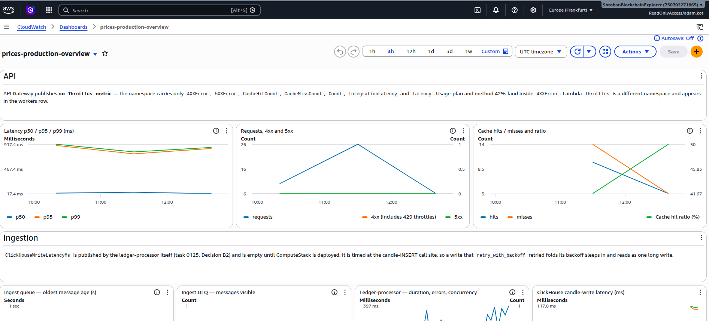
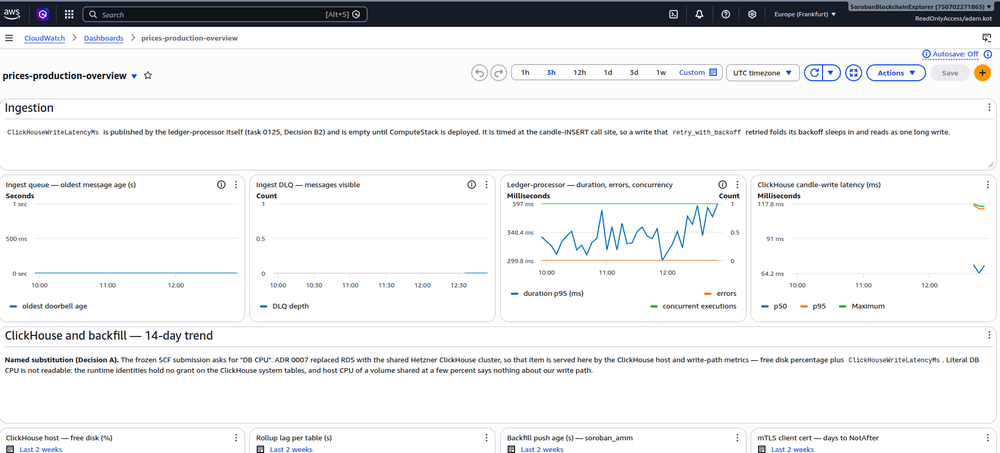
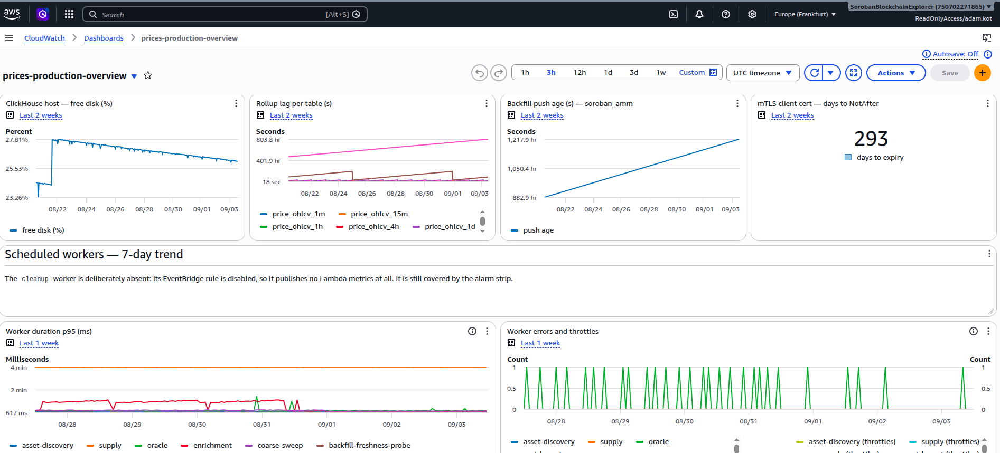
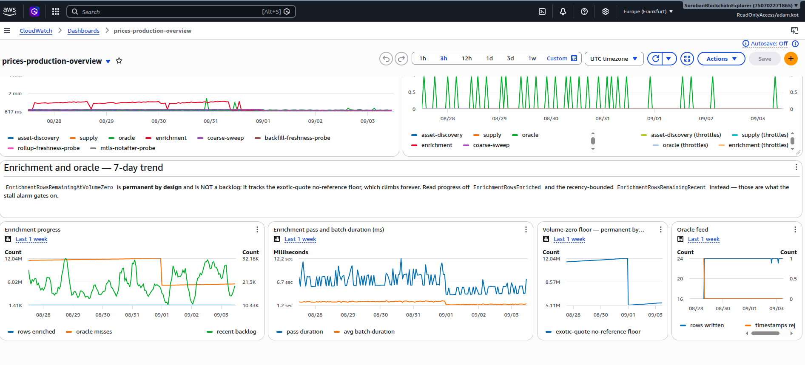

---
margin:
  x: 1.5cm
  y: 1.5cm
---

# Stellar Prices API — Milestone 2 Deliverable Evidence

> - **Project:** Stellar Prices API
> - **Team:** Rumble Fish
>
> This document is the written companion to the Milestone 2 submission video. It
> maps every acceptance criterion from §9 of the technical design
> (_"Tranche 2 — Public API"_) to concrete evidence against the deployed
> production API: live URLs, runnable commands with their output, SQL a reviewer
> can execute, and code references.
>
> **Everything here is reproducible against the public deployment.** The API base
> is `https://prices-api.sorobanscan.rumblefish.dev`, a REGIONAL custom domain
> mapped at the root, so there is no stage path in any URL. Key-gated routes need
> an `x-api-key` header; the key is available on request via the address on the
> submission form.
>
> **Two acceptance criteria are graded against amended wording, and both
> amendments are declared rather than assumed.** AC 2's target is unchanged but
> no key in the account can sustain it; AC 3 names a response header this
> platform does not emit. Each is set out in full in
> [`milestone-2-rfp-deviations.md`](milestone-2-rfp-deviations.md), which is part
> of this submission and should be read alongside this document.
>
> This project runs as a second tenant on infrastructure the **Soroban Block
> Explorer** already operates — a shared AWS sub-account and a shared Hetzner
> ClickHouse cluster. The Soroban Block Explorer is abbreviated **SBE** below.
>
> Evidence images are embedded inline in the published PDF and referenced from
> `screenshots/` in the Markdown source.

## Table of contents

1. [Executive summary](#1-executive-summary)
2. [Deliverable definition](#2-deliverable-definition)
3. [Architecture](#3-architecture)
4. [Deviations from the approved wording](#4-deviations-from-the-approved-wording)
5. [Acceptance-criteria evidence](#5-acceptance-criteria-evidence)
6. [Work items without a numbered criterion](#6-work-items-without-a-numbered-criterion)
7. [Milestone 1 deferrals, now delivered](#7-milestone-1-deferrals-now-delivered)
8. [What is deliberately not claimed](#8-what-is-deliberately-not-claimed)
9. [Live endpoints and access](#9-live-endpoints-and-access)
10. [Repository navigation](#10-repository-navigation)

## 1. Executive summary

Milestone 2 — **Public API** — is complete. All seven endpoint groups are
deployed on a custom domain, key-gated, cached and validated, and **all six
Tranche 2 acceptance criteria are met**. Two are graded against amended wording,
and both amendments are declared in §4 with their reasoning rather than assumed.

| AC  | Criterion                                         | Result                                             |
| --- | ------------------------------------------------- | -------------------------------------------------- |
| 1   | 7 endpoint groups, schema-valid, ≥ 20 assets      | **1021 checks pass, 0 fail, 0 skip**               |
| 2   | 100 req/s for 5 min, p95 < 200 ms, errors < 0.1 % | **p95 47.09 ms, 0 errors in 30,001 requests**      |
| 3   | Cache confirmed within the TTL window             | **hits 45-53 ms, misses 78-145 ms, no overlap**    |
| 4   | VWAP verifiable against raw rows, ≥ 3 assets      | **41 of 41 checks, 4 assets, worst delta 1.4e-11** |
| 5   | `earliest_data_available` ≤ 2022-01-01            | **2015-11-18, reconciled four ways**               |
| 6   | `timeframe=all` from ≥ Jan 2022, spot-checked     | **2,042 points; spot-check on XLM and yBTC**       |

The four §9 work items with no numbered criterion are delivered (§6), as are the
three items Milestone 1 explicitly deferred: the OpenAPI document through the
gateway, the CloudWatch dashboard, and the API edge (§7).

**What this document does not do is present a clean sweep.** Three results carry
limits that materially affect how they should be read, and each is stated where
the evidence is rather than in a footnote.

- **The load-test pass is narrow.** It is cache-dominated, and an uncontended
  cache miss costs 170 to 240 ms — already at the Tranche 2 bar. Widening the pool
  to defeat the cache **took the production read path down for between 19 and 47
  minutes**, and the root cause is not established.
- **AC 3's claim is weaker than the criterion asked for.** A header would be the
  cache asserting itself; latency is behaviour consistent with a cache. No
  `X-Cache` header exists on this platform and none can be produced honestly.
- **AC 6 substitutes its asset.** USDC's series is entirely peg-derived, carries
  no trades, and returns `1` through a real depeg, so it cannot fail the check and
  therefore cannot pass it. XLM and yBTC are spot-checked instead, over 28 dates
  rather than five.

§8 lists everything deliberately not claimed, with a destination for each row.

## 2. Deliverable definition

§9 of the technical design defines Tranche 2 as **Public API**, weeks 5 to 9.
The work it names:

- The seven core endpoint groups, implemented and deployed: `GET /assets`
  (paginated, sortable, filterable), `GET /assets/{id}`,
  `GET /assets/{id}/price` (current price with a `sources` breakdown),
  `GET /assets/{id}/ohlcv` (timeframe and granularity parameters, with a
  `backfill_note` when history is partial), `POST /prices/batch`,
  `GET /oracles/{id}` (Reflector cross-reference), and `GET /backfill/status`.
- API Gateway response caching with per-endpoint TTLs, usage plans, API key
  issuance and throttling.
- The full VWAP formula wired into the current-price path (§5.5).
- Outlier detection, excluding sources that deviate beyond a configurable
  percentage from the inter-source median.
- Aquarius pool metadata integration, so Aquarius appears as a named source in
  the VWAP breakdown.
- Input validation: asset identifier format enforced, parameter ranges
  validated, `400` on invalid input.

**The backfill milestone for the tranche** is SDEX history covering
approximately January 2022 to present, written directly to Hetzner over mTLS per
ADR 0009, with the covered range visible through `GET /backfill/status`.

**Both ingestion streams have completed their ranges, ahead of where the design
document placed them.** The SDEX archive walked from the chain tip to genesis and
reports `completed` as of 2026-07-27; its depth reaches 2015-11-18 — six years
beyond the criterion — reconciled four ways in §5, with every calendar day from
2022-01 to 2026-09 carrying candles. The Soroban AMM stream covered the Soroban
era from the Protocol 20 activation ledger to the boundary where live ingestion
takes over, and every month from 2024-03 to the present carries AMM candles.

The design document expected the archive to still be running well past this
point: its Tranche 3 acceptance criteria ask a reviewer to confirm
`sdex.status: "running"` with a fresh `last_push_at`. The archive finished during
Tranche 2 instead, which makes that wording unsatisfiable rather than merely
early — declared as §4 of the deviations document and carried in §8 below.

**The ingestion path was carried over from the Soroban Block Explorer rather than
built here.** Candles are written straight to the shared Hetzner ClickHouse over
mTLS with no local staging (ADR 0009); the Block Explorer's
`backfill-runner --target=clickhouse` was consumed as-is; and the `stellar-xdr`
parsing crate is compiled into both projects' processors. The design document
costs that reuse at roughly 3–5 and 5–7 developer days respectively.

## 3. Architecture

Unchanged in shape from Milestone 1, extended at the API tier. The full
description, including the component table and the data-flow diagram, is
[`docs/prices-api-general-overview.md`](../prices-api-general-overview.md) §2
and §3.

What Tranche 2 added on top of the Milestone 1 platform:

| Layer         | Addition                                                                                                                                              |
| ------------- | ----------------------------------------------------------------------------------------------------------------------------------------------------- |
| API Gateway   | Per-method response cache (0.5 GB), usage plans, key issuance, two-level throttling, CORS preflight on all seven `/v1` routes, REGIONAL custom domain |
| Lambda (axum) | The six read route groups beyond `/backfill/status`, input validation, the OpenAPI document served from the code                                      |
| ClickHouse    | `current_prices` materialised with the VWAP breakdown, `usd_rate` for measured USD conversion, the `method` provenance column                         |

The API is a single Rust axum Lambda behind API Gateway (ADR 0008), with no VPC
and no NAT gateway. Reads go over the public internet to Caddy on Hetzner with
mutual TLS.

## 4. Deviations from the approved wording

Three places where the delivered system departs from the literal wording of the
RFP or of the Tranche 2 criteria. Each is set out in full, with its measurements
and its reasoning, in
[`milestone-2-rfp-deviations.md`](milestone-2-rfp-deviations.md). That document
is part of this submission; the rows below are pointers, not summaries.

| #   | Wording says                            | We deliver                                                                                                          | Kind      |
| --- | --------------------------------------- | ------------------------------------------------------------------------------------------------------------------- | --------- |
| 1   | `Current Price (float USD)`             | a decimal **string**, so 14 fractional digits survive transport                                                     | defended  |
| 2   | AC 3: _"…return `X-Cache: Hit` header"_ | a reworded criterion graded on latency and deployed cache configuration; **no such header exists on this platform** | disclosed |
| 3   | AC 6: USDC 1d candles spot-checked      | XLM and yBTC over 28 dates; USDC excluded, reason stated                                                            | disclosed |

**AC 2 also carries an in-place amendment**, already recorded in §12 of the
design document since before this submission: the 100 req/s target is unchanged,
but since task 0157 no key on the default plan can sustain it, so the run needs a
usage plan created for it and the report must say which plan the key was on.

Declaring in-tranche refinements in the package itself is the discipline
Milestone 1 was accepted on. Its form answers carry an _"In-tranche scope
refinements"_ section, and its evidence document carries a _"what is deliberately
not claimed"_ list.

## 5. Acceptance-criteria evidence

### AC 1 — All 7 endpoint groups return correct, schema-valid responses for ≥ 20 major assets

**Verdict: met. 1014 checks pass, 0 fail, 0 skip**, against the deployed
production API on **2026-09-09 at 08:12 UTC** — the fourth consecutive
zero-failure run. The 2026-09-07 pair was run twice, 29 minutes apart, and
diffed check by check to an identical verdict.

The evidence is a scripted, re-runnable conformance suite
(`tools/scripts/conformance-0120.mjs`, task 0120). It exercises all seven route
groups for the twenty assets fixed in `tools/scripts/conformance-assets.json`,
a list derived from production volume rank on 2026-08-19 and deliberately
covering all three identifier forms: the native asset, code-with-issuer, and a
Soroban contract address.

**Every response is validated against the API's own live OpenAPI document**,
fetched from `/api-docs-json` at run time rather than from a checked-in copy, so
the API is measured against the contract it actually publishes. Error responses
are validated too. **There has been no schema failure in any run to date**; the
entire failure surface was ever only the correctness layer above the schema.

On top of the schema sit the assertions a schema cannot express: OHLC ordering on
every priced bucket, bucket alignment and strictly increasing timestamps, cursor
pagination proven exhaustive and duplicate-free, the batch endpoint agreeing with
the per-asset endpoint at a matching snapshot, decimal strings that survive the
JSON round trip, and documented sentinels asserted as sentinels.

#### Reproduce it

```bash
# API_KEY and BASE_URL from the environment or .env.local at the repo root
npm run conformance:0120 && echo "TRANCHE 2 AC 1: PASS"
```

The suite paces itself at 1.1 s per request, matching the free plan's 1 req/s
sustained rate, and drives no load. It writes a timestamped JSON report of every
individual check.

#### The trajectory, and what it does and does not show

| run                    | pass     | fail  | skip  |
| ---------------------- | -------- | ----- | ----- |
| 2026-08-19, first pass | 752      | 55    | 0     |
| 2026-08-25             | 847      | 13    | 11    |
| 2026-09-02             | 870      | 16    | 0     |
| 2026-09-07, 10:40      | 1032     | 0     | 0     |
| 2026-09-07, 11:09      | 1032     | 0     | 0     |
| 2026-09-08, 14:42      | 1021     | 0     | 0     |
| **2026-09-09, 08:12**  | **1014** | **0** | **0** |

🔑 **Two things must be read alongside that table, and we would rather state them
than have them noticed.**

**The check count rose, 886 to 1032, and has since drifted down to 1021 and 1014.** Nothing was relaxed
to reach zero. Every change on 2026-09-07 _added_ assertions, and each one
replaced an assumption with a measurement. The later dip is not a removal: checks
are generated per asset **per condition**, so an asset that has not traded inside
the liquidity window yields fewer assertions rather than a skip. **Zero failures
across all four zero-fail runs is the claim; the total is a function of the
market on the day.**

**No production code changed on 2026-09-07.** Every failure that disappeared that
day was a defect in the test, not a fix to the API. Three of them were the same
mistake in different places: an assertion that encoded a market state rather than
the contract. The suite treated a _decided_ sentinel as a pending defect; it
failed buckets that ADR 0011 §5 returns unpriced on purpose; and it called all
twenty fixture assets liquid when two of them had gone quiet since the list was
ranked three weeks earlier.

#### Why the report is citable rather than a snapshot

An acceptance report whose result moves with a background worker cannot be
evidence. The suite used to have exactly that property: three assets failed at
13:26 and passed at 13:38 on 2026-08-27 with unchanged code, because whether a
bucket carried a USD price depended on how far enrichment had advanced.

The two runs above were taken **29 minutes apart** and diffed check by check:

|                               |           |
| ----------------------------- | --------- |
| checks compared               | 1,032     |
| identical verdicts            | **1,032** |
| verdicts changed              | **0**     |
| underlying details that moved | **53**    |

The moving details are what make the identical verdicts mean something. Four
assets advanced at the tip during the gap — `native`, `EURC`, `AQUA` and `BTC`
each went from `0 of 169 buckets unpriced` to `1 of 168`. **Under the previous
assertion those four flip from pass to fail.**

#### Stated limits

- **The reports are gitignored as regenerable.** The citable artefact is the
  figures above plus the one-command reproduction, not a committed file.
- **The pagination walk moves between runs, and by more than a little** — **20
  pages and 3,900 distinct assets** on 2026-09-09, against 27 / 5,353 the day
  before, and 19 / 3,725, 18 / 3,567 and 20 / 3,880 earlier. Exhaustive and
  duplicate-free each time; the traded population itself is what moves, and it
  moves in both directions: roughly 44% up in a day, and most of the way back
  down the next. A reviewer reproducing this should expect their own figure, not
  ours. Owned by task 0261.
- **One assertion is deliberately weaker than the rest.** A candle's timestamp is
  its bucket _start_, so "did this asset trade in the last 24 hours" cannot be
  answered exactly from candles alone. The liquidity test is three-valued:
  certainly inside the window, certainly outside, or a residual band one bucket
  wide that accepts either documented response. Claiming to resolve that band
  would assert something the data does not carry.
- **The fixture list was not re-derived** to today's volume ranking. Doing so
  would break comparability with the four earlier runs.
- USDT is excluded from the fixture, a known defect recorded as task 0172.
- Three defects found during the pass were spawned rather than fixed: tasks 0210,
  0211 and 0261.
- This is **not** the Tranche 3 deliverable _"integration test suite runs in
  CI"_. It is an operator-run acceptance check.

### AC 2 — Load test: 100 req/s for 5 minutes, p95 < 200 ms, error rate < 0.1 %

**Verdict: met, on the amended wording. p95 = 47.09 ms against a 200 ms bar, and
0 errors in 30,001 requests against a 0.1 % bar.** Measured 2026-09-03,
06:04–06:16 UTC, with k6 v2.2.0 (task 0121,
[`prices-api-load-test-100rps.md`](../prices-api-load-test-100rps.md)).

**The amendment, already recorded in §12 before this submission:** the target is
unchanged, but since task 0157 the default plan is 1 req/s with a 100,000 monthly
quota, so no ordinary key can sustain the run. A single 5-minute pass at 100 req/s
is 30,000 requests, nearly a third of a month's allowance. The run therefore used
a purpose-made plan, `prices-production-loadtest-plan` at 150 req/s, burst 300 —
and the criterion asks the report to say so, which it does.

| regime                  | pool          | p50       | p95       | p99        | achieved rate   | non-200 | error rate |
| ----------------------- | ------------- | --------- | --------- | ---------- | --------------- | ------- | ---------- |
| 1 — cache               | 1 asset       | 45.15     | 47.75     | 175.95     | 99.87 req/s     | 0       | 0.00 %     |
| **2 — the AC scenario** | **18 assets** | **45.04** | **47.09** | **107.53** | **99.85 req/s** | **0**   | **0.00 %** |
| 3 — wide                | 4,301 assets  | 64.97     | 76.91     | 183.16     | 94.28 req/s     | 28,314  | 94.38 %    |

Latencies in milliseconds, `phase:main`. Regime 2 is the criterion's scenario.
All four k6 thresholds held and the process exited 0, with zero dropped
iterations.

#### Reproduce it

```sh
S='avg,min,med,max,p(50),p(90),p(95),p(99)'
k6 run packages/prices-api/loadtest/price_load.js \
  -e BASE_URL=https://prices-api.sorobanscan.rumblefish.dev -e API_KEY="$API_KEY" \
  --summary-trend-stats="$S" --summary-export=loadtest-ac.json; echo "exit=$?"
```

`exit=0` means every threshold held, and that is what the report cites: in the
exported JSON a threshold recorded as `false` means _passed_, which is too easy
to misread. The trend-stats flag is required, because k6 stops at p95 by default.
Passing `-e ASSET=native` would pin a single asset and measure the gateway cache
instead of the criterion's scenario. Raw exports for all three regimes are in
`docs/loadtest-results/`.

#### 🔴 The pass is narrow, and quoting it alone would mislead

**Regime 2 is cache-dominated.** With an 18-asset pool and a 10-second TTL the
hit rate cannot fall below 98.20 %, so 47.09 ms is substantially the gateway
cache answering, not the data path. Regimes 1 and 2 are statistically
indistinguishable at p95.

**An uncontended cache miss costs roughly 170 to 240 ms.** That is already at the
Tranche 2 bar and about twice the Tranche 3 bar of 100 ms. The pass rests on the
cache concealing a data path that is, on today's measurements, too slow for
Tranche 3. **p99 already exceeds 100 ms in both passing regimes.**

**🔴 Regime 3 was an incident, not merely a failed run.** Widening the pool to
4,301 assets drove the hit rate to approximately zero and took the production
read path down. 28,314 of 30,001 requests returned `500 db_error`. Single
sequential requests were still failing minutes later. **The outage was at least
19 and at most 47 minutes**, and the width of that range is our own process
failure: the liveness probe died after its sixteenth check and the restart failed
silently. The root cause is not established and is open as task 0260.

Regime 3's latency column is therefore **not a latency measurement** and must not
be read as one, since 94 % of it is the speed of returning an error.

**A standing safety rule follows from this**, and it governs the cache evidence
below: do not verify behaviour by driving cache misses at rate.

#### Deferred

- **Cache-hit and cache-miss percentiles reported separately** — deferred to task 0260. Hits are measured. Misses are not obtainable by this method, because the
  system stops serving before a miss percentile can be sampled at 100 req/s.
- **Cold-start incidence and ClickHouse-side query time** — deferred to task
  0260, blocked on production CloudWatch access rather than on the run.
- The 20-asset pool ran as **18**: two assets returned 404 during setup and were
  excluded before measurement. Which assets are unservable drifts day to day, a
  data-freshness property rather than a fixed defect list.

### AC 3 — Cache confirmed within the TTL window

**This criterion is graded against amended wording. Read
[`milestone-2-rfp-deviations.md`](milestone-2-rfp-deviations.md) §2 for the full
argument; it is not reproduced here.**

The criterion as written asks for consecutive identical requests inside the TTL
window to return an `X-Cache: Hit` header. **This API emits no `X-Cache` header
on any route**, and cannot be made to emit a truthful one. That is not a setting
left switched off: API Gateway's stage cache has no hit-or-miss header feature.

It is graded instead against this wording:

> _"Cache confirmed: consecutive identical requests within the TTL window are
> served from the API Gateway stage cache, and a request after the window is not.
> Demonstrated by response latency, which separates cleanly, and by the deployed
> per-method cache configuration."_

🔑 **The claim weakens, and we state it in those words rather than blur it. A
header would be the cache asserting itself. Latency is behaviour consistent with
a cache.** That is a weaker form of proof than the criterion asked for.

**Verdict on the amended wording: met.** Measured 2026-09-03.

#### The cache works, and it expires when it says it does

`/price`, declared 10-second TTL, same URL throughout. Server time only, so the
TLS handshake a fresh client pays is excluded.

Re-measured 2026-09-08 with the recipe below, exactly as printed:

| request   | expected          | server time  |
| --------- | ----------------- | ------------ |
| first ask | miss              | 171.6 ms     |
| +2 s      | hit               | 40.9 ms      |
| +4 s      | hit               | 50.0 ms      |
| **+13 s** | **miss, expired** | **132.4 ms** |
| +15 s     | hit               | 47.5 ms      |

**Hits fall between 41 and 50 ms, misses between 132 and 172 ms, and the two
ranges do not overlap** — a gap of more than 80 ms. Expiry is demonstrated on
both TTL tiers: `/v1/assets` at a 60-second TTL was still hot at +32 s and
expired at +64 s. Both refilled immediately. These hit figures independently
reproduce the load test's 45 to 47 ms, from a different tool on a different day.

⚠️ **Corrected 2026-09-08.** An earlier revision of this table carried six rows,
including a `+6 s` hit that the printed recipe does not produce — it issues five
requests, not six. A reviewer following the instructions would have got five rows
and wondered what they had done wrong. The table above is one run of the recipe
as written. The earlier figures (misses 139.7 / 144.7 ms, hits 45.1–53.3 ms) show
the same separation on a different day; absolute latency moves with Lambda warmth
and the separation is the claim, not the numbers.

All six key-gated cached routes show the pattern. The deployed per-method
configuration was read straight off the production stage, and three surfaces
agree: the deployed stage, the CDK constant, and the handler's own cache-control
tiers. `x-api-key` appears in no cache key, so the cache is correctly shared
across callers for identical public data.

#### Reproduce it

```sh
BASE=https://prices-api.sorobanscan.rumblefish.dev
srv() { curl -s -o /dev/null -H "x-api-key: $API_KEY" \
  -w '%{time_starttransfer} %{time_appconnect}' "$1" |
  awk '{printf "%.1f ms\n", ($1-$2)*1000}'; }

U=$(date +%s)                                    # any unused value forces a miss
P="$BASE/v1/assets/native/price?min_volume_usd=$U"
srv "$P"; sleep 2; srv "$P"; sleep 2; srv "$P"   # miss, hit, hit
sleep 9;  srv "$P"                               # miss — TTL expired
sleep 2;  srv "$P"                               # hit — refilled
```

Because `min_volume_usd` is part of the `/price` cache key, a guaranteed miss
costs one request. No cold-asset hunting, no waiting, and **no load generation**.

#### Why the header cannot honestly be added

A header written by our own handler would be **actively wrong rather than
merely absent**. API Gateway replays a cached response byte for byte and the
Lambda runs only on a miss, so the header would freeze at miss time and report
`Miss` on every genuine hit. Measured, not assumed: the response body hash held
at `4694801b` across every hit and changed to `039f54a6` only when the entry
expired.

CloudFront, the only architecture that emits a truthful hit-or-miss header,
writes `X-Cache: Hit from cloudfront` — so the literal wording would still be
unmet after three to five days of edge work and a DNS migration. Cost is
explicitly not the argument; the two are within a couple of dollars a month.

The decision is recorded as **ADR 0012**, accepted and ratified by the team lead,
with all three alternatives closed with reasons and an explicit list of what
would justify revisiting it.

#### 🔴 Stated limits — the evidence is not uniformly strong

The gap between a hit and a miss tracks how expensive the underlying query is, so
the method discriminates unevenly across routes.

| route                  | miss / hit | daylight    |
| ---------------------- | ---------- | ----------- |
| `/ohlcv`               | 2.7×       | 120 ms      |
| `/price`               | ~2.9×      | ~95 ms      |
| **`/backfill/status`** | **1.4×**   | **19.5 ms** |

19.5 ms is real and repeatable, but close enough to ordinary variance that a
single pair of requests would not settle it on that route. There it is carried by
the deployed configuration rather than by latency. **A header would not have had
this property**, and presenting the six routes as uniformly strong would overstate
the evidence.

- **`/api-docs-json` is confirmed configured** at a 3600-second TTL but
  deliberately **not** claimed as demonstrated: its entry clears only on a deploy
  flush, so no miss can be induced to compare against.
- **The hit rate under load is derived, never observed** — there is no header to
  count. The bounds are ≥ 99.90 %, ≥ 98.20 % for the criterion's scenario, and
  approximately 0 % for the wide pool. **The derivation holds only because the
  load script sends no query string.** A client varying `min_volume_usd` gets one
  cache entry per value and none of these figures apply.
- `POST /prices/batch` and `/health` are uncached, established from the deployed
  stage configuration. `/health` timings are not offered as evidence, because it
  is a gateway mock and fast either way.

### AC 4 — VWAP verifiable against raw `price_ohlcv` rows for ≥ 3 assets

**Verdict: met, on four assets rather than three. 41 of 41 checks reconciled.**
Measured against a pinned tick, `T = 2026-08-26 13:22:00 UTC`, over the
preceding 24 hours (task 0123).

The method is a from-scratch recomputation. The published `current_prices` row
is compared against **29,108 raw `price_ohlcv_1m FINAL` rows** captured directly
from ClickHouse, re-aggregated in **plain Python with no ClickHouse involvement**,
so the check is independent of the materialised view's own SQL rather than a
restatement of it.

| asset               | sources             | VWAP relative delta | volume delta   |
| ------------------- | ------------------- | ------------------- | -------------- |
| XLM                 | 4                   | `5.1e-14`           | exact, `0E-14` |
| EURC                | 4                   | `8.1e-15`           | exact          |
| BTC                 | 2                   | `1.9e-16`           | exact          |
| AQUA                | 3, guard cuts to 2  | `1.4e-11`           | exact          |
| SCOP (control)      | 2, filter cuts to 1 | `0`                 | exact          |
| USDCAllow (control) | 1                   | `0`                 | exact          |

Four of these are multi-source and count toward the criterion's bar of three:
XLM, EURC, BTC and AQUA. The stated tolerance on `vwap_24h` was a relative
difference of 1e-9; the worst observed was **1.4e-11**, roughly seventy times
tighter. `volume_24h_usd` is a plain sum and was asserted **exactly equal**,
which held on all six.

**The exclusions are attributed, not just tolerated.** AQUA's third source was
dropped by the liveness guard, being stale since 07:53. SCOP's second was dropped
by the population filter, having 25 candles none of which were priced. Each
exclusion is explained by a named rule.

A second run at tick `2026-08-26 14:17:00Z` carried the check through the public
API: **13 of 13 fields were Decimal-value-exact and string-typed** in the JSON
response, so nothing is lost between ClickHouse and the wire.

#### Reproduce it

```bash
cd lore/1-tasks/archive/0123_TEST_vwap-reconciliation-against-raw-ohlcv
python3 benchmark/reconcile.py benchmark/current.csv \
  <(gunzip -c benchmark/raw-T1322.csv.gz)
```

The capture query is `benchmark/q-raw.sql`, and the public-API leg is
`GET /v1/assets/native/price`.

#### Stated limits

- 🔑 **Ties across quote legs are common, not exotic.** Four of the six assets
  had two or more rows sharing the newest priced timestamp, so "the latest priced
  close" is a **set**, and which member the view picks is not contractual. Prices
  are therefore asserted as set membership. This matters because the first draft
  of the reconciliation picked an arbitrary tie member and produced a **false
  mismatch of 3.0e-04 on AQUA**.
- **ETH was deliberately excluded at selection**, because its two venues shared a
  newest-priced timestamp and disagreed on price. Any assertion on it would have
  been flaky, and saying so is better than quietly dropping it.
- **The exclusion sets must be re-derived per run.** Between selection and
  capture, one venue revived and the guard case moved from one asset to another.
- The `min_volume_usd` threshold did not exist when this ran, so no threshold
  exclusions appear. It shipped afterwards as task 0118, covered in §6.
- Side product, carried into outlier tuning: the worst per-venue deviation from
  the inter-source median observed here was **0.824 %**, against a configured
  band of 20 %. The outlier mask excluded nothing, and that headroom is the
  starting evidence for task 0217.

### AC 5 — `GET /backfill/status` shows `earliest_data_available` ≤ 2022-01-01

**Verdict: met, by six years.** The criterion asks for 2022-01-01. The store
reaches **2015-11-18**. Measured 2026-09-04
([`prices-api-backfill-depth-verification.md`](../prices-api-backfill-depth-verification.md),
task 0127) and **re-verified unchanged on 2026-09-08**, after the endpoint
changes described in the limits below were deployed. All four views below were
re-run; none moved.

The figure is reconciled four ways, deliberately, because the endpoint reports a
stored value rather than querying the candles:

| view                                                   | oldest SDEX data       |
| ------------------------------------------------------ | ---------------------- |
| `GET /backfill/status`, `sdex.earliest_data_available` | `2015-11-18T03:47:00Z` |
| the stored `backfill_progress` row                     | `2015-11-18 03:47:00`  |
| `min(timestamp)` on `price_ohlcv_1d`                   | `2015-11-18 00:00:00`  |
| oldest active partition, all seven candle tiers        | `201511`               |

**Depth alone is not coverage, so continuity was checked too.** Every **complete**
month from 2022-01 to 2026-08 carries SDEX candles on **every calendar day** — all
**56** of them, leap day included — and the current month is complete to date. The
distinction matters only because a reviewer running the check mid-month sees the
in-progress month return fewer days than it will hold; that is the calendar, not a
gap. In the criterion's own year there are **4,048,196 daily SDEX candles across
82,096 assets**. Two visibly lower-density months were examined day by day and
showed no empty days and no cliff: breadth of assets varying, not data loss.

#### Reproduce it

```bash
curl -sS -H "x-api-key: $API_KEY" \
  https://prices-api.sorobanscan.rumblefish.dev/v1/backfill/status | jq .sdex
```

ClickHouse read-only `SELECT`s against `prices.price_ohlcv_1d` and
`prices.backfill_progress` reproduce the other three views. A reviewer can be
issued a short-lived read-only client certificate on request.

#### Stated limits

- 🔑 **The stored value is a monotonic high-water mark and cannot correct itself
  downward.** An overstatement would be permanent and invisible. It does not
  overstate here, but that property is exactly why the reconciliation above
  exists rather than trusting the endpoint alone.
- ⚠️ **The endpoint contradicted itself on this very field, and the fix is now
  live.** The SDEX stream reported `completed` alongside `progress_pct: 0` and a
  ledger count implying nothing had been done, because the archive walk runs
  _downward_ toward genesis while the progress arithmetic assumed upward. Fixed
  as PR #283 and **deployed 2026-09-08**; the same row now returns
  `progress_pct: 100.0` with `ledgers_remaining: 0`. A companion defect found
  while deploying it — `realtime_tip_ledger` was read from a backfill bookkeeping
  column that freezes when the backfill stops, leaving it 534,222 ledgers behind
  — was fixed in the same release and now tracks the live ingest cursor.
- ✅ **A neighbouring field in the same payload overstated by 17 days, and no
  longer does.** The AMM stream claimed data from 2024-02-20 while the first
  actual AMM candle is 2024-03-08 19:00. The cause was a true observation of the
  wrong population: a combined backfill run lands SDEX and AMM candles from one
  parse and stamped a single shared watermark on both rows, so the AMM stream
  inherited the earliest **SDEX** minute at the Soroban activation boundary —
  where production holds 141 SDEX candles and zero AMM ones. Fixed at the writer
  (task 0264), the stored row corrected, and **both streams now reconcile to zero
  days overclaimed** against `min(timestamp)` in `price_ohlcv_1d`. The companion
  floor-claim defect on `current_ledger` was fixed as task 0263.
- 🔑 **The `sdex.last_push_at` freshness criterion no longer applies**, and this
  package says so rather than quoting a number. The value is 2026-08-11 on a
  stream that reached `completed` on 2026-07-27. The corollary for operations is
  the opposite of what it first appears: the Tranche 1 alarm on that column does
  not fire forever — it is already gated on the stream's status, so it went quiet
  when the archive completed and, because a stored `completed` is never
  downgraded, it can never fire again. See §7.2 and §8; the gap is future
  coverage, not a false page.
- `backfill_note` is correctly **absent** for the same reason, its precondition
  having lapsed. Both branches are covered by integration tests.

### AC 6 — `timeframe=all` on USDC returns 1d candles from ≥ January 2022, spot-checked

**Verdict: the literal half is met. The spot-check uses different assets, and
that substitution is declared, not slipped in.**

`GET /v1/assets/USDC:GA5Z…/ohlcv?timeframe=all` returns **2,042 daily points
spanning 2021-02-01 to 2026-09-04**, with no gaps. That satisfies the criterion's
first clause as written.

#### 🔴 Why USDC is excluded from the correctness half

The criterion's second clause asks for candles _verifiable against known USDC
price history_. USDC cannot serve that purpose here, and the reason is worth
stating precisely.

|                                   | USDC                                    | `native` (control)     |
| --------------------------------- | --------------------------------------- | ---------------------- |
| points returned                   | 2,042                                   | 2,414                  |
| **points with `trade_count > 0`** | **0**                                   | **2,414, all of them** |
| marked `derived`                  | all 2,042                               | —                      |
| distinct closing values           | **177, of which 1,865 are exactly `1`** | real market values     |

**Not one of those points has a trade behind it.** The series is peg-derived. The
falsifying case is the obvious one: on **2023-03-11**, when USDC broke its peg to
roughly $0.87 after the Silicon Valley Bank failure, we return exactly `1`. XLM on
the same day moved across **36,208 trades**, so the underlying data exists; it is
simply not used for USDC.

A series that cannot report a depeg is repeating an assumption rather than
reporting a price. It would pass this criterion by construction, which is why it
cannot meaningfully pass it. The durable fix is scheduled for Milestone 3 as
task 0265.

#### What is delivered instead

**XLM and yBTC, over 28 dates each rather than the five asked for**, against
Binance daily klines. Binance is public, needs no key, has history predating 2022,
and shares no price source with us.

| asset | median absolute deviation | within 5 %   | worst  |
| ----- | ------------------------- | ------------ | ------ |
| XLM   | **0.06 %**                | **27 of 28** | 16.2 % |
| yBTC  | **0.48 %**                | **27 of 28** | 14.8 % |

Five reviewer-style dates on XLM: 2022-01-03 at −0.19 %, 2022-06-15 at −0.42 %,
2024-07-01 at −0.22 %, 2026-06-15 at +0.01 %, and 2023-03-11 at −25.35 %.

#### Reproduce it

```bash
curl -sS -H "x-api-key: $API_KEY" \
  "https://prices-api.sorobanscan.rumblefish.dev/v1/assets/native/ohlcv?timeframe=all&granularity=1d"

curl -sS "https://data-api.binance.vision/api/v3/klines?symbol=XLMUSDT&interval=1d&startTime=<UTC-midnight-ms>&limit=1"
# field 4 is the close
```

#### 🔴 Stated limits — the outliers are not noise

**Both assets dislocate by the same ratio on the same two dates.** On 2023-03-11
the ratios are 0.746 and 0.744; on 2023-03-15 they are 0.838 and 0.852. Every
neighbouring day is clean. Two unrelated assets moving by an identical factor
indicates a **shared cause, and the mechanism is not yet established.** It is
tracked as task 0266. The obvious peg explanation is **refuted**: it would require
USDC at about $1.34, and USDC fell.

- **The reference is not neutral on exactly those dates.** Binance quotes against
  USDT, which itself traded at a premium during the same stress window.
- **yBTC is thin.** A few hundred trades a day means a single off-market close
  moves the figure, which is what one 2023 date shows while XLM is clean beside it.
- ⚠️ **USD coverage across the whole estate is thin, and thinnest where it is
  oldest.** `close_usd` is zero on **36.20 % of 2022 daily SDEX candles**, 13.32 %
  of 2021, and effectively all of 2015 to 2020. **The spot-check assets were chosen
  from the priced majority, deliberately**, and that choice is disclosed here
  rather than left for a reviewer to discover.

## 6. Work items without a numbered criterion

§9 names four pieces of Tranche 2 work that carry no numbered acceptance
criterion. All four are delivered.

### 6.1 Full VWAP formula, with a minimum-volume source threshold

§5.5 defines the weighted price as the volume-weighted mean of per-source prices,
including only sources above a configurable minimum volume.

🔑 **One correction to §9's wording, stated rather than glossed.** The formula
does not run in a "Current Price Updater Lambda". It runs in
`prices.mv_current_prices`, a ClickHouse materialised view refreshing every
minute, which is the sole writer of `current_prices`. That substitution was made
early and removed two Lambdas from the design.

The `sources` breakdown and the weighting arrived with task 0072. Measured
refresh cost on production: **176 to 211 ms**, reading 1.69 M rows to write about
3,000, comfortably inside the one-minute refresh interval.

The threshold arrived with task 0118, and **a production measurement taken before
merge reversed its design.** Applied unconditionally, a $100 floor would have
blanked the VWAP and sources on **2,960 of 3,068 priced assets, or 96.5 %** —
because 82 % of venues carry a dollar a day or less. The threshold was therefore
made **conditional**: a below-threshold source is dropped only when a funded
source survives. An explicit `?min_volume_usd=` override remains strict, and that
asymmetry is deliberate.

Live evidence, all four responses pinned to one refresh tick on XLM:

| request                  | sources returned         | `vwap_24h`         |
| ------------------------ | ------------------------ | ------------------ |
| no parameter             | aquarius, sdex, soroswap | `0.18374529364442` |
| `?min_volume_usd=100`    | aquarius, sdex, soroswap | `0.18374529364442` |
| `?min_volume_usd=5000`   | aquarius, sdex           | `0.18374945623882` |
| `?min_volume_usd=200000` | aquarius                 | `0.18383237183385` |

```bash
curl -sS -H "x-api-key: $API_KEY" \
  "https://prices-api.sorobanscan.rumblefish.dev/v1/assets/native/price?min_volume_usd=5000"
```

⚠️ **A production defect was found by verifying after deploy, and fixed in the
same change.** API Gateway does not key its cache on the query string, only on
declared cache-key parameters. One filtered request therefore **poisoned the
default response for every other caller** for the length of the TTL window: a
narrowed `sources` came back to a caller who had sent no parameter at all. Fixed
by declaring the parameter on both routes. The planning note for that task had
asserted the opposite, and the measurement is what caught it.

### 6.2 Outlier detection

Sources deviating beyond a configurable percentage from the inter-source median
are excluded from the VWAP. Configured at **20 %**, and it **arms only at three
or more sources**.

🔑 **Three limits that are properties of the design, not defects, and are better
stated than discovered.**

**The three-source guard is load-bearing.** With two sources the median is the
midpoint, so any threshold either keeps both or drops both; with one it is that
source. Below three sources the filter is a no-op by construction.

**At three or more it can clear every source.** The median interpolates on an even
count, so four values of 1, 1, 3, 3 give a median of 2, every element deviates by
50 %, and the source set empties while the headline price still publishes. **An
asset can therefore carry a price with no sources beside it.** Whether
interpolation is the right median here is open as task 0238.

**The headline price is not outlier-filtered — only the VWAP is.** §7 scopes
outlier detection to the VWAP, so this is a deliberate gap rather than an
oversight, and the design document now states the asymmetry instead of hiding it.
The consequence is real: the headline price can come from a manipulated venue
while the VWAP beside it is protected. The decision on whether to filter it moved
to task 0217.

The 20 % band is **a starting value, deliberately loose**. The tuning evidence is
AC 4's reconciliation, where the worst observed venue deviation was 0.824 %, some
twenty-four times inside the band, and the mask excluded nothing.

### 6.3 Aquarius as a named source

Delivered, and visible in the public response rather than only in the pipeline:

```json
"sources": {
  "aquarius": { "price": "0.18206086877515", "volume_24h": "302077.47208850593463" },
  "phoenix":  { ... }, "sdex": { ... }, "soroswap": { ... }
}
```

That is a live payload for XLM. Aquarius appears with a real price and real
24-hour volume, and at a `?min_volume_usd=200000` filter it is the last source
standing.

```bash
curl -sS -H "x-api-key: $API_KEY" \
  https://prices-api.sorobanscan.rumblefish.dev/v1/assets/native/price | jq '.sources | keys'
```

⚠️ **Aquarius coverage is not complete, and the gap is disclosed.** Twenty mainnet
Aquarius _concentrated_ pools are held back from the seeded pool registry, because
the extractor is written for constant-product and stableswap pools only. Their
swap events carry amounts without an identifiable token ordering, so decoding them
is still open as **task 0080**. Any volume those pools carry is absent from the
source's 24-hour figure, which can in turn push it under the threshold in §6.1.

### 6.4 Input validation

Delivered as task 0119: identifier format enforced, parameter ranges validated,
`400` on invalid input, with **about 50 negative tests running in CI without a
database** plus 21 integration tests against live ClickHouse.

The structural proof is worth naming, because it is stronger than the test count.
The negative tests run against a handler state that **panics on any database
access**, so every clean `400` also proves that no query was issued before the
rejection.

Caps: page size 1 to 200, search strings to 64 bytes, cursors to 256 characters,
batches to 100 elements behind a 16 KB body limit, and any window-times-granularity
combination above 5,000 buckets rejected.

⚠️ **That last cap is a consumer-visible breaking change** and is listed here for
that reason. A request spanning 30 days at one-minute granularity is 43,200
buckets and now returns `400` where it previously returned the newest 5,000
silently. Two smaller semantic shifts are recorded with it: naive timestamps are
now pinned to UTC in the handler rather than inheriting the database server's
timezone, and a far-future end bound now anchors the window instead of behaving as
no bound.

A known limitation is stated rather than left latent: the pagination cursor does
not record which sort produced it, so switching sort order mid-walk yields a wrong
page. The fix is deferred to task 0206.

## 7. Milestone 1 deferrals, now delivered

Milestone 1's evidence document listed what it deliberately did not claim. Three
of those rows were Tranche 2 scope. All three are now delivered.

### 7.1 The OpenAPI specification is served through the gateway

**Delivered.** `GET /api-docs-json` is mapped as a keyless, cached route on the
production API, so a reviewer needs no credential to read the contract.

```bash
curl -sS https://prices-api.sorobanscan.rumblefish.dev/api-docs-json \
  | jq '{openapi, servers, paths: (.paths | keys)}'
```

The document is **OpenAPI 3.1.0**, generated from the axum routes rather than
maintained by hand, so it cannot drift from the code. It is also rendered as the
portal's API reference. Three artifact-derived guards run in CI: the full test
suite, a Redocly `recommended-strict` lint that reports **zero errors and zero
warnings**, and a route-parity check confirming the gateway and the document agree,
which was itself confirmed to fail in both drift directions.

⚠️ **A second validator disagrees, and the disagreement is disclosed rather than
hidden.** The Tranche 3 criterion names `openapi-validator`. The gate we ship is
Redocly, which the document passes cleanly. IBM's validator, which owns that name
on npm, reported 13 findings on the same bytes; eight were fixed and **five remain
deliberate**, with the full accounting recorded in the task. We are flagging the
interpretation rather than editing the criterion.

The licence field is currently emitted empty, pending an open decision recorded as
task 0155.

### 7.2 The CloudWatch dashboard has real data widgets

**Delivered.** `prices-production-overview` was a scaffold with no data widgets at
Milestone 1. It now carries six rows: an acceptance strip of API p95 latency, 5xx
rate, cache-hit ratio and ClickHouse write latency, then the alarm strip, then API,
ingestion, ClickHouse and backfill, workers, and enrichment and oracle panels.

A synth-time assertion runs in CI so the dashboard cannot silently lose a
widget.

{width=95%}

{width=95%}

{width=95%}

{width=95%}

{width=95%}

**The alarm strip covers 50 alarms**, derived from the construct tree rather than
hard-coded, so the count maintains itself as alarms are added.

**Cost, which the task was asked to record:** roughly 450,000 metric publications
a month at $0.01 per thousand, about **$4.50, plus about $0.30** for the custom
metric.

🔑 **One named substitution, stated in full.** The frozen Milestone 1 submission
mentions "DB CPU". That is served here by ClickHouse host and write-path metrics,
free disk percentage and write latency, because ADR 0007 replaced RDS with the
shared Hetzner cluster. Literal database CPU is not readable anyway: our runtime
identities hold no grant on the ClickHouse system tables, and host CPU of a volume
we occupy at a few percent would say nothing about our write path.

**A second substitution:** the criterion says read-only IAM _role_; what is
delivered is an IAM _user_ with a narrow inline read policy, because there is no
external principal to trust — the reviewing identity has not been named. A first
draft granted the managed CloudWatch read-only policy, which would also have
exposed **every log group and trace in an account shared with another project**.
That was caught in review and replaced before merge.

⚠️ **Two open items found while building it.** The first is that
**`prices-production-sdex-push-freshness` can never fire again.** The probe
publishes a stream's push age only while that stream reports `running`, and the
sink refuses to downgrade a stored `completed` — so now the archive has finished,
`sdex_archive` can never return to `running`, the metric can never resume, and a
**future** SDEX backfill would run with no freshness cover. The alarm is not
broken and never was: it published 23 daily datapoints from 2026-07-05 to
2026-07-27 and went quiet exactly when the stream completed. What it cannot do is
cover the next run. Task 0176 wired the equivalent alarm for the AMM stream,
which does not inherit the problem — `paused → running` is not a downgrade, so a
later AMM run publishes again and is covered. The second is that the cleanup
worker is deployed but deliberately dark, its schedule disabled after it
destroyed the output of a repair campaign.

### 7.3 The API edge: CORS, custom domain, and the WAF decision

**All three delivered.**

**The custom domain** is live at `https://prices-api.sorobanscan.rumblefish.dev`,
a regional custom domain mapped at the root, so no URL in this package carries a
stage path.

**CORS preflight** is deployed on all seven `/v1` routes, permitting any origin
without credentials. Verified on production and, separately, **in a real browser**:
all seven routes returned 200 from cross-origin `fetch` with no CORS failure.

```bash
curl -X OPTIONS -i https://prices-api.sorobanscan.rumblefish.dev/v1/assets/native/price \
  -H 'Origin: https://example.com' -H 'Access-Control-Request-Method: GET'
# 204, access-control-allow-origin: *
```

**A WAF was decided against, with the reasoning and the reversal triggers
recorded.** This is a public, read-only, key-gated API over public blockchain data
with no personal data, no free-form input reaching a query, and rate abuse already
bounded at two levels. A web ACL would cost $5 to $6 a month against a total
infrastructure budget of about $108. The gap the throttles leave is per-caller
_volume_ rather than rate, and that is stated as the honest counter-argument. Four
named triggers would reverse the decision, including any route that accepts
free-form input or writes.

🔴 **Two failures during this work are disclosed, because both are more
instructive than the result.**

**The deploy took production down for about nine minutes.** The compute deploy
does not build the Rust binary, so it shipped a stale artifact whose handler
panicked at cold start and every Lambda-backed route returned 502. **Every check
in the runbook was structurally blind to it**, because the health probe and all
seven preflights are gateway mocks that never reach the handler. The outage looked
like a clean deploy.

**The first cut of the CORS fix shipped half the mechanism.** Adding preflight
emits only the `OPTIONS` mock; on a proxy route the real response's allow-origin
can only come from the handler, and the handler's CORS layer was scoped to a
different route group. Preflight would have returned 204 and the browser would
still have blocked the actual request, **with `curl` passing throughout** — which
is precisely the defect the task existed to close, nearly re-shipped inside its own
fix.

🔑 **A method note worth keeping.** The browser proof is that the `fetch`
_resolved_, not that a header was read back. `Access-Control-Allow-Origin` is not a
safelisted response header, so script cannot read it cross-origin at all. The first
check script printed a null header on all seven passing routes, and that column was
unreadable by construction. A verification script that reads a header the browser
forbids will report a false negative on a working system.

## 8. What is deliberately not claimed

Milestone 2 is "Public API". The following are either Tranche 3 scope or known
open work, and this submission does not claim them. They are listed so a reviewer
can calibrate what "complete" means here — the same discipline Milestone 1 was
accepted on.

| Item                                                                      | Status                                                                                                                                                                                                                                                                       | Where it lands         |
| ------------------------------------------------------------------------- | ---------------------------------------------------------------------------------------------------------------------------------------------------------------------------------------------------------------------------------------------------------------------------- | ---------------------- |
| Swagger **UI**                                                            | The OpenAPI **document** is served and rendered as an API reference (§7.1). An interactive Swagger UI is not deployed.                                                                                                                                                       | Tranche 3              |
| Self-service onboarding portal                                            | Key issuance is operator-run today, per a documented runbook.                                                                                                                                                                                                                | Tranche 3              |
| Integration suite running **in CI**                                       | The conformance suite is operator-run against production and is deliberately not a CI job; a database service container in CI was decided against.                                                                                                                           | Tranche 3              |
| Security review                                                           | Not performed.                                                                                                                                                                                                                                                               | Tranche 3              |
| Public repository                                                         | The repository is private.                                                                                                                                                                                                                                                   | Tranche 3              |
| 7-day post-launch report                                                  | Not applicable until launch.                                                                                                                                                                                                                                                 | Tranche 3              |
| **Cache hit and miss percentiles reported separately**                    | Hits measured. Misses are **not obtainable by the load-test method** — the system stops serving before a miss percentile can be sampled at 100 req/s (§5, AC 2).                                                                                                             | Task 0260              |
| **Cold-start incidence and ClickHouse query time**                        | Blocked on production CloudWatch access, not on the run.                                                                                                                                                                                                                     | Task 0260              |
| **Root cause of the read-path collapse** under a zero-hit-rate load       | Not established. The outage is reported in full in §5, AC 2.                                                                                                                                                                                                                 | Task 0260              |
| **USDC priced by measurement rather than assertion**                      | Its entire series is peg-derived and returns `1` through a real depeg (§5, AC 6).                                                                                                                                                                                            | Task 0265, M3          |
| **The 2023-03 dislocation** on two unrelated assets at an identical ratio | Real, reproducible, mechanism **not established**. The peg explanation is refuted.                                                                                                                                                                                           | Task 0266              |
| **`soroban_amm.earliest_data_available` overstates by 17 days**           | In the same reviewer-facing payload as AC 5.                                                                                                                                                                                                                                 | Tasks 0263, 0264       |
| Aquarius **concentrated** pool decoding                                   | 20 mainnet pools held back from the registry seed; their volume is absent from the source figure (§6.3).                                                                                                                                                                     | Task 0080              |
| Outlier filtering of the **headline price**                               | Deliberate gap: §7 scopes outlier detection to the VWAP. The asymmetry is documented (§6.2).                                                                                                                                                                                 | Task 0217              |
| Dust-trade candles producing absurd closes                                | The volume threshold filters a **source**, not a **candle**.                                                                                                                                                                                                                 | Task 0116              |
| Pagination cursor bound to its sort order                                 | Switching sort mid-walk yields a wrong page (§6.4).                                                                                                                                                                                                                          | Task 0206              |
| **SDEX push-freshness alarm can never fire again**                        | The metric publishes only while a stream is `running`, and a stored `completed` is never downgraded — so a future SDEX backfill would run without freshness cover (§7.2). Measured, not inferred: the series published 23 datapoints and stopped when the archive completed. | Task 0272              |
| `info.license` emitted empty in the OpenAPI document                      | Licensing decision open.                                                                                                                                                                                                                                                     | Task 0155              |
| **Soroswap candles absent 2026-07-06 → 07-11**                            | A five-day gap in one AMM venue, in the range live ingestion owns; Phoenix and Aquarius run continuously through the same window. Cause under investigation.                                                                                                                 | Fixed before Tranche 3 |
| **Tranche 3 AC 1 is unsatisfiable as worded**                             | It asks a reviewer to confirm `sdex.status: "running"` with a fresh `last_push_at`. The archive reached `completed` during Tranche 2, so two of its three clauses cannot be met — because the work finished early, not because it is missing. Deviations §4.                 | Amend before Tranche 3 |

_Table — out-of-scope and known-open items, stated explicitly._

## 9. Live endpoints and access

| Resource                     | URL / address                                         | Access                              |
| ---------------------------- | ----------------------------------------------------- | ----------------------------------- |
| Production API base          | `https://prices-api.sorobanscan.rumblefish.dev`       | `x-api-key`, key on request         |
| OpenAPI document             | `…/api-docs-json`                                     | **Anonymous**                       |
| Health probe                 | `…/health`                                            | Anonymous                           |
| Asset list                   | `…/v1/assets`                                         | `x-api-key`                         |
| Asset detail                 | `…/v1/assets/{asset_identifier}`                      | `x-api-key`                         |
| Current price with `sources` | `…/v1/assets/{asset_identifier}/price`                | `x-api-key`                         |
| OHLCV candles                | `…/v1/assets/{asset_identifier}/ohlcv`                | `x-api-key`                         |
| Batch prices                 | `POST …/v1/prices/batch`                              | `x-api-key`                         |
| Oracle cross-reference       | `…/v1/oracles/{asset_identifier}`                     | `x-api-key`                         |
| Backfill status              | `…/v1/backfill/status`                                | `x-api-key`                         |
| API reference (rendered)     | `https://sorobanscan.rumblefish.dev/api/docs`         | Anonymous                           |
| Production ClickHouse        | `ch.sorobanscan.rumblefish.dev`, database `prices`    | mTLS, client certificate on request |
| CloudWatch dashboard         | `prices-production-overview`, `eu-central-1`          | IAM, read-only viewer on request    |
| Production alarms            | `prices-production-*`, `eu-central-1`                 | IAM, read-only                      |
| GitHub repository            | `https://github.com/rumblefishdev/stellar-prices-api` | Private during Tranche 2            |

_Table — live verification endpoints and the access model for reviewers._

⚠️ **The `execute-api` URLs cited in the Milestone 1 package are retired.** That
endpoint was switched off on 2026-09-02 and now answers `403`. The Milestone 1
documents were amended in place with dated notes rather than left pointing at a
dead host, so every command in both packages remains runnable as written.

Reviewers wanting hands-on access to the key-gated or private resources — an API
key, a short-lived mTLS client certificate, or the read-only dashboard viewer —
can request them via the address on the submission form.

## 10. Repository navigation

| Topic                                                        | Path                                             |
| ------------------------------------------------------------ | ------------------------------------------------ |
| Technical design, including §9 criteria and revision history | `docs/prices-api-general-overview.md`            |
| **Deviations from the RFP and criteria wording**             | `docs/scf/milestone-2-rfp-deviations.md`         |
| Cache verification, the full AC 3 measurement set            | `docs/prices-api-cache-verification.md`          |
| Backfill depth verification, AC 5 and AC 6                   | `docs/prices-api-backfill-depth-verification.md` |
| Load-test report, AC 2                                       | `docs/prices-api-load-test-100rps.md`            |
| Route, auth and TTL table of record                          | `docs/scf/api-endpoints.md`                      |
| Conformance suite, AC 1                                      | `tools/scripts/conformance-0120.mjs`             |
| Load-test script                                             | `packages/prices-api/loadtest/price_load.js`     |
| REST API (axum)                                              | `packages/prices-api/`                           |
| Current-price materialised view, VWAP and outlier filter     | `packages/prices-clickhouse/schema/current.sql`  |
| ClickHouse schema, source of truth                           | `packages/prices-clickhouse/schema/init.sql`     |
| AWS CDK app                                                  | `infra/`                                         |
| Operator runbooks                                            | `docs/runbooks/`                                 |
| ADRs                                                         | `lore/2-adrs/`                                   |
| Milestone 2 task ledger                                      | `lore/1-tasks/archive/`, tag `milestone-M2`      |

_Table — repository paths for implementation, infrastructure and decision review._

Key ADRs for Milestone 2 context:

- **ADR 0008** — single axum Lambda for the API
- **ADR 0011** — `base_currency` denominates rather than filters, and the unpriced
  bucket contract that AC 1's suite asserts against
- **ADR 0012** — the API Gateway stage cache stays; no CloudFront and no
  `X-Cache` header, with three alternatives closed and a when-to-revisit list
