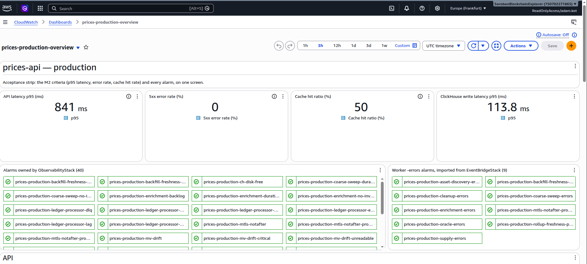

---
margin:
  x: 1.5cm
  y: 1.5cm
---

# Stellar Prices API — Milestone 2 Deliverable Evidence

> - **Project:** Stellar Prices API
> - **Team:** Rumble Fish
>
> This document maps every Tranche 2 acceptance criterion to evidence against the
> deployed production API: live URLs, runnable commands, and SQL a reviewer can
> execute. **Everything here is reproducible against the public deployment.** The
> API base is `https://prices-api.sorobanscan.rumblefish.dev`, a REGIONAL custom
> domain mapped at the root, so no URL carries a stage path. Key-gated routes need
> an `x-api-key` header, and **a reviewer key is published with this document:**
>
> ```
> x-api-key: b4PRlGnUqf9xS7NIw6s8T6otRZVjctBXaBZ5uKut
> ```
>
> It is on the public free tier — 1 request per second, burst 5, 100,000 requests
> a month — and every route it opens is read-only. Every command in this document
> runs as printed with `API_KEY` set to that value.
>
> **Two criteria are graded against amended wording**, each set out in full in
> [`milestone-2-rfp-deviations.md`](milestone-2-rfp-deviations.md), part of this
> submission. The project runs as a second tenant on infrastructure the Soroban
> Block Explorer already operates.

## 1. Executive summary

Milestone 2 — **Public API** — is complete. All seven endpoint groups are
deployed on a custom domain, key-gated, cached and validated, and **all six
Tranche 2 acceptance criteria are met**. Figures below were re-measured against
production on 2026-09-09.

| AC  | Criterion                                         | Result                                             |
| --- | ------------------------------------------------- | -------------------------------------------------- |
| 1   | 7 endpoint groups, schema-valid, ≥ 20 assets      | **1014 checks pass, 0 fail, 0 skip**               |
| 2   | 100 req/s for 5 min, p95 < 200 ms, errors < 0.1 % | **p95 47.09 ms, 0 errors in 30,001 requests**      |
| 3   | Cache confirmed within the TTL window             | **hits 37-54 ms, misses 282-948 ms, no overlap**   |
| 4   | VWAP verifiable against raw rows, ≥ 3 assets      | **41 of 41 checks, 4 assets, worst delta 1.4e-11** |
| 5   | `earliest_data_available` ≤ 2022-01-01            | **2015-11-18, reconciled four ways**               |
| 6   | `timeframe=all` from ≥ Jan 2022, spot-checked     | **2,047 points; spot-check on XLM and yBTC**       |

The four §9 work items with no numbered criterion are delivered (§6), as are the
three items Milestone 1 explicitly deferred: the OpenAPI document through the
gateway, the CloudWatch dashboard, and the API edge (§7).

## 2. Deliverable definition

§9 of the technical design defines Tranche 2 as **Public API**, weeks 5 to 9. The
work it names:

- The seven core endpoint groups, implemented and deployed and listed with their
  access model in §8.
- API Gateway response caching with per-endpoint TTLs, usage plans, API key
  issuance and throttling.
- The full VWAP formula wired into the current-price path (§5.5).
- Outlier detection, excluding sources that deviate beyond a configurable
  percentage from the inter-source median.
- Aquarius pool metadata integration, so Aquarius appears as a named source in
  the VWAP breakdown.
- Input validation: asset identifier format enforced, parameter ranges
  validated, `400` on invalid input.

**The backfill milestone for the tranche** is SDEX history covering approximately
January 2022 to present, written directly to Hetzner over mTLS per ADR 0009, with
the covered range visible through `GET /backfill/status`.

**Both ingestion streams have completed their ranges, ahead of where the design
document placed them.** The SDEX archive walked from the chain tip to genesis and
reports `completed`, reaching **2015-11-18** — six years beyond the criterion —
with every calendar day from 2022-01 to 2026-09 carrying candles. The Soroban AMM
stream covered the Soroban era from the Protocol 20 activation ledger to the
handoff to live ingestion, and every month from 2024-03 carries AMM candles.
Because the archive finished early, Tranche 3's AC 1 asks a reviewer to confirm a
state that no longer exists; declared in §4 of the deviations document.

**The ingestion path was carried over from the Soroban Block Explorer rather than
built here**: candles are written straight to the shared Hetzner ClickHouse over
mTLS with no local staging (ADR 0009), the Block Explorer's `backfill-runner` was
consumed as-is, and the `stellar-xdr` parsing crate is compiled into both
projects' processors.

## 3. Architecture

Unchanged in shape from Milestone 1, extended at the API tier. The full
description, including the component table and the data-flow diagram, is
[`docs/prices-api-general-overview.md`](../prices-api-general-overview.md) §2
and §3.

What Tranche 2 added on top of the Milestone 1 platform:

| Layer         | Addition                                                                                                                                              |
| ------------- | ----------------------------------------------------------------------------------------------------------------------------------------------------- |
| API Gateway   | Per-method response cache (0.5 GB), usage plans, key issuance, two-level throttling, CORS preflight on all seven `/v1` routes, REGIONAL custom domain |
| Lambda (axum) | The six read route groups beyond `/backfill/status`, input validation, the OpenAPI document served from the code                                      |
| ClickHouse    | `current_prices` materialised with the VWAP breakdown, `usd_rate` for measured USD conversion, the `method` provenance column                         |

The API is a single Rust axum Lambda behind API Gateway (ADR 0008), with no VPC
and no NAT gateway. Reads go over the public internet to Caddy on Hetzner with
mutual TLS.

## 4. Deviations from the approved wording

Three places where the delivered system departs from the literal wording of the
RFP or of the Tranche 2 criteria. Each is set out in full, with its measurements
and reasoning, in
[`milestone-2-rfp-deviations.md`](milestone-2-rfp-deviations.md). That document
is part of this submission; the rows below are pointers, not summaries.

| #   | Wording says                            | We deliver                                                                                                          | Kind      |
| --- | --------------------------------------- | ------------------------------------------------------------------------------------------------------------------- | --------- |
| 1   | `Current Price (float USD)`             | a decimal **string**, so 14 fractional digits survive transport                                                     | defended  |
| 2   | AC 3: _"…return `X-Cache: Hit` header"_ | a reworded criterion graded on latency and deployed cache configuration; **no such header exists on this platform** | disclosed |
| 3   | AC 6: USDC 1d candles spot-checked      | XLM and yBTC over 28 dates; USDC excluded, reason stated                                                            | disclosed |

**AC 2 also carries an in-place amendment**, recorded in §12 of the design
document since before this submission: the 100 req/s target is unchanged, but no
key on the default plan can sustain it, so the run needs a usage plan created for
it and the report must say which plan the key was on.

## 5. Acceptance-criteria evidence

### AC 1 — All 7 endpoint groups return correct, schema-valid responses for ≥ 20 major assets

**Verdict: met. 1014 checks pass, 0 fail, 0 skip**, against the deployed
production API on **2026-09-09 at 08:12 UTC**. This is the fourth consecutive
zero-failure run; one earlier pair was additionally run twice, 29 minutes apart,
and diffed check by check to an identical verdict, which is what makes the report
citable rather than a snapshot of one moment.

The evidence is a scripted, re-runnable conformance suite
(`tools/scripts/conformance-0120.mjs`). It exercises all seven route groups for
the twenty assets fixed in `tools/scripts/conformance-assets.json`, deliberately
covering all three identifier forms: the native asset, code-with-issuer, and a
Soroban contract address.

**Every response is validated against the API's own live OpenAPI document**,
fetched from `/api-docs-json` at run time rather than from a checked-in copy, so
the API is measured against the contract it actually publishes. Error responses
are validated too.

On top of the schema sit the assertions a schema cannot express: OHLC ordering on
every priced bucket, bucket alignment and strictly increasing timestamps, cursor
pagination proven exhaustive and duplicate-free, the batch endpoint agreeing with
the per-asset endpoint, and decimal strings that survive the JSON round trip.

#### Reproduce it

```bash
# API_KEY and BASE_URL from the environment or .env.local at the repo root
npm run conformance:0120 && echo "TRANCHE 2 AC 1: PASS"
```

The suite paces itself at 1.1 s per request, matching the free plan's 1 req/s
sustained rate, and drives no load. It writes a timestamped JSON report of every
individual check.

**A reviewer should expect their own total, not ours.** Checks are generated per
asset **per condition**, so an asset that has not traded inside the liquidity
window yields fewer assertions. The zero-failure verdict is the claim; the total
is a function of the market on the day. The pagination walk moves for the same
reason — 20 pages and 3,900 distinct assets on 2026-09-09 — and is exhaustive and
duplicate-free on every run.

### AC 2 — Load test: 100 req/s for 5 minutes, p95 < 200 ms, error rate < 0.1 %

**Verdict: met. p95 = 47.09 ms against a 200 ms bar, and 0 errors in 30,001
requests against a 0.1 % bar.** Measured 2026-09-03, 06:04–06:16 UTC, with k6
v2.2.0 ([`prices-api-load-test-100rps.md`](../prices-api-load-test-100rps.md)).

**The amendment, recorded in §12 of the design document before this submission:**
the target is unchanged, but the default plan is 1 req/s with a 100,000 monthly
quota, so no ordinary key can sustain the run — a single 5-minute pass at
100 req/s is nearly a third of a month's allowance. The run therefore used a
purpose-made plan, `prices-production-loadtest-plan` at 150 req/s, burst 300, and
the criterion asks the report to say so.

| regime                  | pool          | p50       | p95       | p99        | achieved rate   | non-200 | error rate |
| ----------------------- | ------------- | --------- | --------- | ---------- | --------------- | ------- | ---------- |
| 1 — single asset        | 1 asset       | 45.15     | 47.75     | 175.95     | 99.87 req/s     | 0       | 0.00 %     |
| **2 — the AC scenario** | **18 assets** | **45.04** | **47.09** | **107.53** | **99.85 req/s** | **0**   | **0.00 %** |

Latencies in milliseconds, `phase:main`. Regime 2 is the criterion's scenario.
All four k6 thresholds held and the process exited 0, with zero dropped
iterations.

#### Reproduce it

```sh
S='avg,min,med,max,p(50),p(90),p(95),p(99)'
k6 run packages/prices-api/loadtest/price_load.js \
  -e BASE_URL=https://prices-api.sorobanscan.rumblefish.dev -e API_KEY="$API_KEY" \
  --summary-trend-stats="$S" --summary-export=loadtest-ac.json; echo "exit=$?"
```

`exit=0` means every threshold held. The trend-stats flag is required, because k6
stops at p95 by default. Raw exports are in `docs/loadtest-results/`.

**Scope of the claim.** Regime 2 is cache-dominated by design — an 18-asset pool
against a 10-second TTL — so it measures the deployed system as a caller
experiences it. Separate cache-miss percentiles are not obtainable by this method
and are tracked as task 0260.

### AC 3 — Cache confirmed within the TTL window

**This criterion is graded against amended wording.**
[`milestone-2-rfp-deviations.md`](milestone-2-rfp-deviations.md) §2 carries the
full argument; it is not reproduced here.

The criterion as written asks for an `X-Cache: Hit` header. **This API emits no
such header on any route** and cannot emit a truthful one: API Gateway's stage
cache has no hit-or-miss header feature, and our handler runs only on a miss, so a
header it wrote would report `Miss` on every genuine hit. Recorded as **ADR 0012**,
accepted, with all alternatives closed and a when-to-revisit list.

It is graded instead against this wording:

> _"Cache confirmed: consecutive identical requests within the TTL window are
> served from the API Gateway stage cache, and a request after the window is not.
> Demonstrated by response latency, which separates cleanly, and by the deployed
> per-method cache configuration."_

**Verdict on the amended wording: met.**

#### The cache works, and it expires when it says it does

`/price`, declared 10-second TTL, same URL throughout. Server time only, so the
TLS handshake a fresh client pays is excluded. Measured 2026-09-09 with the recipe
below, exactly as printed:

| request   | expected          | server time  |
| --------- | ----------------- | ------------ |
| first ask | miss              | 947.5 ms     |
| +2 s      | hit               | 38.1 ms      |
| +4 s      | hit               | 54.1 ms      |
| **+13 s** | **miss, expired** | **282.4 ms** |
| +15 s     | hit               | 37.2 ms      |

**Hits fall between 37 and 54 ms, misses between 282 and 948 ms, and the two
ranges do not overlap.** The first ask also pays a Lambda cold start, which is why
the miss range is wide; a warm miss on an earlier run measured 132 to 172 ms. The
separation, not the absolute figure, is the claim, and no run to date has produced
overlapping ranges. Expiry is demonstrated on both TTL tiers: `/v1/assets` at a
60-second TTL was still hot at +32 s and expired at +64 s. Both refilled
immediately.

Three surfaces agree on the deployed per-method configuration: the production
stage, the CDK constant, and the handler's own cache-control tiers. `x-api-key`
appears in no cache key, so the cache is correctly shared across callers for
identical public data, and the cached response is replayed byte for byte — the
body hash held constant across every hit and changed only on expiry.

#### Reproduce it

```sh
BASE=https://prices-api.sorobanscan.rumblefish.dev
srv() { curl -s -o /dev/null -H "x-api-key: $API_KEY" \
  -w '%{time_starttransfer} %{time_appconnect}' "$1" |
  awk '{printf "%.1f ms\n", ($1-$2)*1000}'; }

U=$(date +%s)                                    # any unused value forces a miss
P="$BASE/v1/assets/native/price?min_volume_usd=$U"
srv "$P"; sleep 2; srv "$P"; sleep 2; srv "$P"   # miss, hit, hit
sleep 9;  srv "$P"                               # miss — TTL expired
sleep 2;  srv "$P"                               # hit — refilled
```

Because `min_volume_usd` is part of the `/price` cache key, a guaranteed miss
costs one request — no cold-asset hunting and no load generation.

### AC 4 — VWAP verifiable against raw `price_ohlcv` rows for ≥ 3 assets

**Verdict: met, on four assets rather than three. 41 of 41 checks reconciled.**
Measured against a pinned tick, `T = 2026-08-26 13:22:00 UTC`, over the preceding
24 hours.

The method is a from-scratch recomputation. The published `current_prices` row is
compared against **29,108 raw `price_ohlcv_1m FINAL` rows** captured directly from
ClickHouse and re-aggregated in **plain Python with no ClickHouse involvement**,
so the check is independent of the materialised view's own SQL rather than a
restatement of it.

| asset               | sources             | VWAP relative delta | volume delta   |
| ------------------- | ------------------- | ------------------- | -------------- |
| XLM                 | 4                   | `5.1e-14`           | exact, `0E-14` |
| EURC                | 4                   | `8.1e-15`           | exact          |
| BTC                 | 2                   | `1.9e-16`           | exact          |
| AQUA                | 3, guard cuts to 2  | `1.4e-11`           | exact          |
| SCOP (control)      | 2, filter cuts to 1 | `0`                 | exact          |
| USDCAllow (control) | 1                   | `0`                 | exact          |

Four of these are multi-source and count toward the criterion's bar of three: XLM,
EURC, BTC and AQUA. The stated tolerance on `vwap_24h` was a relative difference
of 1e-9; the worst observed was **1.4e-11**, roughly seventy times tighter.
`volume_24h_usd` is a plain sum and was asserted **exactly equal**, which held on
all six. Every source exclusion is attributed to a named rule rather than
tolerated: AQUA's third source was dropped by the liveness guard, SCOP's second by
the population filter.

A second run at tick `2026-08-26 14:17:00Z` carried the check through the public
API: **13 of 13 fields were Decimal-value-exact and string-typed** in the JSON
response, so nothing is lost between ClickHouse and the wire.

#### Reproduce it

```bash
cd lore/1-tasks/archive/0123_TEST_vwap-reconciliation-against-raw-ohlcv
python3 benchmark/reconcile.py benchmark/current.csv \
  <(gunzip -c benchmark/raw-T1322.csv.gz)
```

The capture query is `benchmark/q-raw.sql`, and the public-API leg is
`GET /v1/assets/native/price`.

### AC 5 — `GET /backfill/status` shows `earliest_data_available` ≤ 2022-01-01

**Verdict: met, by six years.** The criterion asks for 2022-01-01. The store
reaches **2015-11-18**. Re-verified 2026-09-09; the figure has not moved across
three separate verification dates.

The figure is reconciled four ways, deliberately, because the endpoint reports a
stored value rather than querying the candles:

| view                                                   | oldest SDEX data       |
| ------------------------------------------------------ | ---------------------- |
| `GET /backfill/status`, `sdex.earliest_data_available` | `2015-11-18T03:47:00Z` |
| the stored `backfill_progress` row                     | `2015-11-18 03:47:00`  |
| `min(timestamp)` on `price_ohlcv_1d`                   | `2015-11-18 00:00:00`  |
| oldest active partition, all seven candle tiers        | `201511`               |

**Depth alone is not coverage, so continuity was checked too.** All **56**
complete months from 2022-01 to 2026-08 carry SDEX candles on **every calendar
day**, leap day included, and the current month is complete to date. In the
criterion's own year there are **4,048,196 daily SDEX candles across 82,096
assets**. Both streams reconcile to **zero days overclaimed** against
`min(timestamp)` in `price_ohlcv_1d`.

#### Reproduce it

```bash
curl -sS -H "x-api-key: $API_KEY" \
  https://prices-api.sorobanscan.rumblefish.dev/v1/backfill/status | jq
```

ClickHouse read-only `SELECT`s against `prices.price_ohlcv_1d` and
`prices.backfill_progress` reproduce the other three views. A reviewer can be
issued a short-lived read-only client certificate on request.

### AC 6 — `timeframe=all` on USDC returns 1d candles from ≥ January 2022, spot-checked

**Verdict: the literal half is met. The spot-check uses different assets, and that
substitution is declared, not slipped in.**

`GET /v1/assets/USDC:GA5Z…/ohlcv?timeframe=all` returns **2,047 daily points
spanning 2021-02-01 to 2026-09-09**, with no gaps, satisfying the criterion's
first clause as written. (Measured 2026-09-09; the series grows by one point a
day.)

#### Why the spot-check uses XLM and yBTC

USDC does not trade against a deep USD book on Stellar, so **its price comes from
an oracle rather than from trades** — and the API says so: the `method` field
names the provenance on every published price, reading `oracle` for USDC and
`traded` for assets priced from venue activity. That is the delivered behaviour,
and it is what a consumer needs in order to know what a number means.

The historical daily series predates measured USD rates in the pipeline, so its
closes are peg-derived rather than measured. A peg-derived series cannot serve as
an independent correctness check against known USDC price history, which is why
the spot-check uses traded assets instead. **Re-deriving USDC history from the
measured rate is Tranche 3 work**, tracked as task 0265.

#### What is delivered instead

**XLM and yBTC, over 28 dates each rather than the five asked for**, against
Binance daily klines. Binance is public, needs no key, has history predating 2022,
and shares no price source with us.

| asset | median absolute deviation | within 5 %   |
| ----- | ------------------------- | ------------ |
| XLM   | **0.06 %**                | **27 of 28** |
| yBTC  | **0.48 %**                | **27 of 28** |

Five reviewer-style dates on XLM: 2022-01-03 at −0.19 %, 2022-06-15 at −0.42 %,
2024-07-01 at −0.22 %, 2026-06-15 at +0.01 %, and 2023-03-11 at −25.35 %. The
dates that fall outside 5 % are a known dislocation on both assets in March 2023,
tracked as task 0266.

#### Reproduce it

```bash
curl -sS -H "x-api-key: $API_KEY" \
  "https://prices-api.sorobanscan.rumblefish.dev/v1/assets/native/ohlcv?timeframe=all&granularity=1d"

curl -sS "https://data-api.binance.vision/api/v3/klines?symbol=XLMUSDT&interval=1d&startTime=<UTC-midnight-ms>&limit=1"
# field 4 is the close
```

## 6. Work items without a numbered criterion

§9 names four pieces of Tranche 2 work that carry no numbered acceptance
criterion. All four are delivered.

### 6.1 Full VWAP formula, with a minimum-volume source threshold

§5.5 defines the weighted price as the volume-weighted mean of per-source prices,
including only sources above a configurable minimum volume.

🔑 **One correction to §9's wording.** The formula does not run in a "Current Price
Updater Lambda". It runs in `prices.mv_current_prices`, a ClickHouse materialised
view refreshing every minute, which is the sole writer of `current_prices`. That
substitution removed two Lambdas from the design. Measured refresh cost on
production: **176 to 211 ms**, reading 1.69 M rows to write about 3,000,
comfortably inside the refresh interval.

The threshold is **conditional**: a below-threshold source is dropped only when a
funded source survives, because 82 % of venues carry a dollar a day or less and an
unconditional floor would blank the VWAP on most priced assets. An explicit
`?min_volume_usd=` override remains strict, and that asymmetry is deliberate.

Live evidence, all four responses pinned to one refresh tick on XLM, 2026-09-09:

| request                  | sources returned         | `vwap_24h`         |
| ------------------------ | ------------------------ | ------------------ |
| no parameter             | aquarius, sdex, soroswap | `0.18946111857203` |
| `?min_volume_usd=100`    | aquarius, sdex, soroswap | `0.18946111857203` |
| `?min_volume_usd=5000`   | aquarius, sdex           | `0.18946070194562` |
| `?min_volume_usd=200000` | aquarius                 | `0.18946105702432` |

The absolute prices move with the market; the shape is the claim — the threshold
drops sources monotonically, and the $100 floor is a no-op on this asset because
every one of its venues clears it.

```bash
curl -sS -H "x-api-key: $API_KEY" \
  "https://prices-api.sorobanscan.rumblefish.dev/v1/assets/native/price?min_volume_usd=5000"
```

### 6.2 Outlier detection

Sources deviating beyond a configurable percentage from the inter-source median
are excluded from the VWAP. Configured at **20 %**, arming only at three or more
sources — below three the median is the midpoint or the source itself, so the
filter is a no-op by construction.

The 20 % band is a starting value, deliberately loose. The tuning evidence is
AC 4's reconciliation, where the worst observed venue deviation was **0.824 %**,
some twenty-four times inside the band. §7 of the design scopes outlier detection
to the VWAP rather than the headline price; that asymmetry is documented and its
review is tracked as task 0217.

### 6.3 Aquarius as a named source

Delivered, and visible in the public response rather than only in the pipeline:

```json
"sources": {
  "aquarius": { "price": "0.18946105702432", "volume_24h": "392976.06047392378807" },
  "sdex":     { "price": "0.18945941005452", "volume_24h": "108010.21063405009136" },
  "soroswap": { "price": "0.18951739892386", "volume_24h": "3708.64979176103103" }
}
```

That is a live payload for XLM, captured 2026-09-09. Aquarius appears with a real
price and real 24-hour volume, and at a `?min_volume_usd=200000` filter it is the
last source standing — it is the largest of the three, ahead of SDEX. A source is
named when it has traded the asset being asked about, so the set varies per asset
and per window.

```bash
curl -sS -H "x-api-key: $API_KEY" \
  https://prices-api.sorobanscan.rumblefish.dev/v1/assets/native/price | jq '.sources | keys'
```

Twenty mainnet Aquarius _concentrated_ pools are held back from the seeded pool
registry, because the extractor is written for constant-product and stableswap
pools; decoding them is task 0080.

### 6.4 Input validation

Delivered: identifier format enforced, parameter ranges validated, `400` on
invalid input, with **about 50 negative tests running in CI without a database**
plus 21 integration tests against live ClickHouse.

The structural proof is stronger than the test count: the negative tests run
against a handler state that **panics on any database access**, so every clean
`400` also proves that no query was issued before the rejection.

Caps: page size 1 to 200, search strings to 64 bytes, cursors to 256 characters,
batches to 100 elements behind a 16 KB body limit, and any
window-times-granularity combination above 5,000 buckets rejected. ⚠️ That last
cap is consumer-visible — 30 days at one-minute granularity is 43,200 buckets and
now returns `400` rather than silently truncating. Naive timestamps are also
pinned to UTC in the handler rather than inheriting the database server's
timezone.

## 7. Milestone 1 deferrals, now delivered

Milestone 1's evidence document listed what it deliberately did not claim. Three
of those rows were Tranche 2 scope. All three are now delivered.

### 7.1 The OpenAPI specification is served through the gateway

**Delivered.** `GET /api-docs-json` is mapped as a keyless, cached route on the
production API, so a reviewer needs no credential to read the contract.

```bash
curl -sS https://prices-api.sorobanscan.rumblefish.dev/api-docs-json \
  | jq '{openapi, servers, paths: (.paths | keys)}'
```

The document is **OpenAPI 3.1.0**, generated from the axum routes rather than
maintained by hand, so it cannot drift from the code. It is also rendered as the
portal's API reference. Three artifact-derived guards run in CI: the full test
suite, a Redocly `recommended-strict` lint that reports **zero errors and zero
warnings**, and a route-parity check confirming the gateway and the document
agree.

### 7.2 The CloudWatch dashboard has real data widgets

**Delivered.** `prices-production-overview` was a scaffold with no data widgets at
Milestone 1. It now carries six rows: an acceptance strip of API p95 latency, 5xx
rate, cache-hit ratio and ClickHouse write latency, then the alarm strip, then
API, ingestion, ClickHouse and backfill, workers, and enrichment and oracle
panels. A synth-time assertion runs in CI so the dashboard cannot silently lose a
widget.

{width=95%}

The other four panel captures are in `docs/scf/screenshots/`. **The alarm strip
covers 50 alarms**, derived from the construct tree rather than hard-coded, so the
count maintains itself as alarms are added; the image above is a dated
illustration captured 2026-09-03 and shows 49 for that reason. No figure in this
section is read off an image. **Cost:** about **$4.80 a month** in metric
publications.

🔑 **Two named substitutions.** Milestone 1 mentions "DB CPU"; that is served here
by ClickHouse host and write-path metrics, free disk percentage and write latency,
because ADR 0007 replaced RDS with the shared Hetzner cluster. And the criterion
says read-only IAM _role_ where an IAM _user_ with a narrow inline read policy is
delivered, because the reviewing identity has not been named and the account is
shared with another project.

### 7.3 The API edge: CORS, custom domain, and the WAF decision

**All three delivered.**

**The custom domain** is live at `https://prices-api.sorobanscan.rumblefish.dev`,
a regional custom domain mapped at the root, so no URL in this package carries a
stage path.

**CORS preflight** is deployed on all seven `/v1` routes, permitting any origin
without credentials. Verified on production and, separately, **in a real browser**:
all seven routes returned 200 from cross-origin `fetch` with no CORS failure.

```bash
curl -X OPTIONS -i https://prices-api.sorobanscan.rumblefish.dev/v1/assets/native/price \
  -H 'Origin: https://example.com' -H 'Access-Control-Request-Method: GET'
# 204, access-control-allow-origin: *
```

**A WAF was decided against, with the reasoning and four named reversal triggers
recorded.** This is a public, read-only, key-gated API over public blockchain data
with no personal data, no free-form input reaching a query, and rate abuse already
bounded at two levels. Any route that accepts free-form input or writes would
reverse the decision.

## 8. Live endpoints and access

| Resource                     | URL / address                                         | Access                              |
| ---------------------------- | ----------------------------------------------------- | ----------------------------------- |
| Production API base          | `https://prices-api.sorobanscan.rumblefish.dev`       | `x-api-key`, key on request         |
| OpenAPI document             | `…/api-docs-json`                                     | **Anonymous**                       |
| Health probe                 | `…/health`                                            | Anonymous                           |
| Asset list and detail        | `…/v1/assets`, `…/v1/assets/{id}`                     | `x-api-key`                         |
| Current price with `sources` | `…/v1/assets/{id}/price`                              | `x-api-key`                         |
| OHLCV candles                | `…/v1/assets/{id}/ohlcv`                              | `x-api-key`                         |
| Batch prices                 | `POST …/v1/prices/batch`                              | `x-api-key`                         |
| Oracle cross-reference       | `…/v1/oracles/{id}`                                   | `x-api-key`                         |
| Backfill status              | `…/v1/backfill/status`                                | `x-api-key`                         |
| API reference (rendered)     | `https://sorobanscan.rumblefish.dev/api/docs`         | Anonymous                           |
| Production ClickHouse        | `ch.sorobanscan.rumblefish.dev`, database `prices`    | mTLS, client certificate on request |
| CloudWatch dashboard         | `prices-production-overview`, `eu-central-1`          | IAM, read-only viewer on request    |
| Production alarms            | `prices-production-*`, `eu-central-1`                 | IAM, read-only                      |
| GitHub repository            | `https://github.com/rumblefishdev/stellar-prices-api` | Private during Tranche 2            |

_Table — live verification endpoints and the access model for reviewers._

⚠️ **The `execute-api` URLs cited in the Milestone 1 package are retired**, switched
off on 2026-09-02. Those documents were amended in place with dated notes, so
every command in both packages remains runnable as written.

The reviewer API key above opens every `/v1` route. The two resources it does not
cover — a short-lived mTLS client certificate for production ClickHouse, and the
read-only CloudWatch dashboard viewer — are issued per person and can be requested
from the project team.

## 9. Repository navigation

| Topic                                                        | Path                                                                   |
| ------------------------------------------------------------ | ---------------------------------------------------------------------- |
| Technical design, including §9 criteria and revision history | `docs/prices-api-general-overview.md`                                  |
| **Deviations from the RFP and criteria wording**             | `docs/scf/milestone-2-rfp-deviations.md`                               |
| Verification reports for AC 2, 3, 5 and 6                    | `docs/prices-api-{load-test-100rps,cache,backfill-depth}-*.md`         |
| Route/auth/TTL table and reviewer SQL                        | `docs/scf/api-endpoints.md`, `docs/scf/ch-demo-queries.sql`            |
| Conformance suite (AC 1) and load-test script (AC 2)         | `tools/scripts/`, `packages/prices-api/loadtest/`                      |
| REST API, ClickHouse schema, CDK app                         | `packages/prices-api/`, `packages/prices-clickhouse/schema/`, `infra/` |
| Operator runbooks and ADRs                                   | `docs/runbooks/`, `lore/2-adrs/`                                       |

_Table — repository paths for implementation, infrastructure and decision review.
Key ADRs for Milestone 2: **0008** (single axum Lambda), **0011** (`base_currency`
denominates rather than filters), **0012** (stage cache, no CloudFront, no
`X-Cache` header)._
