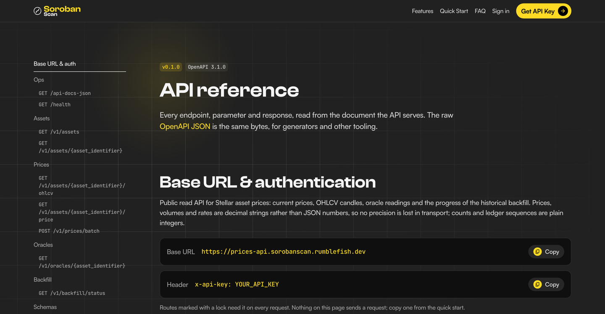

---
margin:
  x: 1.5cm
  y: 1.5cm
---

# Stellar Prices API — Milestone 3 Deliverable Evidence

> - **Project:** Stellar Prices API
> - **Team:** Rumble Fish
> - **Status of this document:** as of 2026-10-05. Every figure
>   carries the date it was measured.
>
> This document maps each Tranche 3 acceptance criterion to its evidence: live
> URLs, runnable commands, and the tasks and reports behind each figure. The API
> base is `https://prices-api.sorobanscan.rumblefish.dev`. Key-gated routes need
> an `x-api-key` header; the reviewer key published with the Milestone 2 package
> (`prices-production-scf-reviewer-key-20260909T120021Z`, free plan: 1 request
> per second, burst 5, 100,000 requests a month, read-only) is still enabled
> (checked 2026-10-01), and the read commands below run as printed with
> `API_KEY` set to it.
>
> Deviations from the criteria wording are set out in
> [`milestone-3-rfp-deviations.md`](milestone-3-rfp-deviations.md). The project
> runs as a second tenant on infrastructure the Soroban Block Explorer operates.

## 1. Executive summary

Milestone 3, **Production Launch & Validation**, is the last tranche. The
service went public on **2026-09-23 at 09:40 CEST**, when the staging password
came off the onboarding portal at `https://sorobanscan.rumblefish.dev/api/`; the
API had been serving on its custom domain since Tranche 2. On 2026-10-02 the
portal moved to `https://sorobanscan.rumblefish.dev/prices-api/`; every `/api/…`
URL answers `301` to the same path there, so the earlier links in this package
still land on it.

State of the nine Tranche 3 acceptance criteria on 2026-10-01:

| AC  | Criterion (short)                                           | State on 2026-10-01                                                                                                                                                                      |
| --- | ----------------------------------------------------------- | ---------------------------------------------------------------------------------------------------------------------------------------------------------------------------------------- |
| 1   | `/backfill/status`: running, fresh push, depth ≤ 2018-01-01 | **Depth met: 2015-11-18.** Liveness graded on the amended wording (deviations §1); every signal OK on 10-01                                                                              |
| 2   | OpenAPI lints clean; Swagger UI deployed                    | **Met on 2026-10-05:** lint clean on the release run on `master` (Redocly CLI 2.44.0, no errors or warnings); reference at `…/prices-api/docs` (deviations §3)                           |
| 3   | Portal accessible; self-service key flow works              | **Met:** recorded walk on 2026-10-05, sign-in 13:00:40, `/v1` call 13:01:28 (200), key revoked 13:06:01, 403 from 13:07 (UTC); portal public since 09-23, guild-gated since 09-02 (0254) |
| 4   | Integration suite passes on CI, link provided               | **Met:** 1,407 unit and 306 ClickHouse integration tests pass on the release run on `master` (10-05), linked in §5; PR CI runs the suite since #327 (09-22)                              |
| 5   | Load test: p95 < 100 ms at 100 req/s, plan named            | **Met on 2026-09-18: p95 49.0 ms, 0 errors in 30,001 requests**, plan `prices-production-loadtest-plan`; scope in deviations §4                                                          |
| 6   | Security checklist signed off                               | **Met.** ClickHouse over mTLS only, secrets in Secrets Manager, inputs validated, no `Action: "*"` or `service:*`; every `Resource: "*"` statement inventoried in §5                     |
| 7   | Repo public; `cdk deploy` from README in a fresh account    | **Met on the fresh-account runbook** (0297, PR #357): repo public, `README.md` → `infra/README.md` on `develop`, on `master` from the next release. Not run in an empty account          |
| 8   | Dashboard accessible to Stellar (read-only IAM); alarms OK  | Dashboard `prices-production-overview`, all 83 alarms OK on 10-05. Access on request for each named reviewer, through IAM Identity Center                                                |
| 9   | 7-day post-launch report                                    | **Met on 2026-09-30: uptime 100.000 %, 0 × 5XX in 65,806 requests, gateway p95 145.2 ms**; push cadence and `earliest_data_available` replaced by live signals (deviations §2)           |

Work items without a numbered criterion are in §6, known issues in §7,
limitations in §8.

## 2. Deliverable definition

§9 of the technical design defines Tranche 3 as **Production Launch &
Validation**, weeks 10 to 13. The work it names, and where each stands:

| Work item                                                                 | State                                                                                                                                                                                                   |
| ------------------------------------------------------------------------- | ------------------------------------------------------------------------------------------------------------------------------------------------------------------------------------------------------- |
| OpenAPI 3.0 specification covering all endpoints                          | Served from the code at `/api-docs-json` as OpenAPI 3.1.0 (deviations §3), with 74 production-shaped examples and a lint gate since 2026-09-24 (task 0306)                                              |
| Self-service onboarding portal: key request, quickstart, example queries  | Public since 2026-09-23, at `…/prices-api/` since 2026-10-02; quick start matches the spec (0163, 0233); privacy policy (0303); Discord sign-in on the Stellar Developers guild since 2026-09-02 (0254) |
| Integration test suite, automated, runs in CI, all 7 endpoint groups      | 229 ClickHouse-backed tests in CI since 2026-09-22 (task 0275), covering each of the seven `/v1` routes (§5, AC 4)                                                                                      |
| Load test report: k6, documented plan, results at 100 / 500 / 1000 req/s  | [`prices-api-load-test-100rps.md`](../prices-api-load-test-100rps.md): all three rates on 2026-09-18 (task 0293)                                                                                        |
| Security review checklist: IAM least privilege, no secrets in env, inputs | Audit in task 0194; IAM detail in §5, AC 6                                                                                                                                                              |
| X-Ray tracing end-to-end                                                  | `TracingConfig.Mode: Active` on api-handler, oracle, enrichment and ledger-processor (§6)                                                                                                               |
| CloudWatch dashboards: latency, errors, ingestion lag, CH write latency…  | `prices-production-overview`, with all 83 `prices-production-*` alarms on its alarm strip (§6)                                                                                                          |
| GitHub repository public with README, architecture docs, deploy steps     | Public since 2026-09-16; root `README.md` and the fresh-account runbook in `infra/README.md` since 2026-09-25 (PR #357, task 0297; AC 7)                                                                |

The tranche's backfill milestone, SDEX history back to January 2018, was
reached in Tranche 2: the archive completed on 2026-07-27 and reaches back to
2015-11-18 (deviations §1). During Tranche 3 the history is recomputed instead
(task 0286, from 2026-09-23): candles are rebuilt from price-forming fills in
fill order, which changes values but not coverage (§7).

## 3. Architecture

The architecture is unchanged since Milestones 1 and 2
([`docs/prices-api-general-overview.md`](../prices-api-general-overview.md) §2
and §3). Tranche 3 added:

| Layer         | Addition                                                                                                                                                                                                                                                                                                                                                                                                                      |
| ------------- | ----------------------------------------------------------------------------------------------------------------------------------------------------------------------------------------------------------------------------------------------------------------------------------------------------------------------------------------------------------------------------------------------------------------------------- |
| Portal (SPA)  | Served under `/prices-api/*` of the explorer's CloudFront distribution from its own S3 bucket (`/api/*` until 2026-10-02, now a `301`); Discord OAuth sign-in, key issuance on the free plan, dashboard, quick start                                                                                                                                                                                                          |
| API Gateway   | 404 `not_found` in the error envelope for unknown routes (0309)                                                                                                                                                                                                                                                                                                                                                               |
| Lambda (axum) | Portal routes load their sources on the first portal request, never at cold start, and a failed load affects only that request (0194, 0311); `as_of` and `price_status` beside every computed current price: list, `/price` and batch (0216)                                                                                                                                                                                  |
| ClickHouse    | Price-forming-fill candle definitions across all tiers (0286 phase 1–2, ADR 0287); scoped `prices_admin` identity for the history recomputation (explorer 0567); `asset_id` derived by the database from the asset's identity (xxh3 of code, issuer and contract, `UInt64`), so every writer gives an asset the same id: 210,749 assets on 210,749 ids since 2026-10-02, guarded by collision and orphan-candle alarms (0139) |
| Observability | api-handler error and 5XX alarms (0249) and a failed-portal-load alarm (0311); liveness alarms on the scheduled workers but the weekly coverage sweep, duration alarms on all but that sweep and asset-supply (0223, 0256); weekly coverage sweep of swap venues, its alarm clearing on a clean run (0100, 0323)                                                                                                              |

## 4. Deviations from the approved wording

Set out in full in
[`milestone-3-rfp-deviations.md`](milestone-3-rfp-deviations.md):

| #   | Wording says                                                              | We deliver                                                                                                                                                   | Kind                           |
| --- | ------------------------------------------------------------------------- | ------------------------------------------------------------------------------------------------------------------------------------------------------------ | ------------------------------ |
| 1   | AC 1: `sdex.status: "running"`, `last_push_at` fresh                      | the archive completed on 2026-07-27; liveness graded on the ingestion alarms and `realtime_tip_ledger` (carried from M2)                                     | disclosed, delivered early     |
| 2   | AC 9: report "SDEX push cadence and `earliest_data_available` trajectory" | both are flat since 2026-07-27; the report carries ingest-queue age and `current_prices` freshness against their alarm thresholds instead                    | disclosed                      |
| 3   | AC 2: `openapi-validator` lint, Swagger UI; Work list: OpenAPI 3.0        | an OpenAPI 3.1.0 document, linted by Redocly `recommended-strict`; the reference at `…/prices-api/docs` is the portal's own renderer, in Swagger UI's layout | disclosed                      |
| 4   | AC 5: p95 < 100 ms at 100 req/s, plan named                               | met on a scenario with 98.3 % cache hits; declared with the miss-only row, the 500 and 1000 req/s rows and the client's location                             | met as written, scope declared |

## 5. Acceptance-criteria evidence

### AC 1 — `GET /backfill/status` shows a running, fresh backfill with depth ≤ 2018-01-01

**Verdict: the depth clause is met by two years — `earliest_data_available` is
2015-11-18. The liveness clauses are graded on the amended wording** (deviations
§1): the archive completed on 2026-07-27, so `sdex.status` is `completed`.

Read on 2026-10-01 at 10:53:45 UTC:

| Signal                                                             | Reading                                                                 |
| ------------------------------------------------------------------ | ----------------------------------------------------------------------- |
| `sdex.earliest_data_available`                                     | `2015-11-18T03:47:00Z`, against ≤ 2018-01-01                            |
| `realtime_tip_ledger`                                              | 64,713,239, 9 ledgers behind Horizon's 64,713,248 (closed 10:53:42 UTC) |
| `prices-production-ledger-processor-lag`                           | OK since 2026-09-18                                                     |
| `prices-production-rollup-freshness-*`, all seven tiers (1m to 1M) | OK; the latest state change 2026-09-14                                  |

```json
{
  "realtime_tip_ledger": 64713239,
  "sdex": {
    "status": "completed",
    "current_ledger": 1,
    "start_ledger": 1,
    "target_ledger": 64712383,
    "progress_pct": 100.0,
    "ledgers_remaining": 0,
    "last_push_at": "2026-10-01T10:52:09Z",
    "earliest_data_available": "2015-11-18T03:47:00Z"
  }
}
```

`sdex.last_push_at` is the last write by any SDEX backfill run. The history
recomputation (task 0286) runs the same `sdex-backfill`, so the value is recent
although the archive completed in July. The response also carries
`soroban_amm`, the Soroban-era AMM backfill stream, which AC 1 does not name.

#### Reproduce it

```bash
curl -s -H "x-api-key: $API_KEY" \
  https://prices-api.sorobanscan.rumblefish.dev/v1/backfill/status | jq .
```

### AC 2 — OpenAPI spec passes lint with no errors; Swagger UI deployed

**Verdict: met; the release run on `master` lints it clean.** The document is
generated from the handler code (utoipa) and served at `/api-docs-json`. Since
task 0306 it carries a production-shaped example for every field, and the lint
fails on any example that no longer matches its schema
(`no-invalid-schema-examples`, `redocly.yaml`). The rendered reference is the
portal's own page, `https://sorobanscan.rumblefish.dev/prices-api/docs`. The lint tool,
the reference and the OpenAPI version differ from the wording: deviations §3.

#### Reproduce it

```bash
npm run openapi:lint          # extracts target/openapi.json from the code and lints it
```

The release run on `master`, [`37298469682`](https://github.com/rumblefishdev/stellar-prices-api/actions/runs/37298469682)
(2026-10-05, merge of #381, job _Rust (fmt, clippy, test, lambda build)_, step
_Lint OpenAPI document_, Redocly CLI 2.44.0):

```text
target/openapi.json: validated in 88ms
Woohoo! Your API description is valid. 🎉
```

{width=95%}

### AC 3 — Onboarding portal accessible; self-service API key request flow functional

**Verdict: met; the walk below is in the video (scene 2).** The
portal is public since 2026-09-23 09:40 CEST, at
`https://sorobanscan.rumblefish.dev/prices-api/` since 2026-10-02 (`/api/`
before, which now redirects). The flow is Discord OAuth → eligibility check
(membership in the official **Stellar Developers** guild, account age) → a key
on the free plan → the dashboard with the key's plan and usage. The guild gate
has been live since 2026-09-02 (task 0254); SDF, which owns the guild, asked the
project to run the integration itself (task 0179). A member the guild has not
screened yet is refused with its own answer (`pending_rules`). The team has run
through the flow on production several times (task 0164).

**The recorded walk, 2026-10-05** (video scene 2). The two `date -u` lines are on
screen; the other times come from the portal's log, CloudTrail, X-Ray and the
gateway's `4XXError` metric. All times UTC.

| step                                        | time               | observed                                                                                                   |
| ------------------------------------------- | ------------------ | ---------------------------------------------------------------------------------------------------------- |
| sign-in through Discord                     | 13:00:40           | the portal returns the account's key (issued at its first sign-in, 12:37:13; `CreateApiKey` in CloudTrail) |
| `date -u` on screen                         | 13:01:05           |                                                                                                            |
| `GET /v1/assets/native/price` with that key | 13:01:28           | 200 and the XLM price (X-Ray)                                                                              |
| Regenerate                                  | 13:06:01           | the portal revokes the key; `UpdateApiKey` with `/enabled` set to `false` in CloudTrail                    |
| `date -u` on screen                         | 13:06:09           |                                                                                                            |
| the same request, twice                     | 13:06:11, 13:06:17 | 200: the gateway still accepted the key while the change propagated                                        |
| the same request                            | 13:07              | 403 (the gateway's `4XXError` metric gives the minute, not the second)                                     |

The gateway accepted the revoked key for 10 to 16 seconds and refused it within
the minute.

### AC 4 — Integration test suite: all tests pass on CI, link provided

**Verdict: met.** Since PR #327 (task 0275, merged 2026-09-22) CI starts a
ClickHouse instance, applies the schema, starts the mTLS reverse proxy and runs
the integration suite after the unit tests, on every pull request that changes
Rust code. These are the tests that were `#[ignore]`d for lack of a database.

The seven endpoint groups the Work list names are the seven `/v1` routes of §9,
counted as the Milestone 2 package counted them
([`milestone-2-evidence.md`](milestone-2-evidence.md) AC 1); the design
document's §4 files the same routes under five headings. Each route has its own
tests in `packages/prices-api/tests/`: `GET /v1/assets` in `list_it.rs`;
`/v1/assets/{id}`, `POST /v1/prices/batch`, `/v1/oracles/{id}` and
`/v1/backfill/status` in `endpoints_it.rs`; `…/price` in `price_it.rs`; and
`…/ohlcv` in `ohlcv_it.rs`.

A run to cite: [`36001067242`](https://github.com/rumblefishdev/stellar-prices-api/actions/runs/36001067242)
(2026-09-24, job _Rust (fmt, clippy, test, lambda build)_, steps _Start
ClickHouse → Apply the ClickHouse schema → Start the ClickHouse reverse proxy →
ClickHouse integration tests_, all `success`).

The first run on `master` after the release, [`37298469682`](https://github.com/rumblefishdev/stellar-prices-api/actions/runs/37298469682)
(2026-10-05, merge of #381, same job, all steps `success`):
`cargo test --workspace` passes 1,407 tests, and the integration step passes
all 306 ClickHouse tests in 39 targets (229 at #327), 0 failed. Ten more `#[ignore]`d
tests need the network (5) or production (5); `ignored-tests.sh` records them
and CI does not run them. CI runs on pull requests and on pushes to `master`.

#### Reproduce it locally

```bash
docker compose up -d clickhouse
tools/scripts/ignored-tests.sh        # exactly what CI runs
```

### AC 5 — Load test: p95 < 100 ms at 100 req/s, the usage plan named

**Verdict: met. p95 49.0 ms against a 100 ms bar, 0 errors in 30,001 requests,
k6 exit 0.** Measured on 2026-09-18 with k6 v2.2.0 from the operator's laptop
in Poland, with one-minute control runs before and after that put the network
floor at a median of ~45 ms ([`prices-api-load-test-100rps.md`](../prices-api-load-test-100rps.md)
§"Evidence run and the ceiling — 2026-09-18", task 0293).

**The plan, as the criterion asks:** `prices-production-loadtest-plan` (id
`i12bsj`), 150 req/s with a burst of 300 for the 100 req/s rows, raised to
1200 / 2400 for the 500 and 1000 req/s rows and restored afterwards. The
default plan (1 req/s, 100,000 requests a month) cannot carry the run.

| rate       | scenario                         | requests | failed                                | k6 med / p95 / p99 (ms) | gateway p95 | cache hits |
| ---------- | -------------------------------- | -------- | ------------------------------------- | ----------------------- | ----------- | ---------- |
| 100 req/s  | **AC scenario**, 17 of 20 assets | 30,001   | 0                                     | 44.7 / **49.0** / 130   | 6 ms        | 98.3 %     |
| 100 req/s  | wide pool, 3,463 assets (misses) | 30,000   | 0                                     | 71.7 / **129.9** / 171  | 45–90 ms    | 0 %        |
| 500 req/s  | wide pool × 4 key variants       | 149,880  | 0                                     | 68.8 / **133.0** / 261  | 87–95 ms    | ~2.6 %     |
| 1000 req/s | wide pool × 8 key variants       | 93,351   | 14,865 (15.9 %), all Lambda throttles | 637 / 1,730 / 2,700     | 1.4–1.5 s   | 0 %        |

**Scope** (deviations §4). The AC scenario is 98.3 % cache hits. With every
request a cache miss, p95 is 129.9 ms from Poland, about 45 ms of it network,
and 45–90 ms at the gateway. At 500 req/s p95 moved by 3 ms. The ramp to
1000 req/s reached the limit of the shared ClickHouse server, between 500 and
~900 req/s, not of Lambda or the gateway; the overload slowed the explorer's
indexer for two minutes, its alarm fired and cleared, and nothing was lost.

#### Reproduce it

```sh
S='avg,min,med,max,p(50),p(90),p(95),p(99)'
k6 run packages/prices-api/loadtest/price_load.js \
  -e BASE_URL=https://prices-api.sorobanscan.rumblefish.dev -e API_KEY="$API_KEY" \
  --summary-trend-stats="$S" --summary-export=loadtest-ac.json; echo "exit=$?"
```

`exit=0` means every threshold held. Raw exports and the observer's logs:
[`docs/loadtest-results/2026-09-18-*`](../loadtest-results/). The key needs a
plan that allows 100 req/s.

The history recomputation (task 0286) has run on the same ClickHouse server
since 2026-09-23, after these measurements.

### AC 6 — Security checklist signed off

**Verdict: met.** The IAM inventory below is from the synthesized templates of
2026-09-25. The checklist as the design document states it:

| Item                                                 | Evidence                                                                                                                                                                                                                                                                                                                                                                                                                                                                                                                                                                      | State        |
| ---------------------------------------------------- | ----------------------------------------------------------------------------------------------------------------------------------------------------------------------------------------------------------------------------------------------------------------------------------------------------------------------------------------------------------------------------------------------------------------------------------------------------------------------------------------------------------------------------------------------------------------------------- | ------------ |
| ClickHouse reachable only via mTLS through Caddy:443 | every client is an mTLS identity mapped by certificate CN; the API's identity is `prices_reader` (SELECT on `prices.*` only), the workers' `prices_writer`                                                                                                                                                                                                                                                                                                                                                                                                                    | met (M1/M2)  |
| mTLS cert + key in Secrets Manager, not env vars     | `prices/production/clickhouse-mtls-prices-{api,ingestion}-production`; Lambdas read them through the Parameters and Secrets extension                                                                                                                                                                                                                                                                                                                                                                                                                                         | met (M1)     |
| All inputs validated                                 | every invalid input answers a 400 in the error envelope (task 0119); unknown routes answer 404 in the same envelope (0309)                                                                                                                                                                                                                                                                                                                                                                                                                                                    | met (M2, M3) |
| No wildcard IAM                                      | no `Action: "*"`, no `service:*` and no administrative managed policy. Three narrower patterns are named here: CDK's read grant on the explorer's ledger bucket expands to `s3:GetObject*`, `s3:GetBucket*` and `s3:List*` on that bucket only, every Lambda has AWS's `AWSLambdaBasicExecutionRole` (log writes on `Resource: "*"`), and the AWS Chatbot role behind the Slack alarm channel has AWS's read-only `CloudWatchReadOnlyAccess`. The templates hold **22** statements with `Resource: "*"`, each for an action that has no resource ARN: see the inventory below | met          |

Audit of the portal's attack surface: task 0194.

**Inventory of the 22 `Resource: "*"` statements** in the synthesized templates
of 2026-09-25 (read from the templates, because CDK adds some statements
itself):

| group                                               | count | who                                                                                                      | why `*`                                                                                    | what bounds it                                                                                                                                               |
| --------------------------------------------------- | ----- | -------------------------------------------------------------------------------------------------------- | ------------------------------------------------------------------------------------------ | ------------------------------------------------------------------------------------------------------------------------------------------------------------ |
| `xray:PutTraceSegments`, `xray:PutTelemetryRecords` | 13    | every traced Lambda (api-handler, ledger-processor, ten scheduled workers)                               | X-Ray has no resource ARNs for these actions; CDK adds the statement for `tracing: ACTIVE` | write-only trace upload. The ledger-processor has it twice (an explicit `XRayWrite` and the automatic one); the duplicate grants nothing more                |
| `cloudwatch:PutMetricData`                          | 8     | ledger-processor, oracle, enrichment, coarse-sweep, both freshness probes, mtls-notafter, coverage-sweep | `PutMetricData` has no resource-level scoping                                              | `StringEquals cloudwatch:namespace = Prices/<Ingest, Oracle, Enrichment, Backfill, Rollup, Mtls, Coverage>`: each worker publishes only to its own namespace |
| `cloudwatch:DescribeAlarms`                         | 1     | mtls-notafter probe (the daily stuck-alarm digest, task 0214)                                            | read-only; scoping it to an alarm-name prefix makes the call fail at runtime               | reads names and states only; the `prices-production-` filter is in the code                                                                                  |

The release's templates (`master` at `5a0c69ae`, 2026-10-05,
`make -C infra synth-production`) hold the same 22, in the same three groups,
and none grants `Action: "*"` or `service:*`.

### AC 7 — GitHub repository public; `cdk deploy` from README works in a fresh AWS account

**Verdict: met on the fresh-account runbook, as the Soroban Block Explorer
claimed its equivalent criterion. The runbook has not been run in an empty AWS
account.**

- **Public repository:** `https://github.com/rumblefishdev/stellar-prices-api`,
  `gh repo view` → `visibility: PUBLIC` since 2026-09-16 (re-checked
  2026-09-28).
- **From README:** the root [`README.md`](../../README.md) (added on 2026-09-25,
  PR #357) leads to the runbook in [`infra/README.md`](../../infra/README.md)
  §"Fresh-account deployment": prerequisites → the platform (the Soroban Block
  Explorer's AWS stacks and its Hetzner ClickHouse server, by that project's
  own runbook) → the `prices` tenant (client certificates, CN → user map,
  schema) → secrets and SSM seeds → domain config → `npm run infra:bootstrap`
  → `npm run infra:deploy:production` → post-deploy checks → tear-down
  (task 0297).
- **Manual steps, each named in the runbook:** ordering the Hetzner server and
  its Storage Box; issuing client certificates from the platform CA, whose key
  never touches CDK or CI; creating the three Secrets Manager values and
  seeding three SSM parameters (CDK owns only the names, so a deploy cannot
  overwrite live credentials); registering the Discord application; a Route 53
  hosted zone.

#### What the claim rests on

| Observable                                                                                                                                  | Evidence                                                                                                                                                                                 | Checked    |
| ------------------------------------------------------------------------------------------------------------------------------------------- | ---------------------------------------------------------------------------------------------------------------------------------------------------------------------------------------- | ---------- |
| The CDK app synthesizes with no AWS account or credentials: every SSM read is a deploy-time `valueForStringParameter`, no context lookups   | CI step "Synth production app", [run 36396870253](https://github.com/rumblefishdev/stellar-prices-api/actions/runs/36396870253) (PR #358; its `infra/` tree is identical to `develop`'s) | 2026-09-28 |
| Every name the runbook has an operator create or read matches the code: five `/platform/*` inputs, three secrets, three seeds, five outputs | read against `infra/src/lib/stacks/compute-stack.ts`, `infra/src/lib/mtls.ts`, `infra/Makefile`                                                                                          | 2026-09-28 |
| `make bootstrap` works on a fresh clone                                                                                                     | fixed in PR #357: it names the environment and no longer synthesizes the app, which cannot synth without built assets; exercised up to the credential call                               | 2026-09-25 |
| The build, synth and secrets steps work on macOS, not only on the Linux CI runner                                                           | on macOS 26.6: 12 aarch64 Lambda bootstraps built and verified, `synth-production` with no credentials, step 4's RAM-disk variant on dummy certificates (task 0239, PR #360)             | 2026-09-28 |

**Why no empty-account run.** It needs the platform this API is a tenant of
first: the explorer's AWS stacks and a Hetzner server with its Storage Box,
ordered by hand. Milestone 1 graded the similar criterion — _"`cdk deploy` from
a clean AWS account produces the full stack with no manual steps"_ — on a synth
of the stacks and deploys to the existing account, with the manual
prerequisites named.

### AC 8 — CloudWatch dashboard accessible to the Stellar team (read-only IAM role); all alarms OK

**Verdict: met; all alarms OK on
2026-10-05.** The dashboard is `prices-production-overview` in `eu-central-1`,
with **83** `prices-production-*` alarms (53 at Milestone 2), including error
and failed-portal-load alarms on the api-handler and liveness and duration
alarms on the scheduled workers (§3). On 2026-10-05 at 13:35 CEST all 83 were
OK (`aws cloudwatch describe-alarms --alarm-name-prefix prices-production-`).

**Access is set up on request for each named reviewer, with MFA, for the length
of the review.** A cross-account role needs the AWS account it trusts, and none
has been named, so access is granted per person; at the first assignment IAM
Identity Center provisions the permission set in the account as a read-only IAM
role. A
reviewer sends their name, e-mail, purpose and end date, and receives an IAM
Identity Center user with the `PricesDashboardRead` permission set: the
dashboard's nine CloudWatch read actions
([`docs/runbooks/0295-dashboard-access-via-identity-center.md`](../runbooks/0295-dashboard-access-via-identity-center.md)).
The block explorer's Milestone 3 package also offers access on request.

**The 83 alarms**, grouped by what they watch, read on 2026-10-05 at 13:35 CEST
(`aws cloudwatch describe-alarms --alarm-name-prefix prices-production-`), every
one `OK`:

| group                                             | alarms (`prices-production-` omitted)                                                                                                                                                                                                       | count  | fires when                                                                                                                                                                                                  |
| ------------------------------------------------- | ------------------------------------------------------------------------------------------------------------------------------------------------------------------------------------------------------------------------------------------- | ------ | ----------------------------------------------------------------------------------------------------------------------------------------------------------------------------------------------------------- |
| API                                               | `api-5xx`, `api-handler-errors`, `api-handler-portal-load-failed`                                                                                                                                                                           | 3      | 5 or more gateway 5XX in 5 min; any api-handler invocation error; a portal source (OAuth secret, plan, guild) fails to load                                                                                 |
| Live ingestion                                    | `ledger-processor-{errors, no-invocations, lag, dlq, dlq-10, dlq-50, forced-partial-flush, unregistered-pool}`                                                                                                                              | 8      | errors or no invocations; the SQS doorbell backing up; ledgers in the DLQ (1, 10, 50); a minute flushed partially; trades dropped from a pool missing from the registry                                     |
| Rollup freshness                                  | `current-prices-freshness`, `rollup-freshness-{1m, 15m, 1h, 4h, 1d, 1w, 1M}`                                                                                                                                                                | 8      | a tier gets no new bucket within its bound (15 min for 1m up to 45 days for 1M); `current_prices` older than 15 min                                                                                         |
| Rollup completeness                               | `rollup-mismatch-{15m, 1h, 4h, 1d, 1w, 1M}`                                                                                                                                                                                                 | 6      | a closed bucket of the last 7 days is missing or disagrees with the tier below                                                                                                                              |
| Rollup views                                      | `mv-drift`, `mv-drift-critical`, `mv-drift-unreadable`, `mv-refresh-{disabled, failing, waiting, unreadable}`                                                                                                                               | 7      | a view drifts from `rollups.sql` or loses `APPEND`; a refresh is stopped, failing or waiting on a stuck dependency; the probe cannot read them                                                              |
| Stored-data invariants, each at 1, 100 and 10,000 | `asset-id-collisions-*`, `asset-id-orphan-candles-*`, `zero-invariant-*`, `usd-peg-applied-*`, `usd-stranded-*`                                                                                                                             | 15     | assets sharing an id, or candles under an id `prices.assets` does not hold; a candle breaking a stored-data invariant; USDT-quoted candles valued at the old $1 peg, or left without a USD close after 48 h |
| Backfill                                          | `sdex-push-freshness`, `amm-push-freshness`, `backfill-earliest-overclaim-{sdex, amm}`                                                                                                                                                      | 4      | a stream's last push ages past its threshold; `earliest_data_available` claims history the candles do not hold                                                                                              |
| Oracle and USD rate                               | `oracle-dark-feed`, `oracle-timestamp-rejected`, `oracle-usdc-snapshot-stalled`                                                                                                                                                             | 3      | no oracle rows for 30 min; a reading refused for an implausible timestamp; no fresh USDC rate for 3 h                                                                                                       |
| Enrichment                                        | `enrichment-backlog`                                                                                                                                                                                                                        | 1      | no USD enrichment progress over 3 hourly passes while recent rows wait                                                                                                                                      |
| Venue coverage                                    | `coverage-sweep-unclassified`, `coverage-sweep-probe-errors`                                                                                                                                                                                | 2      | a contract emits swap-shaped events but is neither indexed nor allow-listed; the weekly sweep fails                                                                                                         |
| ClickHouse host                                   | `ch-disk-free`                                                                                                                                                                                                                              | 1      | free disk below 20 %                                                                                                                                                                                        |
| mTLS certificates                                 | `mtls-notafter`                                                                                                                                                                                                                             | 1      | a client certificate enters its expiry window                                                                                                                                                               |
| Scheduled workers                                 | `<worker>-errors` (9), `<worker>-no-invocations` (8), `<worker>-duration-near-timeout` (7) for asset-discovery, backfill-freshness-probe, cleanup, coarse-sweep, enrichment, mtls-notafter-probe, oracle, rollup-freshness-probe and supply | 24     | invocation errors; no invocation for three periods in a row; a run at 80 % or more of its timeout                                                                                                           |
| **Total**                                         |                                                                                                                                                                                                                                             | **83** | all `OK`                                                                                                                                                                                                    |

### AC 9 — 7-day post-launch monitoring report

**Verdict: met, with two of the five named metrics replaced (deviations §2).
Over the 7 days after launch the API returned no 5XX: uptime 100.000 %, error
rate 0.000 % of 65,806 requests, gateway p95 145.2 ms.** Window **2026-09-23
09:40 → 2026-09-30 09:40 CEST**, from the moment the staging password came off
`/api/*` (07:40:45 UTC). Figures pulled on 2026-09-30 at 09:46 CEST. Full
report: [`milestone-3-monitoring-report.md`](milestone-3-monitoring-report.md)
(task 0296).

| AC 9 asks for                             | Reported                                                                                                                                 | Source                                                                        |
| ----------------------------------------- | ---------------------------------------------------------------------------------------------------------------------------------------- | ----------------------------------------------------------------------------- |
| uptime %                                  | **100.000 %**: 100 % minus the mean 5XX rate of the window's 2,016 five-minute intervals (report §2)                                     | API Gateway `Count` and `5XXError`, stage `production`, 1-minute sums         |
| error rate                                | **0.000 %** 5XX (0 of 65,806); 4XX 13.36 % (8,791), client errors, not downtime                                                          | same                                                                          |
| p95 latency                               | **145.2 ms** at the gateway (p50 25.9, p99 795.7); **254.4 ms** on the Lambda path (p50 38.7, p99 896.7)                                 | `Latency`, `IntegrationLatency`; CloudWatch percentiles over the whole window |
| SDEX push cadence (§2)                    | oldest ledger in the ingest queue ≤ 120 s in **all 10,080 minutes** (max 5 s); `current_prices` lag ≤ 900 s in all 672 probes (max 18 s) | `AWS/SQS ApproximateAgeOfOldestMessage`; `Prices/Rollup RollupLagSeconds`     |
| `earliest_data_available` trajectory (§2) | `2015-11-18T03:47:00Z` at export, as on 2026-09-09; `realtime_tip_ledger` 5 ledgers behind the network at export                         | `GET /v1/backfill/status`; Horizon                                            |

**Scope.** Nothing probes the API from outside (`GET /health` is a keyless
gateway mock), so uptime is derived from the requests the API served, and an
interval without requests counts as up. Requests reached the API in **274 of
the 10,080 minutes**; **96.9 %** of all requests came from a teammate's test
bursts: a `curl` loop on 2026-09-24 and k6 runs testing usage plans (task 0311)
on 2026-09-25 (report §6). The ingestion signals show the service live in every
minute, with or without traffic. The gateway p95 includes cache hits and 4XX
rejections answered in about a millisecond; the Lambda-path p95 is the one to
compare with AC 5's miss-only row. The shared ClickHouse server ran the history
recomputation (task 0286) for the whole window.

**Incidents.** None reached `/v1` as an error. Report §7 lists eight:

- three oracle runs out of memory during the recomputation, each retried a
  minute later and completed (§7);
- two partial portal closures under the test bursts, cause fixed on 2026-09-25
  at 14:47 (task 0311);
- asset-discovery's two liveness alarms absent from 2026-09-25 14:49 to
  09-29 09:49 after a deploy, then restored;
- `zero-invariant-1` in ALARM at the start of the window, OK from 09-24 09:21;
- `coverage-sweep-unclassified` in ALARM from 2026-09-28 08:14 to the end of
  the window; OK since 09-30 17:41 (tasks 0100, 0323).

#### Reproduce it

Every figure above is computed from the raw export committed next to the
report, so it re-runs without AWS access:

```sh
python3 docs/scf/milestone-3-monitoring/report.py
python3 docs/scf/milestone-3-monitoring/report.py --self-test
```

`docs/scf/milestone-3-monitoring/data/` holds the CloudWatch output, 1-minute
series included, and the queries that produced it. `export.sh` re-pulls it with
read access to the production account; CloudWatch keeps 1-minute points for 15
days, so a re-pull after ~2026-10-08 returns coarser data than the committed
export.

## 6. Work items without a numbered criterion

| Item                                    | State                                                                                                                                                                                        |
| --------------------------------------- | -------------------------------------------------------------------------------------------------------------------------------------------------------------------------------------------- |
| X-Ray tracing enabled end-to-end        | `TracingConfig.Mode: Active` on `api-handler`, `oracle`, `enrichment`, `ledger-processor`; the gateway stage traces too (client IPs are in X-Ray for 30 days, as the privacy policy states)  |
| CloudWatch dashboards                   | `prices-production-overview`: API latency and error rate, ingestion lag, ClickHouse write latency, mTLS NotAfter, backfill progress, worker duration and errors, alarm strip (all 83 alarms) |
| Security review checklist               | see AC 6                                                                                                                                                                                     |
| README, architecture docs, deploy steps | `README.md`, `docs/prices-api-general-overview.md`, `docs/runbooks/`, `infra/README.md` (the fresh-account runbook, AC 7)                                                                    |

## 7. Known issues

Open issues, each with the task that owns it.

| Issue                                                                                                                                                                                                                                                                                                                               | State                                                                                                                                                                                                                                        | Task       |
| ----------------------------------------------------------------------------------------------------------------------------------------------------------------------------------------------------------------------------------------------------------------------------------------------------------------------------------- | -------------------------------------------------------------------------------------------------------------------------------------------------------------------------------------------------------------------------------------------- | ---------- |
| Candles before 2026-09-22 were built from every fill, dust included, in the wrong intra-ledger order, and from 2026-07-16 to 2026-09-17 live ingestion missed part of the trades: about two thirds of SDEX's, half of Aquarius's, 44 % of Soroswap's and 12 % of Phoenix's                                                          | Live ingestion is fixed; the history is being recomputed since 2026-09-23 and finishes after delivery (§8)                                                                                                                                   | 0282, 0286 |
| The oracle worker runs out of memory when the recomputation re-emits the asset registry (it reads without `FINAL`)                                                                                                                                                                                                                  | 5 times from 2026-09-23 to 2026-10-01. Lambda retried each run a minute later and it completed, so no update was lost; `oracle-errors` was in ALARM for 4–5 minutes each time                                                                | 0226, 0140 |
| Candles that sat under an asset id shared by two or three unrelated assets (3,320 such ids at the switch; 95 % of those candles are from 2022–23; XLM, USDC and USDT were never affected) were not carried over when the ids became unique; until their months are re-ingested on the new ids, those assets' history has gaps there | Re-ingesting: the months up to 2022-02 (65 months, 2,031,350 one-minute rows) in a second pass of about five to six days after the migration of 2026-10-02, still running at submission; later months through the history recomputation (§8) | 0139, 0286 |

## 8. Limitations

| Item                                                           | State                                                                                                                                                                                                                                                                                                                          |
| -------------------------------------------------------------- | ------------------------------------------------------------------------------------------------------------------------------------------------------------------------------------------------------------------------------------------------------------------------------------------------------------------------------ |
| History recomputation (0286 phase 3)                           | Running since 2026-09-23, operator-run; paused at 2022-02 for the asset-id migration (0139, §7); it resumes on the new ids after that migration's second pass, finishes after delivery and changes values, not coverage                                                                                                        |
| A deploy into an empty AWS account (AC 7)                      | Not done (AC 7); task 0297 reopens on a reviewer's request                                                                                                                                                                                                                                                                     |
| Uptime from an external probe (AC 9)                           | None exists; uptime is derived from served requests (AC 9)                                                                                                                                                                                                                                                                     |
| Cause of the ~4 % slow responses between Lambda and ClickHouse | About 4 % of warm requests spend ~60 ms more between Lambda and ClickHouse. The cause is not the database (p95 10 ms), cold starts or idle connections; it sets the gateway's p95 near 80 ms instead of ~40 (2026-09-18, task 0293). Not instrumented, by decision of 2026-09-18; the read path's timing is task 0249          |
| Throughput above ~500 req/s                                    | The ClickHouse server is shared with the Soroban Block Explorer. 500 req/s of cache-miss reads held for five minutes beside the explorer's ingestion; past ~900 req/s both slow down together (2026-09-18, task 0293), measured before the history recomputation started. Joint verification with the explorer team: task 0047 |
| Content-Security-Policy on the portal                          | None is set: the portal is served by the explorer's distribution, which sets none by design, and loads the explorer's Google Tag Manager container since task 0316. A portal CSP was dropped after it                                                                                                                          |

## 9. Live endpoints and access

| Resource                 | URL / address                                                                                                                  | Access                                                                                                                                                                                                                                          |
| ------------------------ | ------------------------------------------------------------------------------------------------------------------------------ | ----------------------------------------------------------------------------------------------------------------------------------------------------------------------------------------------------------------------------------------------- |
| Production API base      | `https://prices-api.sorobanscan.rumblefish.dev`                                                                                | `x-api-key`; the Milestone 2 reviewer key works                                                                                                                                                                                                 |
| OpenAPI document         | `…/api-docs-json`                                                                                                              | **Anonymous**                                                                                                                                                                                                                                   |
| Health probe             | `…/health`                                                                                                                     | Anonymous                                                                                                                                                                                                                                       |
| `/v1` route groups       | `…/v1/assets`, `…/v1/assets/{id}`, `…/price`, `…/ohlcv`, `POST …/v1/prices/batch`, `…/v1/oracles/{id}`, `…/v1/backfill/status` | `x-api-key`                                                                                                                                                                                                                                     |
| Unknown route            | any other path or method                                                                                                       | 404 `not_found` in the error envelope (since 09-24)                                                                                                                                                                                             |
| Onboarding portal        | `https://sorobanscan.rumblefish.dev/prices-api/`                                                                               | **Anonymous** since 2026-09-23; Discord sign-in for keys                                                                                                                                                                                        |
| API reference (rendered) | `https://sorobanscan.rumblefish.dev/prices-api/docs`                                                                           | Anonymous                                                                                                                                                                                                                                       |
| Privacy policy           | `https://sorobanscan.rumblefish.dev/prices-api/privacy-policy`                                                                 | Anonymous                                                                                                                                                                                                                                       |
| Production ClickHouse    | `ch.sorobanscan.rumblefish.dev`, database `prices`                                                                             | mTLS, client certificate on request                                                                                                                                                                                                             |
| CloudWatch dashboard     | `prices-production-overview`, `eu-central-1`                                                                                   | **On request** for a named reviewer: an IAM Identity Center user with read-only access for the review window (`docs/runbooks/0295-dashboard-access-via-identity-center.md`); request by e-mail with name, surname, e-mail, purpose and end date |
| Production alarms        | `prices-production-*`, `eu-central-1`                                                                                          | same access as the dashboard (`DescribeAlarms`, `DescribeAlarmHistory`)                                                                                                                                                                         |
| GitHub repository        | `https://github.com/rumblefishdev/stellar-prices-api`                                                                          | **Public**                                                                                                                                                                                                                                      |

## 10. Repository navigation

| Topic                                               | Path                                                                                  |
| --------------------------------------------------- | ------------------------------------------------------------------------------------- |
| Technical design, §9 criteria and their amendments  | `docs/prices-api-general-overview.md`                                                 |
| Deviations from the criteria wording                | `docs/scf/milestone-3-rfp-deviations.md`                                              |
| Load-test report (AC 5)                             | `docs/prices-api-load-test-100rps.md`, `docs/loadtest-results/`                       |
| Route/auth/TTL table and reviewer SQL               | `docs/scf/api-endpoints.md`, `docs/scf/ch-demo-queries.sql`                           |
| CI workflow and the integration-test harness (AC 4) | `.github/workflows/ci.yml`, `tools/scripts/ignored-tests.sh`                          |
| OpenAPI lint (AC 2)                                 | `redocly.yaml`, `npm run openapi:lint`                                                |
| Fresh-account deployment runbook (AC 7)             | `README.md` → `infra/README.md` §"Fresh-account deployment"                           |
| REST API, portal, ClickHouse schema, CDK app        | `packages/prices-api/`, `web/portal/`, `packages/prices-clickhouse/schema/`, `infra/` |
| Operator runbooks and ADRs                          | `docs/runbooks/`, `lore/2-adrs/`                                                      |

_Key ADRs for Milestone 3: **0287** (price-forming fills and fill order),
**0292** (`close_usd` zero-as-missing sentinel and its guardrails)._
