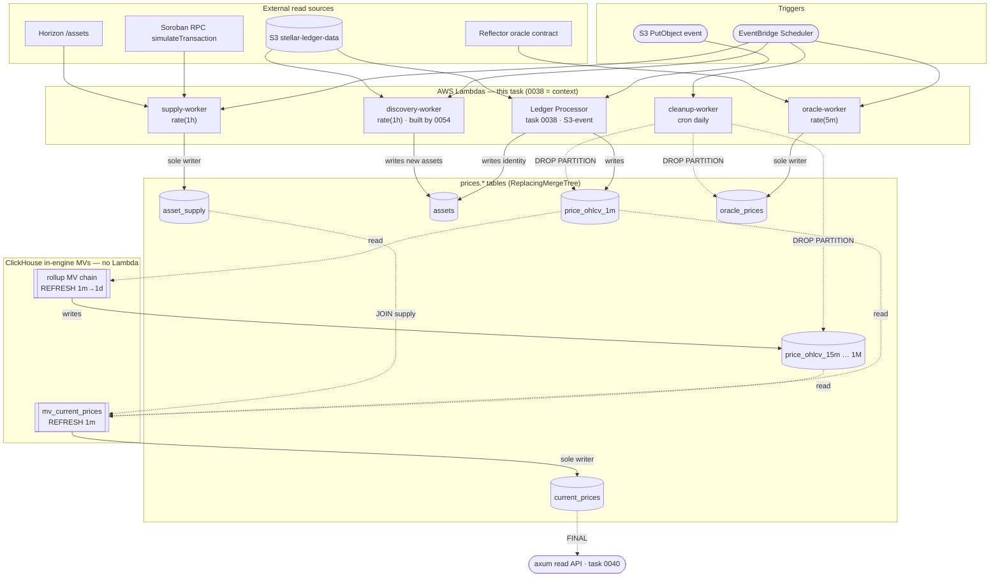

# Prices periodic workers — 4 EventBridge-Scheduler-triggered ClickHouse Lambdas

> **Scope corrected 2026-06-25** against ADR 0007 (accepted) + the live
> ClickHouse schema. The original 5-Lambda / RDS-Postgres design is
> superseded. **Two** of the five planned Lambdas are eliminated, replaced
> by ClickHouse-native refreshable materialized views: the **OHLCV Rollup
> Lambda** (→ the `rollups.sql` MV chain) and the **Current Price Updater
> Lambda** (→ a `current_prices` MV + a new `asset_supply` table; see open
> Q#1 resolution). The surviving **four** (oracle, discovery, supply,
> cleanup) retarget from RDS/`sqlx`/VPC to ClickHouse/mTLS/no-VPC — supply
> is split out of discovery (2026-06-25). See **Architecture validation
> (2026-06-25)** below for the per-worker verdict and evidence.

## Summary

Implement the **four** EventBridge-Scheduler-driven Lambdas that survive
the ADR 0007 ClickHouse refactor: **Oracle Fetcher** (rate 5 min, Reflector
via Soroban RPC `simulateTransaction`), **Asset Discovery** (rate 1 hour),
**Supply Fetcher** (rate 1 hour), and **Cleanup Worker** (cron 02:00 UTC
daily). All four are Rust binaries on `provided.al2` via `lambda_runtime`
per ADR 0006, run **outside any VPC** (ADR 0007 §6), and read/write the
`prices.*` database in BE's Hetzner ClickHouse over HTTPS-mTLS (the same
`prices-clickhouse::mtls` sink seam 0038 uses), **not** RDS.

Two former Lambdas become CH-native and are **not** built here: the **OHLCV
Rollup** is the live MV chain in `packages/prices-clickhouse/schema/rollups.sql`
(task 0051, on prod), and the **Current Price Updater** becomes a refreshable
MV writing `prices.current_prices` every minute, with `market_cap_usd`
computed from the new hourly-refreshed `prices.asset_supply` table that the
**Supply Fetcher** owns (Step 2 + Step 6).

## Context

The general-overview doc §2.1 lists these five workers as
Prices-API-budgeted components alongside the Ledger Processor and
the API handlers. §5.3 specifies each worker's trigger, source,
and output; §5.4 fixes the EventBridge Scheduler rule expressions:

```
oracle-ingest:     rate(5 minutes)  → Lambda "oracle-worker"
asset-discovery:   rate(1 hour)     → Lambda "discovery-worker"
asset-supply:      rate(1 hour)     → Lambda "supply-worker"   (NEW, split from discovery)
retention-cleanup: cron(0 2 * * *)  → Lambda "cleanup-worker"
# ohlcv-rollup  (rate 15m) — REMOVED: now the CH MV chain (rollups.sql)
# price-update  (rate 1m)  — REMOVED: now the current_prices MV (Step 2)
```

The Ledger Processor (0038) is event-driven (S3 PutObject), not
schedule-driven — it lives outside this task.

Why this is one task, not four: all four share the same deployment
shape (`provided.al2` + EventBridge Scheduler rule + ClickHouse mTLS
client + Secrets Manager, **no VPC**), the same CDK stack structure,
and the same observability harness. Splitting them would create four
copies of the same scaffolding. They can be implemented incrementally
within one task — each worker is one binary + one rule + one set of
acceptance criteria — but the deployment, CI, and CDK scaffolding is
built once.

## Architecture validation (2026-06-25)

Re-validated every planned worker against **ADR 0007** (accepted
2026-05-20) and the live `packages/prices-clickhouse/schema/`. The
original §5.3/§5.4 design predates the RDS→ClickHouse flip; this is the
reconciled scope.

| Worker | Verdict | Basis |
|--------|---------|-------|
| **OHLCV Rollup** `rate(15m)` | ❌ **ELIMINATED** | ADR 0007 §3.4 "Rollup Lambda eliminated." Replaced by the refreshable-MV chain `1m→15m→…→1M` in `schema/rollups.sql`; task **0051** archived (chain live on prod 2026-06-22). |
| **Current Price Updater** `rate(1m)` | ❌ **ELIMINATED** | Open Q#1 resolved (2026-06-25): 5 of 6 `current_prices` columns are SQL-derivable from `price_ohlcv_1m` + rollups (§5.5 outlier filter is plain `quantileExact` SQL), so the 1-min Lambda → a refreshable MV. The only external input — `market_cap_usd = price × token_supply` (§3.3, supply from Soroban `total_supply`/Horizon) — moves to a new `prices.asset_supply` table the MV JOINs. See Step 2. |
| **Oracle Fetcher** `rate(5m)` | ✅ KEEP (→CH) | Fetches Reflector via Soroban RPC `simulateTransaction` (external I/O — cannot be an MV) → `prices.oracle_prices`. |
| **Asset Discovery** `rate(1h)` | ✅ KEEP (→CH) — **built by 0054** | Scans ledgers for new assets → `prices.assets`. NOT folded into 0038 (which only `load_registry()` reads). **Q#2 resolved → Option A:** the worker binary + CDK ship from **0054** (T1 minimal: detection + 20-asset seed); 0039 **reuses** it and only **adds** Soroswap/Aquarius pool-registry maintenance. |
| **Supply Fetcher** `rate(1h)` | ✅ KEEP (→CH) | **Split out of discovery (2026-06-25).** Iterates all assets, fetches `token_supply` (Soroban `total_supply` / Horizon — external I/O, not an MV) → sole writer of new `prices.asset_supply`, which the `current_prices` MV JOINs for `market_cap_usd`. Separated from discovery for failure isolation + independent O(N) scaling (see Step 6). |
| **Cleanup/Retention** `cron daily` | ✅ KEEP (thin) | `ALTER TABLE … DROP PARTITION` per per-granularity table (ADR 0007 §3.3). No declarative `TTL` in schema → retention stays procedural. |

**Cross-cutting retargets (apply to all four Lambdas):**

- **RDS/`sqlx` → ClickHouse.** Reuse 0038's `prices-clickhouse::mtls`
  sink seam; no Postgres, no UPSERT — `ReplacingMergeTree` INSERT +
  read-time `FINAL`/`argMax` (ADR 0007 §3, Consequences).
- **No VPC / NAT / SG / RDS-IAM** (ADR 0007 §6). The Step-7 CDK wiring
  drops all VPC + RDS-IAM scaffolding; creds are the mTLS cert/key in
  Secrets Manager (2 secrets/env), same as 0038.
- **Single-writer-per-`ReplacingMergeTree`-row invariant** (load-bearing).
  CH `ReplacingMergeTree` replaces the *whole* row for a sort key on merge —
  there is no column-level merge. So no two writers may target the same row.
  This is why `market_cap_usd` is **not** written by the discovery Lambda
  directly into `current_prices` (the per-minute MV would clobber it, and
  vice-versa) and supply is **not** added to `prices.assets` (the ledger
  processor's `write_assets` re-emits full rows with `updated_at = now()` —
  `prices-ingest-core/src/writer.rs:141` — and would clobber it). Instead
  supply gets its own single-writer table; the MV reads it via JOIN.
- Net Lambda count: **4, not 5** (rollup + price-updater are MVs; supply
  split out of discovery as its own worker).

**Open design questions:**

1. ~~Current Price Updater — Lambda vs. view.~~ **RESOLVED 2026-06-25 →
   eliminate the Lambda; use a refreshable MV + `asset_supply` table.**
   Rationale: §5.5's outlier rule (inter-source median + % threshold) is
   plain ClickHouse SQL (`quantileExact(0.5)` + filtered weighted average),
   and `?min_volume_usd=` is a *read-time* param re-weighted from the
   `sources` JSON (overview §5.5 layering table, L3) — so nothing on the
   write path needs imperative code **except** `market_cap_usd`, which is
   external (`token_supply` via Soroban `total_supply`/Horizon, §3.3) and
   `NULL`-able by design. Supply is slow-moving, so a dedicated hourly
   **Supply Fetcher** (Step 6) writes `prices.asset_supply` and the
   `current_prices` MV multiplies it by the live price. See Step 2 + Step 6.
2. ~~Asset Discovery vs. task 0054.~~ **RESOLVED 2026-06-25 → Option A.**
   **0054** (milestone-M1) builds and ships the Asset Discovery worker
   first — minimal T1 scope (new-asset detection + ~20-major-asset seed +
   `prices.discovery_state` high-water-mark). 0039 does **not** rebuild it;
   0039's discovery step (Step 5) **reuses** 0054's binary + CDK and only
   **adds** the Soroswap/Aquarius pool-registry maintenance 0054 explicitly
   deferred. Rationale: 0054 is narrower, M1-gated, already designed as the
   reusable foundation, and its blockers (0011/0051/0052) are cleared; the
   supply-worker split keeps discovery cleanly separable. So 0054 should be
   promoted/sequenced ahead of 0039's discovery work.

## Topology (workers, MVs, and `prices.*` tables)

Solid arrows = writes; dashed = reads/JOIN or partition drops. Each
`ReplacingMergeTree` table has exactly **one** writer (except `assets`,
written by both the ledger processor and discovery — see task 0067). The
two `[[MV]]` nodes run **inside ClickHouse** (no Lambda).



## Implementation Plan

### Step 1: Shared crate scaffolding

Add `packages/periodic-workers/` (or four sibling binary crates
under `packages/`) sharing a common library for: the **ClickHouse
mTLS client** (reuse 0038's `prices-clickhouse::mtls` seam — Secrets
Manager cert/key fetch via the Parameters/Secrets extension, **no
`sqlx`, no RDS pool**), structured CloudWatch logging, `lambda_runtime`
entrypoint boilerplate, and a small "ran at" telemetry helper.

### Step 2: Current prices — refreshable MV + `asset_supply` (NO Lambda)

Replaces the former `price-updater` Lambda (open Q#1 resolved). Two parts,
each preserving the single-writer-per-row invariant:

**2a. `current_prices` refreshable MV (sole writer of `current_prices`).**

- Add to `packages/prices-clickhouse/schema/rollups.sql` (or a sibling
  `current.sql`): `CREATE MATERIALIZED VIEW prices.mv_current_prices REFRESH
  EVERY 1 MINUTE TO prices.current_prices AS SELECT …`.
- Computes the 5 SQL-derivable columns from `price_ohlcv_1m FINAL` + the
  rollup tables: `price_usd`/`price_xlm` (`argMax(close…, timestamp)`),
  `change_24h_pct`/`change_7d_pct` (latest vs. 24h/7d-ago close),
  `volume_24h_usd` (trailing-24h sum), `vwap_24h` (§5.5 cross-source
  weighted price with the inter-source-median outlier filter via
  `quantileExact(0.5)` + a filtered weighted average), and the per-source
  `sources` JSON.
- `market_cap_usd = price_usd * s.token_supply` via
  `LEFT JOIN prices.asset_supply AS s FINAL ON s.asset_id = …` — `NULL`
  when supply is absent (§3.3 allows it). Price factor is minute-fresh;
  supply factor lags ≤1h. **The MV is the only writer of `current_prices`.**
- ⚠️ Perf check before committing: a 1-min MV recomputing a 24h-trailing
  median-filtered VWAP across all assets×sources is heavier than the
  bounded-window rollup MVs. `EXPLAIN`/time it for the expected asset count;
  fallback is a thin scheduled `INSERT…SELECT` (still no per-asset Lambda).

**2b. `prices.asset_supply` table (sole writer = the hourly Supply Fetcher, Step 6).**

```sql
CREATE TABLE IF NOT EXISTS prices.asset_supply (
    asset_id     UInt32,
    token_supply Decimal(38, 14),
    fetched_at   DateTime DEFAULT now()
) ENGINE = ReplacingMergeTree(fetched_at) ORDER BY (asset_id);
```

- New schema object in `schema/init.sql`. Populated only by Step 6's Supply
  Fetcher — never by the MV, never by discovery, never by the ledger
  processor. This dedicated table is what lets supply (slow) and price
  (fast) each have a single writer, instead of fighting over a shared
  `current_prices`/`assets` row.
- The existing `current_price_usd` read view (`schema/views.sql`) is
  unchanged — it remains the read surface over `current_prices`.

### ~~Step 3: OHLCV Rollup (`rollup-worker`)~~ — ELIMINATED

**Removed per ADR 0007 §3.4.** Rollups are the live ClickHouse
refreshable-MV chain `mv_ohlcv_1m_to_15m → … → 1w_to_1M` in
`packages/prices-clickhouse/schema/rollups.sql` (built/verified by task
0051, on prod since 2026-06-22; correctness hardening tracked in 0059).
No Lambda, no EventBridge rule, no acceptance criterion for rollup in
this task. Nothing to build here — left as a tombstone so the §5.4 rule
list isn't re-added by mistake.

### Step 4: Oracle Fetcher (`oracle-worker`)

- Trigger: EventBridge Scheduler `rate(5 minutes)`.
- Behaviour (§5.3, §2.2): call Reflector's oracle contract via
  Soroban RPC `simulateTransaction`. Write results to
  `oracle_prices` (§3.4) keyed by `(timestamp, asset_id,
  oracle_name)` — partition pattern matches `price_ohlcv`.
- **Failure stance** (§2.2, §5.3): non-critical. A failed
  fetch logs + emits a metric but does not block other
  workers; the column "shows `null` or last known value"
  downstream.
- Soroban RPC endpoint + Reflector contract address read from
  Secrets Manager (per §2.1 row).

### Step 5: Asset Discovery (`discovery-worker`) — reuse 0054, add pool-registry

**Q#2 resolved → Option A: the discovery worker is built and shipped by
task 0054, not here.** 0039 does not rebuild it.

- **Reuse 0054 as-is:** its `packages/asset-discovery/` binary + CDK
  Lambda + `rate(1 hour)` rule + the `prices.discovery_state`
  high-water-mark table + the 20-major-asset seed. 0054 already covers
  new classic-asset issuance + SEP-41 detection → `prices.assets` INSERT
  (`ReplacingMergeTree` dedup on the §3.1 natural key).
- **0039 adds only the deferred extension:** Soroswap / Aquarius pool-pair
  registry maintenance (§2.2) — pool registries tell the Ledger Processor
  (0038) which contracts to extract swaps from. Coordinate the
  pool-registry hand-off with the 0037 Phoenix pool registry surface.
- Supply fetch is **not** here — separate worker (Step 6). 0054 has no
  supply concern either; it predates the split and was discovery-only.
- **Sequencing:** 0054 should ship (or at least land its binary) before
  this step; 0039's discovery work is purely additive on top of it.

### Step 6: Supply Fetcher (`supply-worker`)

- Trigger: EventBridge Scheduler `rate(1 hour)` — same cadence as
  discovery, but a **separate** Lambda.
- Behaviour: iterate the tracked assets in `prices.assets`; for each,
  fetch `token_supply` — Soroban `total_supply` via RPC
  `simulateTransaction` for SEP-41 / contract tokens, Horizon `/assets`
  for classic — and INSERT into `prices.asset_supply` (**sole writer**).
  The Step-2 `current_prices` MV then multiplies the latest known supply
  by the live price every minute to produce `market_cap_usd`.
- **Failure stance: non-critical**, like the Oracle worker (§2.2). A
  per-asset RPC/Horizon failure logs + emits a metric and is skipped —
  `market_cap_usd` is `NULL` for that asset (§3.3 allows it) and the run
  continues. Alarm is informational; never blocks discovery or ingestion.
- **Why separate from discovery** (2026-06-25): different source (RPC/
  Horizon vs S3 ledgers), different cardinality (all N assets vs
  new-this-hour), O(N) external fan-out that scales/rate-limits
  independently, and best-effort criticality that must not pollute
  discovery's completeness-critical health signal or risk its timeout.
- Does **not** write `current_prices` or a supply column on `assets`
  (single-writer invariant).
- Scaling note: O(N assets) external calls per run — batch / bound
  concurrency / respect Horizon rate limits; shardable later if N grows.

### Step 7: Cleanup Worker (`cleanup-worker`)

- Trigger: EventBridge Scheduler `cron(0 2 * * *)` (02:00 UTC
  daily).
- Behaviour (§3.6 Retention Policy, §5.3): delete expired
  fine-grained candles per the §3.6 policy, drop old monthly
  partitions on `price_ohlcv` / `oracle_prices`, and create
  upcoming partitions (2 months ahead per §3.2 comment).
- Idempotent: re-running on the same day is a no-op.

### Step 8: CDK + EventBridge wiring

In the `infra/` CDK app:

- One Lambda function definition per worker (**four**: oracle, discovery,
  supply, cleanup), using 0038's conventions: `provided.al2`, ARM64,
  **no VPC / no RDS-IAM** (ADR 0007 §6), Secrets Manager read of the mTLS
  cert/key bundle. No Lambda for current-prices (it's the Step 2 MV).
- One EventBridge Scheduler rule per worker with the §5.4
  expressions verbatim (rollup **and** price-update rules omitted — both
  are MVs now). Discovery and supply share the `rate(1 hour)` cadence but
  are distinct rules → distinct Lambdas.
- DLQ + retry policy per worker (defer the exact DLQ shape to
  impl time; default to 2 retries + DLQ).
- CloudWatch alarms: per-worker error rate + duration p95;
  Oracle worker alarm explicitly informational (per §2.2's
  "failures do not block primary ingestion").

### Step 9: Tests

- Unit per worker: feed a fixture state and assert the worker's
  output. `discovery-worker`: assert new-asset INSERT (no duplicates).
  `supply-worker`: assert `asset_supply` rows + best-effort skip on a
  fetch failure (no row, run continues). `cleanup-worker`: assert
  partition drops + creates against a fixture date. (No rollup tests —
  covered by 0051/0059.)
- **`current_prices` MV (Step 2):** seed `price_ohlcv_1m` + `asset_supply`
  fixtures, refresh the MV, assert the §5.5 VWAP + outlier exclusion +
  `market_cap_usd = price × supply` (and `NULL` when supply absent). SQL
  test, not a Lambda test.
- Integration: run each worker + the MV against a **local Docker
  ClickHouse** (the prices schema, same harness 0038's e2e uses) and
  snapshot the result. Not Postgres.

## Acceptance Criteria

- [x] **Four** worker Lambdas live (oracle, discovery, supply, cleanup)
      on `provided.al2` (ARM64), no VPC, no RDS — of which **discovery is
      delivered by task 0054** (0039 reuses its binary + CDK, not rebuilt);
      oracle/supply/cleanup are built here.
- [x] **Four** EventBridge Scheduler rules created with the §5.4
      cron/rate expressions verbatim (no rollup, no price-update rule);
      discovery + supply both `rate(1 hour)` as separate rules.
- [x] `prices.asset_supply` table created; `mv_current_prices` refreshable
      MV is the **sole** writer of `current_prices`, refreshes every minute,
      and computes `market_cap_usd = price × asset_supply.token_supply`
      (`0` sentinel when supply absent). **MV is v1** — `price_xlm`,
      `change_24h/7d_pct`, per-source `sources` JSON, and the §5.5 VWAP
      median-outlier filter are **deferred to 0068** (plain VWAP for now).
- [x] `oracle-worker` calls Reflector via Soroban RPC, writes
      `prices.oracle_prices` rows, and emits an alarm-without-blocking
      on RPC failure. (Validated against the live Reflector contract.)
- [x] `discovery-worker` (from **0054**) deployed and inserting new assets
      into `prices.assets` keyed on §3.1 without duplicates. **0039's additive
      Soroswap/Aquarius pool-registry maintenance is deferred → 0069** (not
      built in PR #56). (Q#2 Option A.)
- [x] `supply-worker` writes `token_supply` into `prices.asset_supply`
      (its **sole** writer); a per-asset fetch failure is skipped
      (best-effort) and emits an informational alarm without blocking.
      (Validated against live Horizon; batched flush so a timeout no longer
      drops the whole run — review item #5.)
- [x] `cleanup-worker` `DROP PARTITION`s the oldest stale monthly
      partition per per-granularity table and creates the
      2-months-ahead partition; idempotent on same-day re-run.
- [x] Single-writer invariant holds: no two writers target the same
      `current_prices` / `asset_supply` row (writer audit — MV owns
      `current_prices`, supply worker owns `asset_supply`).
- [x] Per-worker CloudWatch alarms wired (error rate, duration
      p95); Oracle **and** supply alarms marked informational.
- [x] Integration harness covers the four workers + the `current_prices`
      MV against a local Docker **ClickHouse** mirror of the `prices.*`
      schema.
- [x] ~~`rollup-worker`~~ — eliminated (CH MV chain; ADR 0007 §3.4).
- [x] ~~`price-updater`~~ — eliminated (refreshable MV + `asset_supply`;
      open Q#1, 2026-06-25).

## Implementation Notes

Delivered by **PR #56** (merge commit `02d7cc1` → develop, 2026-06-26):

- **Worker crates** — `packages/{cleanup,supply,oracle}-worker/` (each `lib.rs`
  + `main.rs` behind a `lambda` feature, `required-features = ["lambda"]`), plus
  `packages/asset-discovery/` reused from 0054. Each has an `#[ignore]`
  integration test (`tests/*_it.rs`).
- **Schema** — `packages/prices-clickhouse/schema/current.sql` (the
  `current_prices` refreshable MV) + the `prices.asset_supply` table;
  `tests/current_mv_it.rs` exercises the MV computation.
- **CDK** — all four EventBridge rules wired to their worker Lambdas + alarms in
  `infra/src/lib/stacks/eventbridge-stack.ts`; the four wiring blocks were later
  collapsed into a `createWorkerLambda` factory in `lambda-baseline.ts`
  (review item #7). The orphaned `priceUpdater` rule was retired (→ `assetSupply`).
- **CI guard** — the `rust` job now builds + verifies the Lambda bootstraps on a
  native ARM runner (`ubuntu-24.04-arm`); see `.github/workflows/ci.yml`.
- **Validation** — unit + clippy + infra typecheck/build/lint green; live Horizon
  fetch (supply) and a **live Reflector price fetch** (oracle) proven via
  `#[ignore]` network tests; full `cdk synth` succeeds with real arm64 assets.

Full review trail: `notes/G-pr56-review-checklist.md`.

## Issues Encountered

- **Lambda bins silently skipped by a bare `cargo lambda build`** (caught while
  building the CI guard locally). Every worker bin is gated behind
  `required-features = ["lambda"]` to keep default `cargo build`/`test` lean, so
  `cargo lambda build --release --arm64` (no feature flag) builds none of the
  five deploy bins and packages only unrelated CLIs. A `failglob "any bootstrap"`
  check false-passes. Fix: `--features lambda` + explicit `-p` per crate, and the
  verify step asserts each of the five expected `target/lambda/<name>/bootstrap`
  paths. Also corrected the now-wrong build-command comments in the worker
  Cargo.toml files. (Not a regression — pre-existing build ergonomics.)
- **`current_prices` MV column/order + overflow bugs** (review items #1, #6).
  Positional `TO` insert mismatch fixed by an explicit target column list;
  `market_cap_usd` made `Decimal256`-exact with `accurateCastOrNull` → `0`
  sentinel on out-of-range instead of throwing `DECIMAL_OVERFLOW`.
- **Oracle ms-vs-s timestamp** (review item #2) — Reflector timestamps are ms;
  the worker now divides by 1000 to match the event path (was mis-dating every
  oracle row to ~2106 via the `u32::MAX` clamp).
- **Supply worker terminal-write timeout** (review item #5) — thousands of
  sequential Horizon GETs could exceed the 5-min timeout before the single
  `write_supplies`, losing the whole run; now flushes in batches.

## Design Decisions

### Emerged

1. **MV `market_cap_usd` uses a `0` sentinel, not `NULL`, when supply is
   absent.** The plan said `NULL`; the overflow-safe path
   (`accurateCastOrNull` → `ifNull(…, 0)`) degrades out-of-range/absent values
   to `0` so a single bad asset can't fail the whole refresh. Consumers treat
   `0` as "unknown".
2. **`current_prices` MV shipped as v1** — only the SQL-trivial columns
   (`price_usd`, `volume_24h_usd`, `vwap_24h` plain, `market_cap_usd`). The
   richer columns (`price_xlm`, `change_24h/7d_pct`, `sources` JSON, §5.5
   median-outlier VWAP) were split to **0068** to land the MV sooner; the
   refreshable MV recomputes every row each minute, so no backfill is needed
   when v2 lands.
3. **Discovery pool-registry maintenance dropped from this task → 0069.** Step 5
   planned it as additive on top of 0054; it was not built in PR #56 and is
   carried out as a standalone backlog task rather than blocking the archive.
4. **CI Lambda build guard adapted, not copied, from BE.** BE's `failglob
   "any bootstrap"` check would false-pass here because of the `lambda`-feature
   gate; the verify step asserts the five named bootstraps instead.

## Dependencies

- **0011** — Lambda + EventBridge + Secrets Manager CDK scaffolding
  (no RDS/VPC under ADR 0007). **Archived (done).**
- **0038** — live ingestion producing `prices.price_ohlcv_1m`. The
  `current_prices` MV and the cleanup worker read it; discovery maintains
  the asset registry and the supply worker maintains `asset_supply`, both
  feeding the live path. **PR #34 merged to develop 2026-06-25.**
- **0054** (Q#2 Option A) — delivers the Asset Discovery worker (binary +
  CDK) that 0039's Step 5 reuses. 0039's discovery work (pool-registry
  maintenance) is additive and sequenced **after** 0054 lands its binary.
  Not a hard blocker on the rest of 0039 (oracle/supply/cleanup/MV proceed
  independently).

## Out of scope

- API read handlers — see 0040.
- Historical backfill — see ADR 0001 (Stream 1) and ADR 0005
  (Stream 2). Periodic workers operate only on data already
  in the `prices.*` ClickHouse database.
- Reflector contract deployment, key management beyond Secrets
  Manager.
- Cross-oracle merging (Chainlink, RedStone, Band, etc.) — the
  §3.4 schema supports it but only Reflector is in-scope for
  the §5.3 oracle worker.

## Future Work

- **0069** (FEATURE, backlog) — Asset Discovery Soroswap/Aquarius pool-registry
  maintenance. The additive Step 5 work was not built in PR #56; carried out as
  a standalone task. Coordinate the registry hand-off with the 0037 Phoenix
  pool-registry surface.

- **0068** (FEATURE, backlog) — `current_prices` MV v2 columns. The v1 MV
  leaves `price_xlm`, `change_24h_pct`, `change_7d_pct`, `sources` at their
  table DEFAULTs and uses a plain VWAP. Extend the MV (XLM-quote orientation,
  24h/7d reference-close self-join, per-source JSON, §5.5 outlier filter). No
  backfill needed — the refreshable MV recomputes every row each minute.

- **0067** (BUG, backlog) — `assets` enrichment columns (`home_domain`, and
  any future on-`assets` column) are clobbered by the ledger processor's
  full-row `write_assets` re-emit. Surfaced by this task's single-writer
  analysis; 0039 dodges it for supply via the dedicated `asset_supply`
  table, but `home_domain` still needs the writer-ownership fix.

## Notes

- Four workers in one task is a deliberate scoping call: the
  scaffolding (CDK Lambda + EventBridge rule + Secrets Manager
  mTLS + CH client + CW alarms) is identical across all four, and
  the per-worker logic is small. If any worker grows beyond
  ~300 lines of impl logic during build, split it out into its
  own task at that point — don't pre-emptively fragment.
- Per ADR 0006 §Decision the first Rust binary lands with the
  Ledger Processor; this task is the second wave and reuses
  the same `cargo lambda` packaging + CI patterns established
  by 0038.
- Oracle worker's "non-critical" stance (§2.2) is load-bearing
  — make sure its alarm severity and runbook reflect that, or
  on-call will be paged for what the design says should be
  ignorable.
